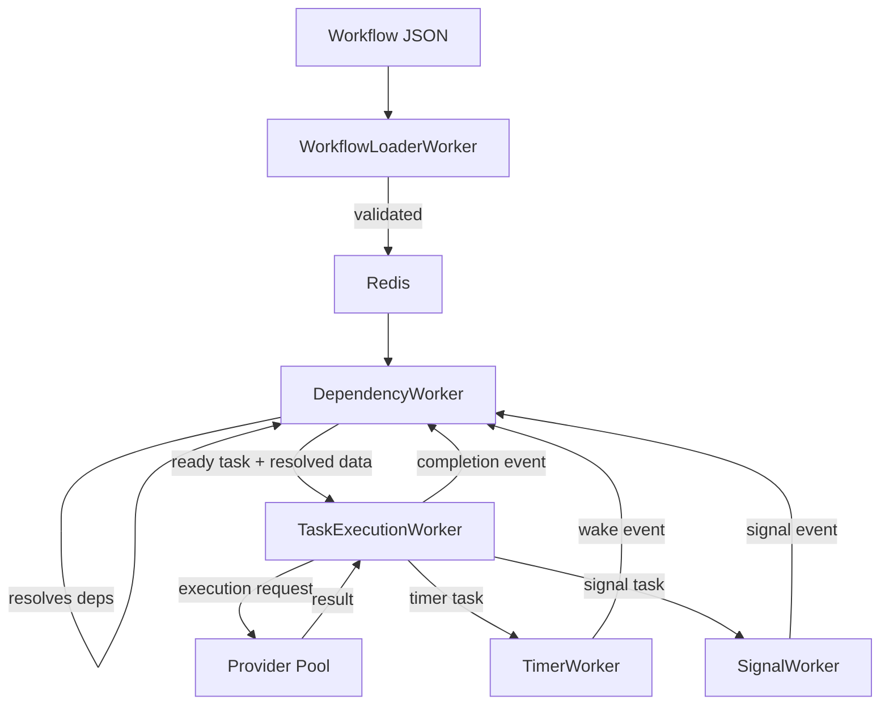

# Gleitzeit 0.0.7 - Complete System Architecture Audit

## System Overview

Gleitzeit is a distributed workflow orchestration system with ~20,000 lines of Python code organized into distinct architectural layers.

## Architecture Layers & Responsibilities

### 1. Core Layer (`/core`)
**Purpose**: Foundation models, errors, and shared utilities

| Component | Lines | Responsibility | Current State |
|-----------|-------|----------------|---------------|
| models.py | 498 | Data models (Task, Workflow, TaskStatus) | ✅ Well-defined |
| errors.py | 1012 | Error hierarchy and handling | ✅ Comprehensive |
| sharding.py | ~200 | Workflow locality via hash tags | ✅ Working |
| events.py | ~150 | Event definitions for workers | ✅ Clean |
| redis_cluster.py | ~250 | Redis cluster support | ✅ Functional |

**Assessment**: Core layer is solid with proper abstractions.

### 2. Workers Layer (`/workers`)
**Purpose**: Distributed task processing via specialized workers

| Worker | Responsibility | Dependencies | Issues |
|--------|---------------|--------------|---------|
| **WorkflowLoaderWorker** | Parse & validate workflows | None | ✅ Clean |
| **DependencyWorker** | Resolve task dependencies | Redis streams | ✅ Correct |
| **TaskExecutionWorker** | Execute tasks | Old providers | ❌ Uses archived providers |
| **TimerWorker** | Handle timer wakeups | Timer state in Redis | ✅ Separate concern |
| **SignalWorker** | Handle signal delivery | Signal state in Redis | ✅ Separate concern |

**Key Finding**: Workers correctly handle workflow orchestration. Dependencies are properly managed by DependencyWorker, NOT providers.

### 3. Providers Layer (`/providers`)
**Purpose**: Task execution abstraction

| Component | Purpose | Status |
|-----------|---------|---------|
| **New System** | Clean provider architecture | ✅ Well-designed |
| **Archived** | Old provider implementations | ⚠️ Still referenced |
| **Bridge** | Workflow-provider adapter | ❌ Mixes concerns |

**Critical Issue**: The bridge I created incorrectly passes dependencies to providers!

### 4. Orchestrator Layer (`/orchestrator`)
**Purpose**: Component lifecycle management

| Component | Responsibility | Status |
|-----------|---------------|---------|
| ComponentOrchestrator | Manage worker processes | ✅ Clean |
| (Was SystemManager) | Now manages workers, not tasks | ✅ Correct evolution |

### 5. Timers & Signals (`/timers`, `/signals`)
**Purpose**: Stateless timer and signal management

| Component | Responsibility | Status |
|-----------|---------------|---------|
| StatelessTimerManager | Timer scheduling without state | ✅ Proper separation |
| StatelessSignalManager | Signal routing without state | ✅ Proper separation |

## Architectural Violations Found

### ❌ VIOLATION 1: Dependencies in Provider Layer

**Location**: `workflow_bridge.py`
```python
def prepare_params(self, task_data: Dict, workflow: Dict) -> Dict[str, Any]:
    if task_type == 'python':
        params['args'] = self.resolve_dependencies(task_data, workflow)  # ❌ WRONG!
```

**Why it's wrong**:
- Providers should ONLY execute tasks
- Dependencies are workflow orchestration concerns
- DependencyWorker already handles this correctly

**Correct Flow**:
```
DependencyWorker resolves dependencies
    ↓
TaskExecutionWorker gets resolved data
    ↓
Provider executes with prepared inputs (NOT dependency resolution)
```

### ❌ VIOLATION 2: Workflow Context in Providers

**Location**: Multiple places
```python
# Old system
provider.execute(task_data, workflow)  # ❌ Passes entire workflow

# Bridge attempts
metadata['workflow_id'] = workflow.get('id')  # ⚠️ Metadata ok, but not workflow logic
```

**Why it's wrong**:
- Providers shouldn't know about workflows
- Creates tight coupling
- Violates single responsibility

### ❌ VIOLATION 3: Status Confusion

**Mixed Responsibilities**:
- TaskStatus enum: Workflow state (✅ Correct)
- Provider status: Execution result (should be separate)
- Bridge mapping: Trying to unify incompatible concepts

## Proper Separation of Concerns

### ✅ CORRECT: Workflow Orchestration

```
┌─────────────────────────────────────────────┐
│          WORKFLOW ORCHESTRATION              │
│                                               │
│  WorkflowLoaderWorker                        │
│       ↓                                      │
│  DependencyWorker (handles dependencies)     │
│       ↓                                      │
│  TaskExecutionWorker                         │
│       ├─→ TimerWorker (timer coordination)   │
│       └─→ SignalWorker (signal coordination) │
└─────────────────────────────────────────────┘
```

### ✅ CORRECT: Provider Responsibilities

```
┌─────────────────────────────────────────────┐
│              PROVIDERS                       │
│                                               │
│  Input: Task parameters (resolved)           │
│  Output: Execution result                    │
│                                               │
│  NOT responsible for:                        │
│  - Dependencies                              │
│  - Workflow state                            │
│  - Task scheduling                           │
│  - Signal/timer coordination                 │
└─────────────────────────────────────────────┘
```

## System Integration Blueprint

### 1. Correct Data Flow



### 2. Correct Provider Integration

```python
# TaskExecutionWorker should do:
class TaskExecutionWorker:
    async def execute_task(self, task_data: Dict, resolved_inputs: Dict):
        """
        Execute task with already-resolved inputs

        Args:
            task_data: Task definition
            resolved_inputs: Dependencies already resolved by DependencyWorker
        """
        # Create execution request
        request = ExecutionRequest(
            method=task_data.get('method'),
            params={
                **task_data.get('params', {}),
                'inputs': resolved_inputs  # Already resolved!
            }
        )

        # Execute through provider
        response = await provider.execute(request)

        # Return result (no dependency handling here!)
        return response
```

### 3. Correct Status Management

```python
# Task lifecycle (workflow concern)
TaskStatus.PENDING → QUEUED → EXECUTING → COMPLETED

# Provider execution (provider concern)
class ExecutionStatus(Enum):
    SUCCESS = "success"
    ERROR = "error"
    TIMEOUT = "timeout"

# Special coordination states (workflow concern)
TaskStatus.SCHEDULED  # Timer scheduled
TaskStatus.WAITING    # Waiting for signal
```

## Component Responsibility Matrix

| Concern | Owner | NOT Owner |
|---------|-------|-----------|
| **Task Dependencies** | DependencyWorker | ❌ Providers |
| **Workflow State** | Workers + Redis | ❌ Providers |
| **Task Execution** | Providers | ✅ |
| **Parameter Validation** | Providers | ✅ |
| **Timer Scheduling** | TimerWorker | ❌ Providers |
| **Signal Coordination** | SignalWorker | ❌ Providers |
| **Result Storage** | TaskExecutionWorker | ❌ Providers |
| **Retry Logic** | Workers | ❌ Providers |
| **Error Handling** | Both (different levels) | ✅ |

## Recommendations

### 1. Fix Provider Integration

```python
# Remove dependency handling from providers
class PythonProvider:
    async def execute(self, request: ExecutionRequest):
        # Just execute with given params
        code = request.params.get('code')
        inputs = request.params.get('inputs', {})  # Pre-resolved
        # Execute code with inputs
```

### 2. Simplify Bridge

```python
class SimpleProviderAdapter:
    """Just adapts call format, no workflow logic"""

    async def execute(self, task_type: str, params: Dict):
        # Simple format conversion only
        response = await orchestrator.execute(
            task_type=task_type,
            params=params  # Already prepared by worker
        )
        return response.result
```

### 3. Keep Concerns Separate

- **Workers**: Handle workflow orchestration, dependencies, scheduling
- **Providers**: Execute tasks with given parameters
- **Timers/Signals**: Handle their specific coordination
- **No mixing**: Each component does ONE thing well

### 4. Status Clarity

```python
# Workflow states (for workers)
from gleitzeit.core.models import TaskStatus

# Execution results (for providers)
@dataclass
class ExecutionResponse:
    status: ExecutionStatus  # NOT TaskStatus
    result: Any
    error: Optional[Dict]
```

## System Health Assessment

| Component | Health | Action Required |
|-----------|--------|-----------------|
| Core Models | ✅ Excellent | None |
| Workers | ✅ Good | Update to use new providers |
| DependencyWorker | ✅ Excellent | None - correctly handles deps |
| New Providers | ✅ Good | Remove dependency handling |
| Provider Bridge | ❌ Poor | Major refactor needed |
| Timer/Signal | ✅ Excellent | None |
| Orchestrator | ✅ Good | None |

## Critical Actions

1. **IMMEDIATE**: Remove dependency resolution from providers
2. **IMMEDIATE**: Fix WorkflowProviderBridge to not pass workflow context
3. **SHORT-TERM**: Update TaskExecutionWorker to use new providers correctly
4. **SHORT-TERM**: Separate ExecutionStatus from TaskStatus
5. **MEDIUM-TERM**: Complete provider validation without workflow logic

## Conclusion

The Gleitzeit architecture is fundamentally sound with clear separation between:
- **Orchestration** (workers handle workflows, dependencies, coordination)
- **Execution** (providers execute individual tasks)
- **Coordination** (specialized workers for timers/signals)

The main issue is the incorrect mixing of concerns in the provider integration layer. Providers should be "dumb" executors that take parameters and return results, while all orchestration logic remains in the worker layer where it belongs.

The system correctly handles dependencies through DependencyWorker - this should NOT be duplicated or moved to providers.