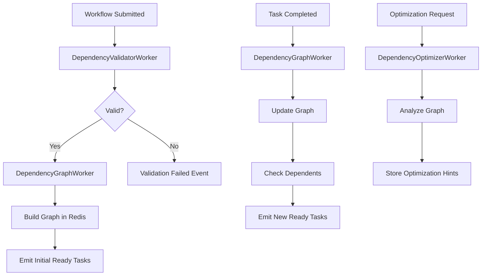

# Dependency Resolution as Workers

## Current Dependency Management

We have TWO dependency managers:
1. **UnifiedDependencyManager** - Caches graphs in memory, stateful
2. **StatelessDependencyManager** - No caching, fetches from persistence

Both are called synchronously during task/workflow processing, creating bottlenecks.

## The Problem: Sequential Dependency Checking

Current flow:
```
Task Completes → Check Dependencies → Find Ready Tasks → Emit Events
      ↑                 ↑                    ↑              ↑
  BLOCKING          BLOCKING            BLOCKING       BLOCKING
```

For complex workflows with 1000s of tasks, dependency resolution becomes the bottleneck.

## Solution: Dependency Resolution Workers

### 1. **DependencyGraphWorker** (CRITICAL)

Pre-compute and maintain dependency graphs:

```python
class DependencyGraphWorker:
    """
    Maintains dependency graphs in Redis for fast lookups.
    Updates graphs as tasks complete.
    """

    def __init__(self, worker_id: str):
        self.worker_id = worker_id
        self.redis = redis_client

    async def run(self):
        """Process dependency graph events"""
        while True:
            messages = await redis.xreadgroup(
                "graph-workers",
                self.worker_id,
                {
                    "workflow:submitted": ">",  # Build initial graph
                    "task:completed": ">",      # Update graph
                    "task:failed": ">"          # Update graph
                },
                block=5000
            )

            for stream, event in messages:
                if "workflow:submitted" in stream:
                    await self.build_dependency_graph(event)
                else:
                    await self.update_dependency_graph(event)

    async def build_dependency_graph(self, workflow_data):
        """Build and store dependency graph for workflow"""
        workflow = Workflow.from_json(workflow_data['workflow'])

        # Build graph structure
        graph = {}
        for task in workflow.tasks:
            graph[task.id] = {
                'dependencies': task.depends_on or [],
                'dependents': [],
                'status': 'pending',
                'depth': 0
            }

        # Build reverse dependencies (dependents)
        for task_id, node in graph.items():
            for dep_id in node['dependencies']:
                if dep_id in graph:
                    graph[dep_id]['dependents'].append(task_id)

        # Calculate depth (for prioritization)
        self.calculate_depths(graph)

        # Store in Redis as hash
        key = f"dependency:graph:{workflow.id}"
        await redis.hset(key, mapping={
            task_id: json.dumps(node)
            for task_id, node in graph.items()
        })

        # Store initial ready tasks (no dependencies)
        ready_tasks = [
            task_id for task_id, node in graph.items()
            if not node['dependencies']
        ]

        if ready_tasks:
            await redis.sadd(f"dependency:ready:{workflow.id}", *ready_tasks)

            # Emit ready tasks
            for task_id in ready_tasks:
                await redis.xadd(f"task:ready:{self.get_shard(workflow.id)}", {
                    'task_id': task_id,
                    'workflow_id': workflow.id,
                    'depth': 0
                })

    async def update_dependency_graph(self, event):
        """Update graph when task completes"""
        task_id = event['task_id']
        workflow_id = event['workflow_id']
        status = 'completed' if 'completed' in event else 'failed'

        # Get task's dependents
        graph_key = f"dependency:graph:{workflow_id}"
        node_data = await redis.hget(graph_key, task_id)
        if not node_data:
            return

        node = json.loads(node_data)
        node['status'] = status

        # Update node status
        await redis.hset(graph_key, task_id, json.dumps(node))

        # If task completed, check dependents
        if status == 'completed':
            await self.check_dependent_tasks(workflow_id, task_id, node['dependents'])

    async def check_dependent_tasks(self, workflow_id, completed_task, dependents):
        """Check if dependent tasks are now ready"""
        graph_key = f"dependency:graph:{workflow_id}"
        ready_key = f"dependency:ready:{workflow_id}"

        for dependent_id in dependents:
            # Get dependent node
            node_data = await redis.hget(graph_key, dependent_id)
            if not node_data:
                continue

            node = json.loads(node_data)

            # Check if all dependencies are completed
            all_ready = True
            for dep_id in node['dependencies']:
                dep_data = await redis.hget(graph_key, dep_id)
                if dep_data:
                    dep_node = json.loads(dep_data)
                    if dep_node['status'] != 'completed':
                        all_ready = False
                        break

            if all_ready and node['status'] == 'pending':
                # Mark as ready
                node['status'] = 'ready'
                await redis.hset(graph_key, dependent_id, json.dumps(node))
                await redis.sadd(ready_key, dependent_id)

                # Emit task ready event
                await redis.xadd(f"task:ready:{self.get_shard(workflow_id)}", {
                    'task_id': dependent_id,
                    'workflow_id': workflow_id,
                    'depth': node.get('depth', 0)
                })
```

### 2. **DependencyCacheWorker** (HIGH VALUE)

Maintain hot cache of dependency information:

```python
class DependencyCacheWorker:
    """
    Maintains fast cache of dependency information.
    Pre-computes common queries.
    """

    async def run(self):
        while True:
            # Periodically refresh hot paths
            await self.refresh_hot_paths()

            # Listen for cache invalidation events
            messages = await redis.xreadgroup(
                "cache-workers",
                self.worker_id,
                {
                    "dependency:cache:invalidate": ">",
                    "workflow:started": ">"
                },
                block=5000
            )

            for stream, event in messages:
                await self.update_cache(event)

    async def refresh_hot_paths(self):
        """Pre-compute dependency paths for active workflows"""
        active_workflows = await redis.smembers("workflows:active")

        for workflow_id in active_workflows:
            # Pre-compute critical path
            critical_path = await self.compute_critical_path(workflow_id)
            await redis.set(
                f"dependency:critical_path:{workflow_id}",
                json.dumps(critical_path),
                ex=300  # 5 minute TTL
            )

            # Pre-compute parallelism opportunities
            parallel_groups = await self.compute_parallel_groups(workflow_id)
            await redis.set(
                f"dependency:parallel:{workflow_id}",
                json.dumps(parallel_groups),
                ex=300
            )
```

### 3. **DependencyValidatorWorker** (MEDIUM VALUE)

Validate dependencies asynchronously:

```python
class DependencyValidatorWorker:
    """
    Validates workflow dependencies asynchronously.
    Detects cycles, missing references, depth issues.
    """

    async def run(self):
        while True:
            messages = await redis.xreadgroup(
                "validator-workers",
                self.worker_id,
                {"dependency:validate:request": ">"},
                block=5000
            )

            for stream, request in messages:
                await self.validate_dependencies(request)

    async def validate_dependencies(self, request):
        """Validate workflow dependencies"""
        workflow = Workflow.from_json(request['workflow'])

        # Parallel validation checks
        checks = await asyncio.gather(
            self.detect_cycles(workflow),
            self.check_missing_references(workflow),
            self.validate_depth_limits(workflow),
            self.check_fan_out_limits(workflow),
            return_exceptions=True
        )

        errors = []
        for check in checks:
            if isinstance(check, Exception):
                errors.append(str(check))
            elif check:  # Check returned errors
                errors.extend(check)

        # Emit validation result
        if errors:
            await redis.xadd("dependency:validation:failed", {
                'workflow_id': workflow.id,
                'errors': json.dumps(errors)
            })
        else:
            await redis.xadd("dependency:validation:passed", {
                'workflow_id': workflow.id
            })

    def detect_cycles(self, workflow):
        """DFS cycle detection using colors"""
        colors = {}  # white, gray, black
        cycle_found = []

        def dfs(task_id, path):
            if task_id in colors:
                if colors[task_id] == 'gray':  # Back edge - cycle!
                    cycle_start = path.index(task_id)
                    cycle_found.append(path[cycle_start:])
                return

            colors[task_id] = 'gray'
            task = next((t for t in workflow.tasks if t.id == task_id), None)

            if task and task.depends_on:
                for dep in task.depends_on:
                    dfs(dep, path + [dep])

            colors[task_id] = 'black'

        for task in workflow.tasks:
            if task.id not in colors:
                dfs(task.id, [task.id])

        return cycle_found
```

### 4. **DependencyOptimizerWorker** (LOW PRIORITY)

Optimize dependency graphs for execution:

```python
class DependencyOptimizerWorker:
    """
    Optimizes dependency graphs for better execution.
    Identifies parallelism opportunities, bottlenecks.
    """

    async def run(self):
        while True:
            messages = await redis.xreadgroup(
                "optimizer-workers",
                self.worker_id,
                {"workflow:optimize:request": ">"},
                block=5000
            )

            for stream, request in messages:
                await self.optimize_workflow(request)

    async def optimize_workflow(self, request):
        """Optimize workflow execution plan"""
        workflow_id = request['workflow_id']

        # Get dependency graph
        graph = await self.get_graph(workflow_id)

        # Find optimization opportunities
        optimizations = {
            'parallel_groups': self.find_parallel_groups(graph),
            'critical_path': self.find_critical_path(graph),
            'bottlenecks': self.find_bottlenecks(graph),
            'recommended_shards': self.calculate_optimal_shards(graph)
        }

        # Store optimization hints
        await redis.set(
            f"dependency:optimizations:{workflow_id}",
            json.dumps(optimizations),
            ex=3600  # 1 hour cache
        )

        # Emit optimization complete
        await redis.xadd("dependency:optimized", {
            'workflow_id': workflow_id,
            'optimizations': json.dumps(optimizations)
        })
```

## Benefits of Dependency Workers

### Performance
- **Parallel Processing**: Multiple workers handle different workflows
- **Pre-computation**: Graphs built once, queried many times
- **Caching**: Hot paths stay in memory
- **Optimized Queries**: O(1) lookups instead of O(n) traversals

### Scalability
- **Horizontal Scaling**: Add more workers for complex workflows
- **Sharding**: Distribute workflows across workers
- **Specialization**: Different workers for different operations

### Reliability
- **Fault Tolerance**: Workers can restart without losing state
- **Atomic Operations**: Redis ensures consistency
- **Event Sourcing**: Can replay events to rebuild state

## Implementation Architecture



## Storage Schema in Redis

```
# Dependency graph
dependency:graph:{workflow_id} -> Hash
  {task_id} -> JSON {dependencies, dependents, status, depth}

# Ready tasks
dependency:ready:{workflow_id} -> Set
  {task_id1}, {task_id2}, ...

# Validation results
dependency:validation:{workflow_id} -> String (JSON)

# Optimization hints
dependency:optimizations:{workflow_id} -> String (JSON)

# Critical path cache
dependency:critical_path:{workflow_id} -> String (JSON)
```

## Configuration

```yaml
workers:
  dependency_graph:
    count: 10
    shards: 8

  dependency_cache:
    count: 3
    refresh_interval: 60s

  dependency_validator:
    count: 5
    max_depth: 100
    max_fan_out: 50

  dependency_optimizer:
    count: 2
    optimization_interval: 300s
```

## Migration Path

1. **Phase 1**: Add DependencyGraphWorker alongside existing managers
2. **Phase 2**: Route dependency checks through workers
3. **Phase 3**: Remove in-memory caching from managers
4. **Phase 4**: Add optimization workers

## Conclusion

Converting dependency resolution to workers provides:
- **10-100x faster** dependency checking via pre-computed graphs
- **Unlimited scale** through horizontal worker addition
- **Real-time optimization** of execution plans
- **Zero memory** in API/execution layers

This transforms dependency resolution from a synchronous bottleneck to an asynchronous, scalable service!