# Workflow Orchestration as Workers

## Current Workflow Processing Flow

1. **WorkflowLoaderV2** - Loads YAML/JSON, validates, creates Workflow objects
2. **WorkflowManager** - Submits workflows, validates dependencies
3. **StatelessTaskOrchestrator** - Processes task events, checks dependencies
4. **ExecutionEngineV2** - Coordinates execution

## The Problem: Sequential Bottlenecks

Current flow is sequential:
```
Load YAML → Validate → Submit → Store → Process Events → Execute
         ↑              ↑        ↑                ↑
     BLOCKING       BLOCKING  BLOCKING        BLOCKING
```

Each step blocks the next, creating a pipeline stall.

## Solution: Workflow Processing Workers

Break workflow processing into parallel workers:

### 1. **WorkflowLoaderWorker** (CRITICAL)

Instead of loading workflows synchronously, make it event-driven:

```python
class WorkflowLoaderWorker:
    """
    Dedicated worker for loading and validating workflows.
    Consumes workflow submission requests, loads files, validates, and emits.
    """

    def __init__(self, worker_id: str):
        self.worker_id = worker_id
        self.loader = WorkflowLoaderV2()

    async def run(self):
        """Main worker loop - consume workflow load requests"""
        while True:
            # Consume workflow submission requests
            messages = await redis.xreadgroup(
                "workflow-loaders",
                self.worker_id,
                {"workflow:submit:request": ">"},
                block=5000
            )

            for stream, request in messages:
                await self.process_workflow_submission(request)

    async def process_workflow_submission(self, request):
        """Load, validate, and emit workflow"""
        try:
            # Extract submission details
            source = request.get('source')  # file path or inline YAML
            params = request.get('parameters', {})
            user_id = request.get('user_id')

            # Load workflow (file or inline)
            if 'file_path' in source:
                workflow_dict = await self.load_file(source['file_path'])
            else:
                workflow_dict = yaml.safe_load(source['content'])

            # Validate structure
            errors = self.loader.validate_workflow(workflow_dict)
            if errors:
                await self.emit_validation_failed(request['id'], errors)
                return

            # Create workflow object
            workflow = self.loader.create_workflow(workflow_dict, params)

            # Emit for next stage
            await redis.xadd(
                "workflow:validated",
                {
                    "workflow_id": workflow.id,
                    "workflow": workflow.to_json(),
                    "user_id": user_id,
                    "request_id": request['id']
                }
            )

        except Exception as e:
            await self.emit_load_failed(request['id'], str(e))
```

**Benefits**:
- Multiple loaders process submissions in parallel
- File I/O doesn't block other workflows
- Validation happens in parallel
- Can handle batch submissions

### 2. **WorkflowValidatorWorker** (HIGH VALUE)

Separate validation into its own worker:

```python
class WorkflowValidatorWorker:
    """
    Validates workflows - dependencies, providers, resources.
    Can be scaled based on validation complexity.
    """

    async def run(self):
        while True:
            messages = await redis.xreadgroup(
                "workflow-validators",
                self.worker_id,
                {"workflow:validated": ">"},
                block=5000
            )

            for stream, workflow_data in messages:
                await self.validate_workflow(workflow_data)

    async def validate_workflow(self, data):
        workflow = Workflow.from_json(data['workflow'])

        # Parallel validation checks
        checks = await asyncio.gather(
            self.validate_dependencies(workflow),
            self.validate_providers(workflow),
            self.validate_resources(workflow),
            self.validate_permissions(workflow, data['user_id']),
            return_exceptions=True
        )

        errors = [str(e) for e in checks if isinstance(e, Exception)]

        if errors:
            await redis.xadd("workflow:validation:failed", {
                "workflow_id": workflow.id,
                "errors": json.dumps(errors)
            })
        else:
            # Emit to submission queue
            await redis.xadd("workflow:ready", {
                "workflow_id": workflow.id,
                "workflow": data['workflow']
            })
```

**Benefits**:
- Validation scales independently
- Complex validations don't block simple ones
- Can add specialized validators (security, resource limits)

### 3. **WorkflowSchedulerWorker** (CRITICAL)

Schedule initial tasks and manage workflow lifecycle:

```python
class WorkflowSchedulerWorker:
    """
    Schedules workflow tasks based on dependencies.
    Replaces centralized orchestrator with distributed scheduling.
    """

    async def run(self):
        while True:
            # Listen for workflow events
            messages = await redis.xreadgroup(
                "workflow-schedulers",
                self.worker_id,
                {
                    "workflow:ready": ">",
                    "task:completed": ">",
                    "task:failed": ">"
                },
                block=5000
            )

            for stream, event in messages:
                if "workflow:ready" in stream:
                    await self.schedule_initial_tasks(event)
                elif "task:completed" in stream:
                    await self.schedule_dependent_tasks(event)
                elif "task:failed" in stream:
                    await self.handle_task_failure(event)

    async def schedule_initial_tasks(self, workflow_data):
        """Schedule all tasks with no dependencies"""
        workflow = Workflow.from_json(workflow_data['workflow'])

        # Find tasks with no dependencies
        initial_tasks = [
            task for task in workflow.tasks
            if not task.depends_on
        ]

        # Emit task:ready for each
        for task in initial_tasks:
            await redis.xadd(f"task:ready:{self.get_shard(task)}", {
                "task_id": task.id,
                "workflow_id": workflow.id,
                "task": task.to_json()
            })

    async def schedule_dependent_tasks(self, completion_event):
        """Check and schedule tasks whose dependencies are met"""
        workflow_id = completion_event['workflow_id']
        completed_task_id = completion_event['task_id']

        # Get workflow state
        workflow = await self.get_workflow(workflow_id)

        # Find tasks depending on completed task
        dependent_tasks = [
            task for task in workflow.tasks
            if completed_task_id in task.depends_on
        ]

        for task in dependent_tasks:
            # Check if ALL dependencies are complete
            if await self.all_dependencies_met(task, workflow_id):
                await redis.xadd(f"task:ready:{self.get_shard(task)}", {
                    "task_id": task.id,
                    "workflow_id": workflow_id,
                    "task": task.to_json()
                })
```

**Benefits**:
- No central orchestrator bottleneck
- Multiple schedulers handle different workflows
- Event-driven task scheduling
- Natural parallelism

### 4. **WorkflowProgressWorker** (MEDIUM VALUE)

Track workflow progress separately:

```python
class WorkflowProgressWorker:
    """
    Tracks workflow progress and emits status updates.
    Separate from execution for clean separation.
    """

    async def run(self):
        while True:
            messages = await redis.xreadgroup(
                "progress-trackers",
                self.worker_id,
                {
                    "task:completed": ">",
                    "task:failed": ">",
                    "task:started": ">"
                },
                block=5000
            )

            for stream, event in messages:
                await self.update_progress(event)

    async def update_progress(self, event):
        workflow_id = event['workflow_id']

        # Get current progress
        stats = await redis.hgetall(f"workflow:progress:{workflow_id}")

        # Update based on event type
        if "completed" in event:
            stats['completed'] = int(stats.get('completed', 0)) + 1
        elif "failed" in event:
            stats['failed'] = int(stats.get('failed', 0)) + 1
        elif "started" in event:
            stats['running'] = int(stats.get('running', 0)) + 1

        # Calculate percentage
        total = int(stats.get('total', 1))
        done = int(stats.get('completed', 0)) + int(stats.get('failed', 0))
        percentage = (done / total) * 100

        # Update progress
        await redis.hset(f"workflow:progress:{workflow_id}", mapping={
            **stats,
            'percentage': percentage,
            'updated_at': datetime.now().isoformat()
        })

        # Check if workflow is complete
        if done == total:
            status = 'completed' if stats.get('failed', 0) == 0 else 'failed'
            await redis.xadd(f"workflow:{status}", {
                "workflow_id": workflow_id,
                "stats": json.dumps(stats)
            })
```

## Complete Workflow Processing Pipeline

```mermaid
graph LR
    A[API Request] --> B[workflow:submit:request]
    B --> C[WorkflowLoaderWorker]
    C --> D[workflow:validated]
    D --> E[WorkflowValidatorWorker]
    E --> F[workflow:ready]
    F --> G[WorkflowSchedulerWorker]
    G --> H[task:ready:shard]
    H --> I[TaskExecutionWorker]
    I --> J[task:completed]
    J --> G
    J --> K[WorkflowProgressWorker]
    K --> L[workflow:completed]
```



## Sharding Strategy

### Workflow Sharding
```python
def get_workflow_shard(workflow_id: str) -> int:
    """Shard workflows for distribution"""
    return hash(workflow_id) % NUM_WORKFLOW_SHARDS
```

### Task Sharding
```python
def get_task_shard(task: Task) -> int:
    """Shard tasks by workflow for locality"""
    return hash(task.workflow_id) % NUM_TASK_SHARDS
```

## Configuration

```yaml
workers:
  workflow_loader:
    count: 5
    max_file_size: 100MB
    validation_timeout: 30s

  workflow_validator:
    count: 3
    parallel_checks: true

  workflow_scheduler:
    count: 10
    shards: 8

  workflow_progress:
    count: 2
    update_interval: 1s
```

## Benefits Over Current Architecture

### Current (Sequential)
- Single loader processes all workflows
- Validation blocks submission
- One orchestrator schedules all tasks
- Progress mixed with execution

### Worker-Based (Parallel)
- Multiple loaders handle submissions
- Validators run in parallel
- Distributed schedulers per shard
- Dedicated progress tracking

### Performance Impact
- **Current**: ~10 workflows/second
- **With Workers**: ~1000+ workflows/second

## Migration Path

### Phase 1: WorkflowLoaderWorker
- Keep existing WorkflowManager
- Add loader workers for parallel loading
- Route submissions through workers

### Phase 2: WorkflowSchedulerWorker
- Replace orchestrator with schedulers
- Distributed task scheduling
- Event-driven progression

### Phase 3: Complete Pipeline
- Add validator workers
- Add progress workers
- Remove old sequential code

## Key Innovation: Event-Driven Workflow Processing

Instead of sequential processing:
```
Submit → Load → Validate → Schedule → Execute
```

We have parallel streams:
```
Submit ──┬──> Loader Workers ──┬──> Validator Workers ──┬──> Scheduler Workers
         ├──> Loader Workers ──┼──> Validator Workers ──┼──> Scheduler Workers
         └──> Loader Workers ──└──> Validator Workers ──└──> Scheduler Workers
```

Each stage can scale independently based on workload!

## Conclusion

Converting workflow processing to workers enables:
- **Massive parallelism** at every stage
- **Independent scaling** per processing type
- **Fault isolation** between stages
- **Geographic distribution** of workers
- **10-100x throughput** improvement

This transforms Gleitzeit from a traditional orchestrator to a **cloud-native, distributed workflow engine** capable of handling thousands of workflows per second.