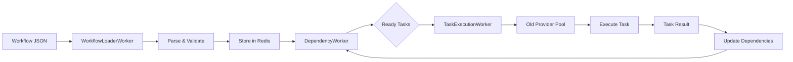

# Workflow-Provider Integration Audit

## Executive Summary

This audit examines how the current Gleitzeit 0.0.7 workflow system integrates with providers and identifies the changes needed to use the new clean provider architecture.

## Current State Analysis

### 1. Workflow Execution Architecture

```
[Workflow Submission] → [WorkflowLoaderWorker] → [Redis Streams]
                                ↓
                        [DependencyWorker]
                                ↓
                        [TaskExecutionWorker] ← Uses Old Providers
                                ↓
                        [Timer/Signal Workers]
```

### 2. Current Provider Usage

#### TaskExecutionWorker (`task_execution_worker.py`)
- Uses `SimpleProviderPool` from archived providers
- Direct instantiation of old providers (PythonProvider, ShellProvider)
- Provider selection based on task type
- No unified orchestration

#### Key Integration Points
```python
# Current implementation
self.provider_pool = SimpleProviderPool(
    max_size=10,
    redis_client=self.redis
)

# Provider execution
provider = await self.provider_pool.get_provider(task_type)
result = await provider.execute(task_data, workflow)
```

### 3. Worker Types and Their Provider Dependencies

| Worker | Provider Usage | Status |
|--------|---------------|---------|
| WorkflowLoaderWorker | None | ✅ Ready |
| DependencyWorker | None | ✅ Ready |
| TaskExecutionWorker | Old providers directly | ❌ Needs update |
| TaskExecutionWorkerV2 | Old provider registry | ❌ Needs update |
| TimerWorker | Handles timer tasks | ⚠️ May need coordination |
| SignalWorker | Handles signal tasks | ⚠️ May need coordination |

## Workflow Execution Flow

### 1. Current Flow



### 2. Task Types and Protocol Mapping

| Task Type | Old Provider | New Protocol | Status |
|-----------|-------------|--------------|---------|
| python | PythonProvider | python/v2 | ✅ Implemented |
| shell | ShellProvider | shell/v2 | ❌ Not yet |
| timer | TimerProvider | timer/v2 | ✅ Implemented |
| signal | SignalProvider | signal/v2 | ✅ Implemented |
| http | HTTPProvider | http/v2 | ❌ Not yet |
| llm | OllamaProvider | llm/v2 | ❌ Not yet |

## Integration Gaps Identified

### 1. Provider Interface Mismatch
- **Old**: `provider.execute(task_data, workflow)` - passes entire workflow context
- **New**: `provider.execute(ExecutionRequest)` - standardized request object

### 2. Response Format Differences
- **Old**: Returns raw result or TaskResult
- **New**: Returns ExecutionResponse with status, result, error, metrics

### 3. Status Handling
- **Old**: TaskResult with TaskStatus enum
- **New**: ExecutionResponse with string status ("success", "error", "sleeping", "waiting")

### 4. Provider Lifecycle
- **Old**: Created per worker, managed by SimpleProviderPool
- **New**: Centralized orchestrator with auto-scaling pools

### 5. Missing Features in New System
- Workflow context passing
- Task dependency information
- Result caching and sharing

## Integration Strategy

### Option 1: Adapter Pattern (Recommended)
Create a bridge that adapts the new provider system to work with existing workers:

```python
class WorkflowProviderBridge:
    """Bridges workflow workers with new provider system"""

    def __init__(self, orchestrator: ProviderOrchestrator):
        self.orchestrator = orchestrator

    async def execute_task(self, task_data: Dict, workflow: Dict) -> Any:
        # Convert workflow task to ExecutionRequest
        request = self.convert_to_request(task_data, workflow)

        # Execute through new provider
        response = await self.orchestrator.execute(
            task_type=task_data['type'],
            method=task_data.get('method'),
            params=self.prepare_params(task_data, workflow)
        )

        # Convert response to expected format
        return self.convert_response(response)
```

### Option 2: Direct Integration
Update TaskExecutionWorker to use new provider orchestrator directly:

```python
class TaskExecutionWorkerV3(BaseWorker):
    def __init__(self, config: WorkerConfig):
        super().__init__(config)
        self.orchestrator = ProviderOrchestrator(redis_client=self.redis)

    async def execute_task(self, task_data: Dict, workflow: Dict):
        response = await self.orchestrator.execute(
            task_type=task_data['type'],
            params=task_data
        )
        return response.result if response.status == "success" else None
```

### Option 3: Gradual Migration
1. Keep old providers for existing workflows
2. Use new providers for new task types
3. Migrate task types one by one

## Recommended Implementation Plan

### Phase 1: Bridge Implementation (Week 1)
1. Create `WorkflowProviderBridge` class
2. Implement request/response conversion
3. Handle workflow context passing
4. Map old task types to new protocols

### Phase 2: Worker Updates (Week 1-2)
1. Update TaskExecutionWorker to use bridge
2. Test with existing workflows
3. Ensure timer/signal coordination works
4. Handle sleeping/waiting states properly

### Phase 3: Enhanced Features (Week 2)
1. Add workflow context to ExecutionRequest metadata
2. Implement result caching in provider system
3. Add workflow-aware pooling (affinity)
4. Performance optimization

### Phase 4: Migration (Week 3)
1. Migrate existing workflows to new format
2. Update workflow examples
3. Document changes
4. Deprecation notices for old providers

## Critical Considerations

### 1. State Management
- Timer tasks return "sleeping" → TimerWorker handles wakeup
- Signal tasks return "waiting" → SignalWorker handles signal delivery
- Need coordination between providers and specialized workers

### 2. Workflow Context
- Current system passes entire workflow to providers
- New system needs workflow context in metadata
- Consider security implications of context sharing

### 3. Result Propagation
- Results need to flow back through dependency system
- Status updates must trigger dependency checks
- Event streams must remain sharded for locality

### 4. Performance Impact
- New pooling system may increase latency initially
- But provides better concurrency and scaling
- Need benchmarking before production

## Risk Assessment

| Risk | Impact | Mitigation |
|------|--------|------------|
| Breaking existing workflows | High | Use adapter pattern, extensive testing |
| Performance degradation | Medium | Benchmark, optimize pool sizes |
| State inconsistency | High | Careful status mapping, integration tests |
| Memory overhead from pools | Low | Configure appropriate pool limits |
| Provider failures | Medium | Health checks, circuit breakers |

## Success Metrics

1. **Compatibility**: All existing workflows continue to work
2. **Performance**: < 10ms overhead per task execution
3. **Scalability**: Support 100+ concurrent tasks per provider type
4. **Reliability**: 99.9% success rate for provider calls
5. **Monitoring**: Full visibility into provider pools and execution

## Next Steps

1. **Immediate** (Today):
   - Choose integration strategy (recommend Option 1)
   - Create WorkflowProviderBridge implementation
   - Write integration tests

2. **Short-term** (This Week):
   - Update TaskExecutionWorker
   - Test with sample workflows
   - Document changes

3. **Medium-term** (Next Week):
   - Migrate remaining providers (HTTP, Shell, LLM)
   - Performance optimization
   - Production readiness review

## Conclusion

The new provider system offers significant improvements in scalability and maintainability, but requires careful integration with the existing workflow execution system. The recommended adapter pattern approach minimizes risk while enabling gradual migration to the new architecture.

The key challenge is maintaining workflow state consistency while transitioning from the old provider model to the new pooled, orchestrated system. With proper bridging and testing, this transition can be achieved without disrupting existing workflows.