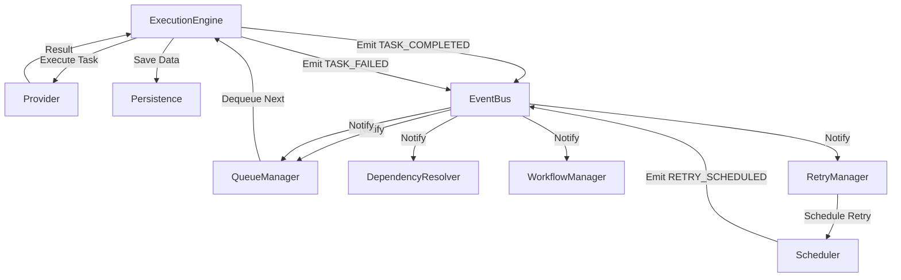

# Complete Architecture: Centralized Event System with Queue and Retry Management

## Core Principle: Single Responsibility, Event-Driven Coordination

### Component Responsibilities

#### 1. ExecutionEngine (Event Source)
- **Owns**: Task execution lifecycle
- **Emits**: All task state change events
- **Does NOT**: Directly manage queues or retries

#### 2. QueueManager (Event Consumer)
- **Owns**: Task queue state and ordering
- **Listens to**: Task events to update queue state
- **Does NOT**: Execute tasks or emit task events

#### 3. RetryManager (Event Consumer & Producer)
- **Owns**: Retry logic and scheduling
- **Listens to**: TASK_FAILED events
- **Emits**: RETRY_SCHEDULED events only
- **Does NOT**: Execute tasks or update task status directly

#### 4. Persistence (Pure Data Layer)
- **Owns**: Data storage and retrieval
- **Does NOT**: Emit any events

## Event Flow Architecture



## Detailed Event Flows

### 1. Task Execution Success Flow

```python
# execution_engine.py
async def _execute_task(self, task: Task):
    # Step 1: Mark as executing
    task.status = TaskStatus.EXECUTING
    task.started_at = datetime.utcnow()
    await self.persistence.save_task(task)
    
    # Emit TASK_STARTED event
    await self.event_bus.emit(create_task_started_event(
        task_id=task.id,
        workflow_id=task.workflow_id,
        source="execution_engine"
    ))
    
    try:
        # Step 2: Execute via provider
        result = await self._route_task_to_provider(task, params)
        
        # Step 3: Update task and save
        task.status = TaskStatus.COMPLETED
        task.completed_at = datetime.utcnow()
        
        task_result = TaskResult(
            task_id=task.id,
            status=TaskStatus.COMPLETED,
            result=result
        )
        
        # Save BEFORE emitting events
        await self.persistence.save_task(task)
        await self.persistence.save_task_result(task_result)
        
        # Step 4: Emit completion event
        await self.event_bus.emit(create_task_completed_event(
            task_id=task.id,
            workflow_id=task.workflow_id,
            result=result,
            source="execution_engine"
        ))
        
    except Exception as e:
        # Handle failure (see failure flow)
        ...
```

### 2. Task Failure and Retry Flow

```python
# execution_engine.py
async def _execute_task(self, task: Task):
    try:
        # ... execution code ...
    except Exception as e:
        # Step 1: Mark as failed
        task.status = TaskStatus.FAILED
        task.error_message = str(e)
        task.completed_at = datetime.utcnow()
        
        # Save immediately
        await self.persistence.save_task(task)
        
        # Step 2: Emit failure event
        await self.event_bus.emit(create_task_failed_event(
            task_id=task.id,
            workflow_id=task.workflow_id,
            error=str(e),
            attempt_number=task.attempt_count,
            is_retryable=self._is_retryable_error(e),
            source="execution_engine"
        ))
        # That's it! RetryManager handles the rest
```

### 3. Queue Manager Integration

```python
# task_queue/queue_manager.py
class QueueManager:
    def __init__(self, persistence, event_bus):
        self.persistence = persistence
        self.event_bus = event_bus
        self._register_handlers()
    
    def _register_handlers(self):
        """Register for events we care about"""
        self.event_bus.register(EventType.TASK_COMPLETED, self._on_task_completed)
        self.event_bus.register(EventType.TASK_FAILED, self._on_task_failed)
        self.event_bus.register(EventType.RETRY_SCHEDULED, self._on_retry_scheduled)
        self.event_bus.register(EventType.WORKFLOW_SUBMITTED, self._on_workflow_submitted)
    
    async def _on_task_completed(self, event: GleitzeitEvent):
        """Handle task completion"""
        task_id = event.data['task_id']
        workflow_id = event.data.get('workflow_id')
        
        # Remove from active queue
        await self._remove_from_queue(task_id)
        
        # Check for newly available tasks (dependencies satisfied)
        if workflow_id:
            ready_tasks = await self._find_ready_tasks(workflow_id)
            for task in ready_tasks:
                await self._enqueue_task(task)
                
                # Emit event that task is ready
                await self.event_bus.emit(create_task_ready_event(
                    task_id=task.id,
                    workflow_id=workflow_id,
                    source="queue_manager"
                ))
    
    async def _on_retry_scheduled(self, event: GleitzeitEvent):
        """Handle retry scheduling"""
        task_id = event.data['task_id']
        retry_at = event.data['retry_at']
        
        # Add to retry queue with scheduled time
        await self._add_to_retry_queue(task_id, retry_at)
    
    async def dequeue_next_task(self) -> Optional[Task]:
        """Get next task to execute"""
        # Check retry queue first
        retry_task = await self._check_retry_queue()
        if retry_task:
            return retry_task
        
        # Then check regular queue
        return await self._dequeue_by_priority()
```

### 4. Retry Manager Integration

```python
# core/retry_manager.py
class RetryManager:
    def __init__(self, persistence, event_bus, scheduler):
        self.persistence = persistence
        self.event_bus = event_bus
        self.scheduler = scheduler
        self._register_handlers()
    
    def _register_handlers(self):
        """Register for failure events"""
        self.event_bus.register(EventType.TASK_FAILED, self._on_task_failed)
    
    async def _on_task_failed(self, event: GleitzeitEvent):
        """Decide if task should be retried"""
        task_id = event.data['task_id']
        error = event.data['error']
        is_retryable = event.data.get('is_retryable', True)
        attempt_number = event.data.get('attempt_number', 1)
        
        if not is_retryable:
            logger.info(f"Task {task_id} failed with non-retryable error")
            return
        
        # Get task and check retry config
        task = await self.persistence.get_task(task_id)
        if not task or not task.retry_config:
            return
        
        # Check if we've exceeded max attempts
        if attempt_number >= task.retry_config.max_attempts:
            logger.info(f"Task {task_id} exceeded max retry attempts")
            # Emit final failure event
            await self.event_bus.emit(create_task_permanently_failed_event(
                task_id=task_id,
                reason="Max retry attempts exceeded",
                source="retry_manager"
            ))
            return
        
        # Calculate retry delay
        delay = self._calculate_backoff(
            attempt_number,
            task.retry_config.backoff_strategy,
            task.retry_config.base_delay
        )
        
        retry_at = datetime.utcnow() + timedelta(seconds=delay)
        
        # Update task for retry
        task.status = TaskStatus.RETRY_PENDING
        task.attempt_count = attempt_number + 1
        task.next_retry_at = retry_at
        await self.persistence.save_task(task)
        
        # Schedule the retry
        await self.scheduler.schedule(
            task_id=task_id,
            run_at=retry_at,
            callback=self._trigger_retry
        )
        
        # Emit retry scheduled event
        await self.event_bus.emit(create_retry_scheduled_event(
            task_id=task_id,
            retry_at=retry_at,
            attempt_number=attempt_number + 1,
            source="retry_manager"
        ))
    
    async def _trigger_retry(self, task_id: str):
        """Called by scheduler when retry time arrives"""
        task = await self.persistence.get_task(task_id)
        if not task:
            return
        
        # Update status
        task.status = TaskStatus.QUEUED
        await self.persistence.save_task(task)
        
        # Emit event to trigger re-execution
        await self.event_bus.emit(create_task_ready_for_retry_event(
            task_id=task_id,
            attempt_number=task.attempt_count,
            source="retry_manager"
        ))
```

### 5. Event-Driven Execution Loop

```python
# execution_engine.py
class ExecutionEngine:
    async def start(self, mode: ExecutionMode):
        """Start the execution engine"""
        if mode == ExecutionMode.EVENT_DRIVEN:
            # Register for events that trigger execution
            self.event_bus.register(EventType.TASK_READY, self._on_task_ready)
            self.event_bus.register(EventType.TASK_READY_FOR_RETRY, self._on_task_ready)
            self.event_bus.register(EventType.WORKFLOW_SUBMITTED, self._on_workflow_submitted)
            
            # Also run periodic check for queued tasks
            asyncio.create_task(self._periodic_queue_check())
    
    async def _on_task_ready(self, event: GleitzeitEvent):
        """Handle task ready events"""
        task_id = event.data['task_id']
        
        # Check if we have capacity
        if self._active_task_count >= self.max_concurrent_tasks:
            logger.debug(f"At capacity, task {task_id} will wait")
            return
        
        # Get task and execute
        task = await self.persistence.get_task(task_id)
        if task and task.status in [TaskStatus.QUEUED, TaskStatus.RETRY_PENDING]:
            asyncio.create_task(self._execute_task(task))
    
    async def _periodic_queue_check(self):
        """Periodically check for queued tasks"""
        while self.running:
            if self._active_task_count < self.max_concurrent_tasks:
                # Ask queue manager for next task
                task = await self.queue_manager.dequeue_next_task()
                if task:
                    asyncio.create_task(self._execute_task(task))
            
            await asyncio.sleep(1)  # Check every second
```

## Event Type Definitions

```python
# core/events.py
class EventType(Enum):
    # Task lifecycle (emitted by ExecutionEngine)
    TASK_STARTED = "task:started"
    TASK_COMPLETED = "task:completed"
    TASK_FAILED = "task:failed"
    
    # Task queue events (emitted by QueueManager)
    TASK_QUEUED = "task:queued"
    TASK_READY = "task:ready"
    TASK_DEQUEUED = "task:dequeued"
    
    # Retry events (emitted by RetryManager)
    RETRY_SCHEDULED = "retry:scheduled"
    TASK_READY_FOR_RETRY = "task:ready_for_retry"
    TASK_PERMANENTLY_FAILED = "task:permanently_failed"
    
    # Workflow events (emitted by WorkflowManager)
    WORKFLOW_SUBMITTED = "workflow:submitted"
    WORKFLOW_STARTED = "workflow:started"
    WORKFLOW_COMPLETED = "workflow:completed"
    WORKFLOW_FAILED = "workflow:failed"
    
    # System events
    CAPACITY_AVAILABLE = "system:capacity_available"
    CAPACITY_FULL = "system:capacity_full"
```

## Benefits of This Architecture

### 1. Clear Separation of Concerns
- ExecutionEngine: Executes tasks
- QueueManager: Manages task queues
- RetryManager: Handles retry logic
- Persistence: Stores data

### 2. No Circular Dependencies
- Events flow in one direction
- No component triggers its own events indirectly

### 3. Scalable
- Each component can be scaled independently
- Can add more event consumers without changing producers

### 4. Testable
- Each component can be tested in isolation
- Mock event bus for unit tests

### 5. Observable
- All state changes go through events
- Easy to add logging, metrics, tracing

## Implementation Priority

1. **Phase 1**: Core Event Flow
   - Fix ExecutionEngine to be sole source of task events
   - Remove events from persistence adapters

2. **Phase 2**: Queue Integration
   - Refactor QueueManager to be event-driven
   - Remove direct calls from ExecutionEngine to QueueManager

3. **Phase 3**: Retry Integration
   - Refactor RetryManager to be event-driven
   - Add scheduler for delayed retries

4. **Phase 4**: Workflow Management
   - Add WorkflowManager as event consumer
   - Handle workflow completion via events

5. **Phase 5**: Monitoring
   - Add metrics collector as event consumer
   - Add distributed tracing support