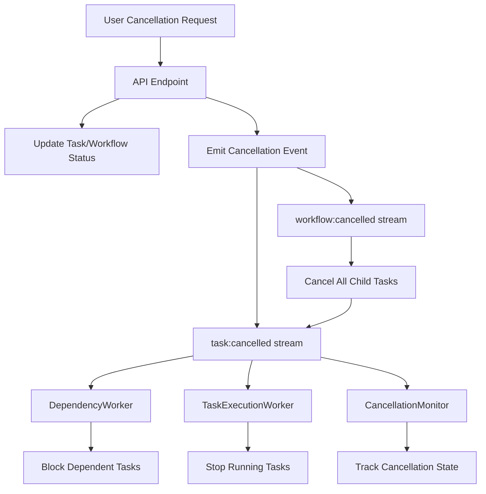

# Gleitzeit 0.0.7 Cancellation Feature Design

## 1. Overview

This design document outlines the implementation of comprehensive task and workflow cancellation functionality for Gleitzeit 0.0.7. The goal is to enable immediate and graceful cancellation of tasks and workflows, similar to the existing `task:blocked` pattern but with active event-driven cancellation propagation.

## 2. Design Principles

1. **Consistency with Existing Patterns**: Follow the `task:blocked` pattern for preventing execution
2. **Event-Driven Architecture**: Use Redis streams for real-time cancellation propagation
3. **Graceful Degradation**: Always attempt graceful shutdown before forcing termination
4. **Idempotency**: Multiple cancellation requests should be safe
5. **No Retry**: Cancelled tasks should never be retried (same as blocked tasks)

## 3. Architecture

### 3.1 Event Flow



### 3.2 State Transitions

```
PENDING -> CANCELLED (before execution)
RUNNING -> CANCELLING -> CANCELLED (during execution)
COMPLETED/FAILED/BLOCKED -> (no change, already terminal)
```

## 4. Detailed Implementation

### 4.1 Stream Structure

#### task:cancelled Stream
```json
{
  "task_id": "task_123",
  "workflow_id": "workflow_456",
  "reason": "user_requested|workflow_cancelled|dependency_cancelled",
  "cancelled_by": "user_id|system",
  "cancelled_at": "2024-01-15T10:30:00Z",
  "force_kill": false,
  "grace_period_ms": 5000
}
```

#### workflow:cancelled Stream
```json
{
  "workflow_id": "workflow_456",
  "reason": "user_requested|parent_cancelled",
  "cancelled_by": "user_id|system",
  "cancelled_at": "2024-01-15T10:30:00Z",
  "cascade": true,
  "force_kill": false
}
```

### 4.2 Worker Modifications

#### 4.2.1 DependencyWorker Enhancement

```python
class DependencyWorker(BaseWorker):
    async def get_consumer_streams(self):
        """Add cancellation streams to consumption list"""
        streams = await super().get_consumer_streams()
        for shard in self.assigned_shards:
            # Existing streams
            streams.append(f"workflow:submitted:shard:{shard}")
            streams.append(f"task:completed:shard:{shard}")
            streams.append(f"task:failed:shard:{shard}")

            # NEW: Cancellation streams
            streams.append(f"task:cancelled:shard:{shard}")
            streams.append(f"workflow:cancelled:shard:{shard}")
        return streams

    async def process_message(self, stream_key: str, message: dict):
        """Route messages to appropriate handlers"""
        if "task:cancelled" in stream_key:
            await self.handle_task_cancelled(message)
        elif "workflow:cancelled" in stream_key:
            await self.handle_workflow_cancelled(message)
        else:
            await super().process_message(stream_key, message)

    async def handle_task_cancelled(self, data: dict):
        """Handle task cancellation - block dependents"""
        task_id = data['task_id']
        workflow_id = data['workflow_id']

        # Get dependency graph
        graph = await self.get_dependency_graph(workflow_id)

        # Find all tasks that depend on the cancelled task
        dependent_tasks = self.find_dependent_tasks(graph, task_id)

        for dependent_id in dependent_tasks:
            # Check if task is already in terminal state
            status = await self.get_task_status(dependent_id)
            if status not in ['completed', 'failed', 'cancelled', 'blocked']:
                # Block the dependent task
                await self.block_task(
                    task_id=dependent_id,
                    workflow_id=workflow_id,
                    reason="dependency_cancelled",
                    blocked_by=task_id
                )

                # Emit blocked event for audit trail
                await self.emit_task_blocked(dependent_id, workflow_id, task_id)

        # Check if workflow should be marked as failed
        await self.check_workflow_completion(workflow_id)

    async def handle_workflow_cancelled(self, data: dict):
        """Handle workflow cancellation - cancel all tasks"""
        workflow_id = data['workflow_id']
        cascade = data.get('cascade', True)

        if not cascade:
            return

        # Get all tasks in workflow
        tasks = await self.get_workflow_tasks(workflow_id)

        for task_id in tasks:
            status = await self.get_task_status(task_id)

            # Only cancel non-terminal tasks
            if status not in ['completed', 'failed', 'cancelled', 'blocked']:
                # Emit task cancellation event
                await self.redis.xadd(
                    self.get_stream_key("task:cancelled", task_id),
                    {
                        b"task_id": task_id.encode(),
                        b"workflow_id": workflow_id.encode(),
                        b"reason": b"workflow_cancelled",
                        b"cancelled_at": datetime.utcnow().isoformat().encode()
                    }
                )
```

#### 4.2.2 TaskExecutionWorker Enhancement

```python
class TaskExecutionWorker(BaseWorker):
    def __init__(self, *args, **kwargs):
        super().__init__(*args, **kwargs)
        self.running_tasks = {}  # task_id -> RunningTask
        self.cancellation_monitor_task = None

    async def start(self):
        """Start worker with cancellation monitoring"""
        await super().start()
        # Start cancellation monitor
        self.cancellation_monitor_task = asyncio.create_task(
            self.monitor_cancellations()
        )

    async def monitor_cancellations(self):
        """Monitor for cancellation events for running tasks"""
        while self.running:
            try:
                # Subscribe to cancellation stream for our shard
                for shard in self.assigned_shards:
                    stream_key = f"task:cancelled:shard:{shard}"

                    # Non-blocking read with short timeout
                    messages = await self.redis.xread(
                        {stream_key.encode(): b'$'},
                        block=100  # 100ms timeout
                    )

                    for stream, stream_messages in messages:
                        for msg_id, data in stream_messages:
                            await self.handle_running_task_cancellation(data)

            except Exception as e:
                logger.error(f"Error monitoring cancellations: {e}")
                await asyncio.sleep(1)

    async def handle_running_task_cancellation(self, data: dict):
        """Handle cancellation of a running task"""
        task_id = data[b'task_id'].decode()

        if task_id in self.running_tasks:
            running_task = self.running_tasks[task_id]
            logger.info(f"Cancelling running task {task_id}")

            # Attempt graceful cancellation
            await self.cancel_running_task(running_task)

    async def cancel_running_task(self, running_task: 'RunningTask'):
        """Cancel a running task based on its handler type"""
        handler_type = running_task.handler_type

        if handler_type == 'python':
            await self.cancel_python_task(running_task)
        elif handler_type == 'http':
            await self.cancel_http_task(running_task)
        elif handler_type == 'ollama':
            await self.cancel_ollama_task(running_task)
        else:
            # Generic cancellation
            if running_task.task:
                running_task.task.cancel()

    async def cancel_python_task(self, running_task: 'RunningTask'):
        """Cancel a Python subprocess task"""
        if running_task.process:
            # Send SIGTERM for graceful shutdown
            running_task.process.terminate()

            # Wait for grace period
            grace_period = running_task.grace_period_ms / 1000.0
            try:
                await asyncio.wait_for(
                    running_task.process.wait(),
                    timeout=grace_period
                )
            except asyncio.TimeoutError:
                # Force kill if not terminated gracefully
                running_task.process.kill()
                await running_task.process.wait()

    async def cancel_http_task(self, running_task: 'RunningTask'):
        """Cancel an HTTP request"""
        if running_task.http_session:
            # Close the session to cancel requests
            await running_task.http_session.close()

    async def execute_task(self, task_data: dict):
        """Execute task with cancellation support"""
        task_id = task_data['id']

        # Check if already cancelled before starting
        status = await self.get_task_status(task_id)
        if status == 'cancelled':
            logger.info(f"Task {task_id} already cancelled, skipping execution")
            return

        # Create running task entry
        running_task = RunningTask(
            task_id=task_id,
            handler_type=task_data.get('protocol'),
            started_at=datetime.utcnow(),
            grace_period_ms=5000
        )

        self.running_tasks[task_id] = running_task

        try:
            # Execute with periodic cancellation checks
            result = await self.execute_with_cancellation_check(
                task_data,
                running_task
            )
            return result
        finally:
            # Clean up running task entry
            del self.running_tasks[task_id]

    async def execute_with_cancellation_check(
        self,
        task_data: dict,
        running_task: 'RunningTask'
    ):
        """Execute task with periodic cancellation checks"""
        task_id = task_data['id']

        # Create execution task
        execution_task = asyncio.create_task(
            self.handler_registry.execute(task_data)
        )
        running_task.task = execution_task

        # Create cancellation check task
        check_interval = 1.0  # Check every second

        while not execution_task.done():
            # Check if task was cancelled
            status = await self.get_task_status(task_id)
            if status == 'cancelled':
                execution_task.cancel()
                raise TaskCancelledException(f"Task {task_id} cancelled")

            # Wait for either completion or next check interval
            try:
                await asyncio.wait_for(
                    asyncio.shield(execution_task),
                    timeout=check_interval
                )
            except asyncio.TimeoutError:
                continue  # Continue checking

        return await execution_task

@dataclass
class RunningTask:
    """Represents a currently running task"""
    task_id: str
    handler_type: str
    started_at: datetime
    grace_period_ms: int = 5000
    task: Optional[asyncio.Task] = None
    process: Optional[asyncio.subprocess.Process] = None
    http_session: Optional[aiohttp.ClientSession] = None
```

### 4.3 Handler Modifications

#### 4.3.1 Base Handler Interface

```python
class BaseHandler(ABC):
    """Enhanced base handler with cancellation support"""

    @abstractmethod
    async def cancel(self, context: Dict[str, Any]) -> None:
        """
        Cancel the current execution.

        Args:
            context: Execution context containing task details
        """
        pass

    def supports_cancellation(self) -> bool:
        """Check if handler supports graceful cancellation"""
        return True
```

#### 4.3.2 Python Handler

```python
class PythonHandler(BaseHandler):
    """Python handler with subprocess cancellation"""

    async def execute(self, task: Dict) -> Dict:
        """Execute Python code with cancellation support"""
        proc = await asyncio.create_subprocess_exec(
            'python', '-c', task['params']['code'],
            stdout=asyncio.subprocess.PIPE,
            stderr=asyncio.subprocess.PIPE
        )

        # Store process for potential cancellation
        task['_process'] = proc

        try:
            stdout, stderr = await proc.communicate()
            return {
                'stdout': stdout.decode(),
                'stderr': stderr.decode(),
                'returncode': proc.returncode
            }
        finally:
            # Clean up process reference
            task.pop('_process', None)

    async def cancel(self, context: Dict[str, Any]) -> None:
        """Cancel running Python subprocess"""
        proc = context.get('_process')
        if proc and proc.returncode is None:
            proc.terminate()
            await asyncio.sleep(0.5)  # Grace period
            if proc.returncode is None:
                proc.kill()
```

### 4.4 API Enhancements

#### 4.4.1 Bulk Cancellation Endpoint

```python
@router.post("/workflows/cancel-batch")
async def cancel_workflows_batch(
    workflow_ids: List[str],
    reason: str = "user_requested",
    force: bool = False,
    redis: aioredis.Redis = Depends(get_redis)
):
    """Cancel multiple workflows in batch"""
    results = []

    for workflow_id in workflow_ids:
        try:
            result = await cancel_workflow_internal(
                workflow_id=workflow_id,
                reason=reason,
                force=force,
                redis=redis
            )
            results.append({
                "workflow_id": workflow_id,
                "status": "cancelled",
                "success": True
            })
        except Exception as e:
            results.append({
                "workflow_id": workflow_id,
                "status": "error",
                "success": False,
                "error": str(e)
            })

    return {
        "total": len(workflow_ids),
        "succeeded": sum(1 for r in results if r["success"]),
        "failed": sum(1 for r in results if not r["success"]),
        "results": results
    }
```

#### 4.4.2 Cancellation Status Endpoint

```python
@router.get("/tasks/{task_id}/cancellation-status")
async def get_cancellation_status(
    task_id: str,
    redis: aioredis.Redis = Depends(get_redis)
):
    """Get detailed cancellation status for a task"""
    state = await redis.hgetall(f"task:state:{task_id}")

    if not state:
        raise HTTPException(404, "Task not found")

    status = state.get(b"status", b"").decode()

    if status == "cancelled":
        return {
            "task_id": task_id,
            "status": "cancelled",
            "cancelled_at": state.get(b"cancelled_at", b"").decode(),
            "cancelled_by": state.get(b"cancelled_by", b"").decode(),
            "reason": state.get(b"cancelled_reason", b"").decode(),
            "was_running": state.get(b"was_running", b"false").decode() == "true",
            "graceful": state.get(b"graceful_cancel", b"true").decode() == "true"
        }
    elif status == "cancelling":
        return {
            "task_id": task_id,
            "status": "cancelling",
            "cancellation_requested_at": state.get(b"cancel_requested_at", b"").decode(),
            "grace_period_ends_at": state.get(b"grace_period_ends_at", b"").decode()
        }
    else:
        return {
            "task_id": task_id,
            "status": status,
            "cancellable": status not in ["completed", "failed", "blocked"]
        }
```

### 4.5 Cancellation Monitor Service

A new lightweight service to monitor and enforce cancellations:

```python
class CancellationMonitor:
    """
    Monitors cancellation requests and ensures they are enforced.
    Handles edge cases like stuck cancellations and force kills.
    """

    def __init__(self, redis: aioredis.Redis):
        self.redis = redis
        self.pending_cancellations = {}  # task_id -> CancellationRequest

    async def run(self):
        """Main monitoring loop"""
        tasks = [
            asyncio.create_task(self.monitor_cancellation_requests()),
            asyncio.create_task(self.enforce_cancellation_deadlines()),
            asyncio.create_task(self.cleanup_completed_cancellations())
        ]

        await asyncio.gather(*tasks)

    async def monitor_cancellation_requests(self):
        """Track new cancellation requests"""
        while True:
            # Read from cancellation streams
            streams = [f"task:cancelled:shard:{i}" for i in range(16)]

            messages = await self.redis.xread(
                {s.encode(): b'$' for s in streams},
                block=1000
            )

            for stream, stream_messages in messages:
                for msg_id, data in stream_messages:
                    await self.track_cancellation(data)

    async def track_cancellation(self, data: dict):
        """Track a cancellation request"""
        task_id = data[b'task_id'].decode()

        self.pending_cancellations[task_id] = CancellationRequest(
            task_id=task_id,
            requested_at=datetime.utcnow(),
            grace_period_ms=int(data.get(b'grace_period_ms', b'5000')),
            force_kill=data.get(b'force_kill', b'false') == b'true'
        )

    async def enforce_cancellation_deadlines(self):
        """Force kill tasks that exceed grace period"""
        while True:
            now = datetime.utcnow()

            for task_id, request in list(self.pending_cancellations.items()):
                deadline = request.requested_at + timedelta(
                    milliseconds=request.grace_period_ms
                )

                if now > deadline:
                    # Check if task is still running
                    status = await self.get_task_status(task_id)

                    if status in ['running', 'cancelling']:
                        logger.warning(
                            f"Force killing task {task_id} after grace period"
                        )
                        await self.force_kill_task(task_id)

                    # Remove from tracking
                    del self.pending_cancellations[task_id]

            await asyncio.sleep(1)
```

## 5. Testing Strategy

### 5.1 Unit Tests

```python
# test_cancellation.py

async def test_cancel_pending_task():
    """Test cancelling a task before it starts"""
    # Submit task
    task_id = await submit_task(sample_task)

    # Cancel immediately
    await cancel_task(task_id)

    # Verify task never executes
    await asyncio.sleep(2)
    status = await get_task_status(task_id)
    assert status == "cancelled"
    assert not await task_was_executed(task_id)

async def test_cancel_running_task():
    """Test cancelling a task during execution"""
    # Submit long-running task
    task = create_sleep_task(duration=10)
    task_id = await submit_task(task)

    # Wait for task to start
    await wait_for_status(task_id, "running")

    # Cancel task
    start_time = time.time()
    await cancel_task(task_id)

    # Verify task stops before completion
    await wait_for_status(task_id, "cancelled")
    elapsed = time.time() - start_time
    assert elapsed < 5  # Should cancel within grace period

async def test_cancel_workflow_cascades():
    """Test that workflow cancellation cascades to all tasks"""
    # Submit workflow with multiple tasks
    workflow = create_workflow_with_tasks(10)
    workflow_id = await submit_workflow(workflow)

    # Cancel workflow
    await cancel_workflow(workflow_id)

    # Verify all tasks are cancelled
    tasks = await get_workflow_tasks(workflow_id)
    for task in tasks:
        status = await get_task_status(task['id'])
        assert status in ["cancelled", "blocked"]

async def test_dependent_tasks_blocked_on_cancel():
    """Test that dependent tasks are blocked when dependency is cancelled"""
    # Create workflow with dependencies
    workflow = {
        "tasks": [
            {"id": "task1", "dependencies": []},
            {"id": "task2", "dependencies": ["task1"]},
            {"id": "task3", "dependencies": ["task2"]}
        ]
    }

    workflow_id = await submit_workflow(workflow)

    # Cancel task1
    await cancel_task("task1")

    # Verify task2 and task3 are blocked
    assert await get_task_status("task2") == "blocked"
    assert await get_task_status("task3") == "blocked"

    # Verify blocked reason
    state = await get_task_state("task2")
    assert state["blocked_by"] == "task1"
    assert state["blocked_reason"] == "dependency_cancelled"
```

### 5.2 Integration Tests

```python
async def test_concurrent_cancellations():
    """Test handling multiple concurrent cancellation requests"""
    # Submit 100 workflows
    workflow_ids = []
    for i in range(100):
        wf_id = await submit_workflow(create_simple_workflow())
        workflow_ids.append(wf_id)

    # Cancel all workflows concurrently
    cancel_tasks = [
        cancel_workflow(wf_id) for wf_id in workflow_ids
    ]
    await asyncio.gather(*cancel_tasks)

    # Verify all cancelled
    for wf_id in workflow_ids:
        status = await get_workflow_status(wf_id)
        assert status == "cancelled"

async def test_cancellation_during_retry():
    """Test cancelling a task during retry delay"""
    # Submit task that will fail and retry
    task = create_failing_task_with_retry(retries=3, delay=5)
    task_id = await submit_task(task)

    # Wait for first failure
    await wait_for_event("task:failed", task_id)

    # Cancel during retry delay
    await cancel_task(task_id)

    # Verify no retry occurs
    await asyncio.sleep(10)
    retry_count = await get_task_retry_count(task_id)
    assert retry_count == 0
```

### 5.3 Performance Tests

```python
async def test_cancellation_performance():
    """Test cancellation doesn't degrade system performance"""

    # Start performance monitoring
    start_metrics = await get_system_metrics()

    # Submit 1000 workflows
    workflows = [submit_workflow(create_workflow()) for _ in range(1000)]
    workflow_ids = await asyncio.gather(*workflows)

    # Cancel 500 workflows while others are running
    to_cancel = workflow_ids[:500]
    cancel_tasks = [cancel_workflow(wf_id) for wf_id in to_cancel]

    start_time = time.time()
    await asyncio.gather(*cancel_tasks)
    cancel_time = time.time() - start_time

    # Verify cancellation is fast
    assert cancel_time < 10  # Should cancel 500 workflows in < 10s

    # Verify system remains responsive
    end_metrics = await get_system_metrics()
    assert end_metrics.cpu_usage < start_metrics.cpu_usage * 1.5
    assert end_metrics.memory_usage < start_metrics.memory_usage * 1.5
```

## 6. Rollout Plan

### Phase 1: Foundation (Week 1)
- [ ] Implement cancellation stream consumption in DependencyWorker
- [ ] Add basic cancellation checks to TaskExecutionWorker
- [ ] Update task state transitions
- [ ] Basic unit tests

### Phase 2: Running Task Cancellation (Week 2)
- [ ] Implement RunningTask tracking
- [ ] Add handler-specific cancellation logic
- [ ] Implement grace period and force kill
- [ ] Integration tests

### Phase 3: Monitoring & Polish (Week 3)
- [ ] Deploy CancellationMonitor service
- [ ] Add metrics and monitoring
- [ ] Performance testing
- [ ] Documentation updates

### Phase 4: Production Rollout (Week 4)
- [ ] Deploy to staging environment
- [ ] Load testing
- [ ] Gradual production rollout
- [ ] Monitor for issues

## 7. Monitoring & Metrics

### Key Metrics to Track

1. **Cancellation Latency**
   - Time from cancellation request to task stopped
   - P50, P95, P99 percentiles

2. **Graceful vs Force Kills**
   - Percentage of tasks cancelled gracefully
   - Number of force kills required

3. **Stream Lag**
   - Unconsumed messages in cancellation streams
   - Consumer group lag

4. **System Impact**
   - CPU/Memory usage during mass cancellations
   - Redis operations per second

### Dashboards

```yaml
cancellation_dashboard:
  panels:
    - title: "Cancellation Request Rate"
      query: "rate(cancellation_requests_total[5m])"

    - title: "Cancellation Latency"
      query: "histogram_quantile(0.95, cancellation_latency_seconds)"

    - title: "Force Kill Rate"
      query: "rate(force_kills_total[5m])"

    - title: "Blocked Tasks Due to Cancellation"
      query: "sum(tasks_blocked{reason='dependency_cancelled'})"
```

## 8. Error Handling

### Common Error Scenarios

1. **Task Already Completed**
   - Return success with note that task was already complete
   - No action needed

2. **Redis Connection Lost During Cancellation**
   - Retry with exponential backoff
   - Log error if persistent failure

3. **Handler Doesn't Support Cancellation**
   - Mark task as cancelled in state
   - Let task complete naturally
   - Log warning

4. **Subprocess Won't Die**
   - Escalate from SIGTERM to SIGKILL
   - If still alive, mark as "zombie" and alert ops

## 9. Security Considerations

1. **Authorization**
   - Only task/workflow owner can cancel
   - Admin override capability
   - Audit all cancellation requests

2. **Resource Cleanup**
   - Ensure all resources are released on cancellation
   - Clean up temporary files
   - Close network connections

3. **Rate Limiting**
   - Limit cancellation requests per user
   - Prevent cancellation spam attacks

## 10. Future Enhancements

1. **Selective Cancellation**
   - Cancel specific task types within workflow
   - Pattern-based cancellation

2. **Cancellation Policies**
   - Configure per-workflow cancellation behavior
   - Auto-cancel on timeout

3. **Cancellation Webhooks**
   - Notify external systems of cancellations
   - Integration with monitoring tools

4. **Undo Cancellation**
   - Allow resuming cancelled workflows
   - Checkpoint and restore capability