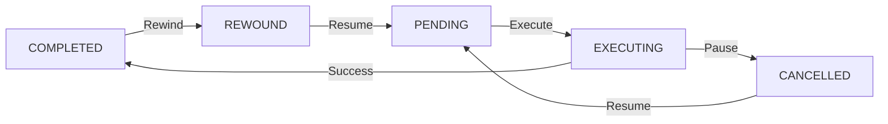

# Pause-Rewind Feature Documentation

## Overview

Gleitzeit now supports pausing workflows with optional "rewind" capability, allowing you to:
- **Pause**: Stop workflow execution gracefully
- **Rewind**: Reset tasks to re-execute from an earlier point
- **Resume**: Continue execution from where you paused or rewound

## Key Features

### ✅ Implemented in Phase 1
- Simple pause by cancelling running tasks
- Resume by requeuing cancelled tasks
- Rewind to specific task or step number
- Preserve old results for comparison
- Full authentication and authorization
- Event-driven coordination
- Redis-based scalable state management

### 🚀 Future Phase 2
- Provider-specific pause (Docker containers, etc.)
- Checkpoint-based resume
- Selective result preservation

## Usage Guide

### 1. Simple Pause and Resume

```python
import asyncio
from gleitzeit import GleitzeitClient

async def pause_resume_example():
    client = GleitzeitClient()
    await client.initialize()
    
    # Submit a workflow
    workflow_id = "wf-123"
    
    # Pause the workflow
    result = await client.pause_workflow(workflow_id)
    print(f"Paused: {result}")
    # Output: {"status": "paused", "cancelled_tasks": 2, ...}
    
    # Check pause status
    status = await client.get_pause_status(workflow_id)
    print(f"Pause info: {status}")
    
    # Resume the workflow
    result = await client.resume_workflow(workflow_id)
    print(f"Resumed: {result}")
    # Output: {"status": "resumed", "requeued_tasks": 2, ...}
```

### 2. Pause with Rewind to Task

```python
async def rewind_to_task_example():
    client = GleitzeitClient()
    await client.initialize()
    
    # Pause and rewind to specific task
    result = await client.pause_workflow(
        workflow_id="wf-123",
        rewind_to_task="data_validation",  # Task ID
        reason="Bad input data, need to reprocess"
    )
    
    print(f"Rewound to task: {result}")
    # Output: {
    #   "status": "paused",
    #   "rewind_task_id": "data_validation",
    #   "reset_tasks": 3,  # Tasks that will rerun
    #   "preserved_results": 3  # Old results saved
    # }
    
    # Resume - tasks from data_validation onward will rerun
    await client.resume_workflow(workflow_id)
```

### 3. Pause with Rewind to Step Number

```python
async def rewind_to_step_example():
    client = GleitzeitClient()
    await client.initialize()
    
    # Pause and rewind to step 3 (1-based indexing)
    result = await client.pause_workflow(
        workflow_id="wf-123",
        rewind_to_step=3,  # Step number
        reason="Retry from step 3 with new parameters"
    )
    
    print(f"Rewound to step 3: {result}")
    # Tasks at step 3 and beyond will be reset
```

## API Endpoints

### POST `/api/v1/workflows/{workflow_id}/pause`

Pause a workflow with optional rewind.

**Request Body:**
```json
{
    "rewind_to": "task_id",      // Optional: Task ID to rewind to
    "rewind_to_step": 3,          // Optional: Step number (1-based)
    "reason": "Debugging issue"    // Optional: Reason for pause
}
```

**Response:**
```json
{
    "workflow_id": "wf-123",
    "status": "paused",
    "rewind_point": 2,
    "rewind_task_id": "task_3",
    "reset_tasks": 2,
    "cancelled_tasks": 1,
    "preserved_results": 2
}
```

### POST `/api/v1/workflows/{workflow_id}/resume`

Resume a paused workflow.

**Response:**
```json
{
    "workflow_id": "wf-123",
    "status": "resumed",
    "requeued_tasks": 3,
    "message": "Tasks requeued for execution"
}
```

### GET `/api/v1/workflows/{workflow_id}/pause-status`

Get detailed pause metadata.

**Response:**
```json
{
    "paused": true,
    "paused_at": "2024-01-15T10:30:00Z",
    "paused_by": "user-123",
    "pause_reason": "Debugging",
    "rewind_point": 2,
    "rewind_task_id": "task_3",
    "cancelled_tasks": ["task_4"],
    "reset_tasks": ["task_3", "task_4", "task_5"],
    "preserved_results": {
        "task_3": {"old_result": "data"},
        "task_4": {"old_result": "processed"}
    }
}
```

## CLI Commands

### Pause Workflow
```bash
# Simple pause
gleitzeit workflow pause wf-123

# Pause with reason
gleitzeit workflow pause wf-123 --reason "Debugging issue"

# Pause with rewind to task
gleitzeit workflow pause wf-123 --rewind-to-task data_validation

# Pause with rewind to step
gleitzeit workflow pause wf-123 --rewind-to-step 3
```

### Resume Workflow
```bash
gleitzeit workflow resume wf-123
```

### Check Pause Status
```bash
gleitzeit workflow pause-status wf-123
```

## How Rewind Works

### Task Status Transitions



### Example Workflow Rewind

**Before Pause:**
```
Task1 [COMPLETED] → Task2 [COMPLETED] → Task3 [EXECUTING] → Task4 [PENDING]
```

**Pause with Rewind to Task2:**
```
Task1 [COMPLETED] → Task2 [REWOUND] → Task3 [REWOUND] → Task4 [REWOUND]
```

**After Resume:**
```
Task1 [COMPLETED] → Task2 [PENDING] → Task3 [PENDING] → Task4 [PENDING]
```

Tasks 2, 3, and 4 will execute again from the beginning.

## Authentication & Authorization

All pause/resume operations require:

1. **Authentication**: Valid session or API token
2. **Ownership Check**: User must own the workflow or have admin role
3. **Audit Trail**: All operations are logged with user ID and timestamp

### Permission Model

```python
# Required permissions
PAUSE_OWN = "workflows:pause"      # Can pause own workflows
PAUSE_ANY = "workflows:force_pause" # Can pause any workflow (admin)
REWIND = "workflows:rewind"        # Can use rewind feature
```

## Use Cases

### 1. Error Recovery
```python
# Workflow fails at task 5 due to external service error
await client.pause_workflow(workflow_id, rewind_to_task="task_4")
# Fix external service
await client.resume_workflow(workflow_id)
```

### 2. Data Correction
```python
# Discover bad input affected processing
await client.pause_workflow(workflow_id, rewind_to_task="data_validation")
# Update input data
await client.resume_workflow(workflow_id)
```

### 3. Debugging
```python
# Need to debug specific task with more logging
await client.pause_workflow(workflow_id, rewind_to_step=3)
# Enable debug logging
await client.resume_workflow(workflow_id)
```

### 4. Resource Management
```python
# Pause to free up resources
await client.pause_workflow(workflow_id)
# Later when resources available
await client.resume_workflow(workflow_id)
```

## Implementation Details

### Task Metadata During Rewind

When a task is rewound, its metadata includes:
- `rewound: true` - Indicates task was rewound
- `previous_result` - The result before rewind (for comparison)

### Preserved Results

Old results are stored in Redis pause metadata:
- Available for comparison after resume
- Can detect if rerun produced different results
- Useful for debugging non-deterministic issues

### Event Flow

1. `workflow.pausing` - Pause initiated
2. `workflow.paused` - Pause complete
3. `workflow.rewound` - Rewind complete (if applicable)
4. `workflow.resuming` - Resume initiated
5. `workflow.resumed` - Resume complete

## Monitoring & Observability

### Metrics
- `workflow_pauses_total` - Total pauses
- `workflow_resumes_total` - Total resumes
- `workflow_rewinds_total` - Total rewinds
- `pause_duration_seconds` - How long paused
- `tasks_reset_per_rewind` - Tasks reset count

### Logging
All pause/resume operations are logged with:
- User ID
- Workflow ID
- Action (pause/resume/rewind)
- Timestamp
- Reason (if provided)

## Limitations & Considerations

### Current Limitations
1. **Tasks must be idempotent** - They will rerun from beginning
2. **No partial progress** - Tasks restart completely (Phase 1)
3. **Resource cleanup** - Tasks should handle cancellation gracefully
4. **Result size** - Large results impact Redis memory

### Best Practices
1. **Use descriptive reasons** - Helps with debugging and audit
2. **Test idempotency** - Ensure tasks can safely rerun
3. **Monitor pause duration** - Long pauses consume Redis memory
4. **Clean up old pauses** - Remove pause metadata after completion

## Error Handling

### Common Errors

```python
try:
    await client.pause_workflow(workflow_id)
except Exception as e:
    if "not found" in str(e):
        print("Workflow doesn't exist")
    elif "Cannot pause workflow in completed state" in str(e):
        print("Workflow already finished")
    elif "Authentication required" in str(e):
        print("Need to login first")
```

### State Validation

The system prevents invalid transitions:
- Can't pause a completed/failed workflow
- Can't resume a non-paused workflow
- Can't rewind to non-existent task

## Testing

### Manual Testing
```bash
# Run the test script
python test_pause_rewind.py
```

### Integration Testing
```python
import pytest

async def test_pause_rewind():
    client = GleitzeitClient()
    await client.initialize()
    
    # Submit workflow
    workflow = create_test_workflow()
    result = await client.submit_workflow(workflow)
    
    # Test pause
    pause_result = await client.pause_workflow(
        result["workflow_id"],
        rewind_to_task="task_2"
    )
    assert pause_result["status"] == "paused"
    assert pause_result["reset_tasks"] > 0
    
    # Test resume
    resume_result = await client.resume_workflow(result["workflow_id"])
    assert resume_result["status"] == "resumed"
```

## Migration Guide

### For Existing Workflows
No changes needed - existing workflows continue to work. Pause/resume is opt-in.

### For New Workflows
Consider making tasks idempotent to support pause/rewind:

```python
# Good - Idempotent task
async def process_data(data_id: str):
    # Check if already processed
    if await is_processed(data_id):
        return await get_result(data_id)
    
    # Process data
    result = await do_processing(data_id)
    await save_result(data_id, result)
    return result

# Bad - Not idempotent
counter = 0
async def increment():
    global counter
    counter += 1  # Will double-count on rerun
    return counter
```

## Troubleshooting

### Workflow Won't Pause
- Check workflow status (must be RUNNING)
- Verify authentication
- Check ownership permissions

### Tasks Not Rewinding
- Ensure rewind_to_task exists in workflow
- Check step number is valid (1-based)
- Verify task dependencies

### Resume Fails
- Check workflow is actually paused
- Verify pause metadata exists
- Check Redis connectivity

## Future Enhancements (Phase 2)

### Provider-Specific Pause
```python
# Docker: Pause container without stopping
await client.pause_workflow(workflow_id, mode="suspend")

# Python: Checkpoint state
await client.pause_workflow(workflow_id, checkpoint=True)
```

### Selective Resume
```python
# Resume only specific tasks
await client.resume_workflow(
    workflow_id,
    tasks=["task_3", "task_4"]
)
```

### Branching
```python
# Keep both original and new results
await client.pause_workflow(
    workflow_id,
    rewind_to_task="task_2",
    branch=True  # Create new branch
)
```

## Support

For issues or questions about pause-rewind functionality:
1. Check this documentation
2. Review test examples in `test_pause_rewind.py`
3. Check logs for detailed error messages
4. Open an issue on GitHub