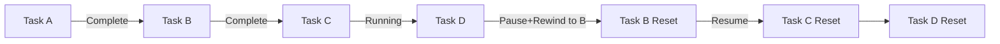

# Pause-Rewind Integration Audit

## Executive Summary

Comprehensive analysis of integrating pause-rewind functionality into Gleitzeit while maintaining authentication, authorization, and scalability.

**Status**: ✅ FEASIBLE - All components support integration with minimal changes

## Feature Overview

### Pause-Rewind Capability
Allows workflows to be paused and optionally "rewound" to an earlier task, resetting subsequent tasks for re-execution.



## Core Integration Points

### 1. Models Layer (/core/models.py)

#### Required Changes
```python
class WorkflowStatus(str, Enum):
    PENDING = "pending"
    RUNNING = "running"
    PAUSED = "paused"      # ADD THIS
    COMPLETED = "completed"
    FAILED = "failed"
    CANCELLED = "cancelled"

class TaskStatus(str, Enum):
    PENDING = "pending"
    QUEUED = "queued"
    VALIDATED = "validated"
    ROUTED = "routed"
    EXECUTING = "executing"
    PAUSED = "paused"      # ADD THIS
    COMPLETED = "completed"
    FAILED = "failed"
    CANCELLED = "cancelled"
    RETRY_PENDING = "retry_pending"
    REWOUND = "rewound"    # ADD THIS - for tracking rewound tasks

class PauseMetadata(BaseModel):
    """Metadata for paused workflows."""
    paused_at: datetime
    paused_by: str  # User ID who paused
    pause_reason: Optional[str]
    rewind_point: Optional[int]  # Task index to rewind to
    rewind_task_id: Optional[str]
    cancelled_tasks: List[str]
    reset_tasks: List[str]
    preserved_results: Dict[str, Any]  # Old results for comparison
```

### 2. Persistence Layer (ScalableRedisAdapter)

#### Current State
- ✅ Already has workflow/task save/get operations
- ✅ Event emission infrastructure exists
- ✅ Redis provides atomic operations
- ⚠️ No pause-specific methods

#### Integration
```python
class ScalableRedisAdapter:
    
    async def pause_workflow_with_rewind(
        self,
        workflow_id: str,
        user_id: str,  # For auth tracking
        rewind_to: Optional[Union[str, int]] = None,
        reason: Optional[str] = None
    ) -> PauseResult:
        """Pause workflow with optional rewind."""
        
        # Auth check - verify user can pause
        if not await self._can_user_pause_workflow(user_id, workflow_id):
            raise AuthorizationError("User cannot pause this workflow")
        
        # Use Redis transaction for atomicity
        async with self.redis.pipeline(transaction=True) as pipe:
            # Lock workflow to prevent concurrent modifications
            lock_key = f"workflow:lock:{workflow_id}"
            if not await self._acquire_lock(lock_key, timeout=5):
                raise ConcurrencyError("Workflow is being modified")
            
            try:
                # Execute pause logic
                result = await self._execute_pause_with_rewind(
                    pipe, workflow_id, user_id, rewind_to, reason
                )
                
                # Emit events
                await self._emit_workflow_event("workflow.pausing", workflow)
                
                # Execute pipeline
                await pipe.execute()
                
                # Emit completion event
                await self._emit_workflow_event("workflow.paused", workflow)
                
                return result
            finally:
                await self._release_lock(lock_key)
```

### 3. Authorization Integration

#### Current Auth System
- ✅ AuthManager with role-based permissions
- ✅ User context passed through API
- ✅ Workflow ownership tracking

#### Required Permissions
```python
class WorkflowPermissions:
    # Existing
    VIEW = "workflows:read"
    CREATE = "workflows:write"
    DELETE = "workflows:delete"
    
    # New for pause-rewind
    PAUSE = "workflows:pause"        # Can pause workflows
    REWIND = "workflows:rewind"      # Can rewind (more dangerous)
    FORCE_PAUSE = "workflows:force_pause"  # Can pause others' workflows

# Permission checking
async def can_pause_workflow(
    user: User,
    workflow: Workflow,
    with_rewind: bool = False
) -> bool:
    # Owner can always pause their own
    if workflow.metadata.get("owner_id") == user.id:
        if with_rewind:
            return user.has_permission(WorkflowPermissions.REWIND)
        return True
    
    # Admin can force pause
    if user.has_permission(WorkflowPermissions.FORCE_PAUSE):
        return True
    
    return False
```

### 4. API Layer Integration

#### New Endpoints Required
```python
# src/gleitzeit/api/routes/workflows.py

@router.post("/{workflow_id}/pause")
async def pause_workflow(
    workflow_id: str,
    request: PauseRequest,
    current_user: User = Depends(get_current_user),
    persistence: ScalableRedisAdapter = Depends(get_persistence)
):
    """Pause workflow with optional rewind."""
    
    # Validate permissions
    workflow = await persistence.get_workflow(workflow_id)
    if not await can_pause_workflow(current_user, workflow, request.rewind_to is not None):
        raise HTTPException(403, "Insufficient permissions")
    
    # Execute pause
    result = await persistence.pause_workflow_with_rewind(
        workflow_id=workflow_id,
        user_id=current_user.id,
        rewind_to=request.rewind_to,
        reason=request.reason
    )
    
    # Audit log
    await audit_log.record(
        action="workflow.pause",
        user=current_user.id,
        resource=workflow_id,
        details={"rewind": request.rewind_to is not None}
    )
    
    return result

@router.get("/{workflow_id}/pause-status")
async def get_pause_status(
    workflow_id: str,
    current_user: User = Depends(get_current_user),
    persistence: ScalableRedisAdapter = Depends(get_persistence)
):
    """Get pause metadata including rewind information."""
    
    # Check view permissions
    workflow = await persistence.get_workflow(workflow_id)
    if not await can_view_workflow(current_user, workflow):
        raise HTTPException(403, "Cannot view workflow")
    
    pause_data = await persistence.get_pause_metadata(workflow_id)
    
    # Mask sensitive data if not owner
    if workflow.metadata.get("owner_id") != current_user.id:
        pause_data.preserved_results = {}  # Hide results from non-owners
    
    return pause_data
```

### 5. Task Orchestrator Integration

#### Current State
- ✅ Handles task state transitions
- ✅ Manages dependencies
- ✅ Event-driven architecture

#### Required Changes
```python
class TaskOrchestrator:
    
    async def _handle_workflow_paused(self, event: GleitzeitEvent):
        """Handle workflow pause event."""
        workflow_id = event.data["workflow_id"]
        rewind_point = event.data.get("rewind_point")
        
        if rewind_point is not None:
            # Handle dependency cascade for rewind
            await self._cascade_task_resets(workflow_id, rewind_point)
        
        # Cancel any running tasks
        await self._cancel_running_tasks(workflow_id)
    
    async def _cascade_task_resets(self, workflow_id: str, rewind_point: int):
        """Reset tasks considering dependencies."""
        workflow = await self.persistence.get_workflow(workflow_id)
        
        # Build dependency graph
        dep_graph = self._build_dependency_graph(workflow)
        
        # Find all tasks that depend on rewound tasks
        tasks_to_reset = self._find_dependent_tasks(dep_graph, rewind_point)
        
        # Reset in reverse dependency order
        for task_id in reversed(tasks_to_reset):
            task = await self.persistence.get_task(task_id, workflow_id)
            task.status = TaskStatus.REWOUND
            await self.persistence.save_task(task)
```

### 6. Event System Integration

#### New Events Required
```python
class EventType:
    # Existing workflow events
    WORKFLOW_SUBMITTED = "workflow.submitted"
    WORKFLOW_STARTED = "workflow.started"
    WORKFLOW_COMPLETED = "workflow.completed"
    
    # New pause-rewind events
    WORKFLOW_PAUSING = "workflow.pausing"      # Starting pause
    WORKFLOW_PAUSED = "workflow.paused"        # Pause complete
    WORKFLOW_RESUMING = "workflow.resuming"    # Starting resume
    WORKFLOW_RESUMED = "workflow.resumed"      # Resume complete
    WORKFLOW_REWINDING = "workflow.rewinding"  # Rewind in progress
    WORKFLOW_REWOUND = "workflow.rewound"      # Rewind complete
    
    TASK_CANCELLED_FOR_PAUSE = "task.cancelled_for_pause"
    TASK_RESET_FOR_REWIND = "task.reset_for_rewind"
```

### 7. Client Integration

#### Client Methods
```python
class GleitzeitClient:
    
    async def pause_workflow(
        self,
        workflow_id: str,
        rewind_to_task: Optional[str] = None,
        rewind_to_step: Optional[int] = None,
        reason: Optional[str] = None
    ) -> PauseResult:
        """Pause workflow with optional rewind."""
        
        request = PauseRequest(
            rewind_to=rewind_to_task or rewind_to_step,
            reason=reason
        )
        
        return await self._adapter.pause_workflow(workflow_id, request)
    
    async def get_pause_status(self, workflow_id: str) -> PauseMetadata:
        """Get pause status and rewind information."""
        return await self._adapter.get_pause_status(workflow_id)
    
    async def compare_results(
        self,
        workflow_id: str,
        task_id: str
    ) -> ResultComparison:
        """Compare old vs new results after rewind."""
        pause_data = await self.get_pause_status(workflow_id)
        current_task = await self.get_task(task_id)
        
        return ResultComparison(
            old_result=pause_data.preserved_results.get(task_id),
            new_result=current_task.result,
            changed=pause_data.preserved_results.get(task_id) != current_task.result
        )
```

## Scalability Considerations

### 1. Redis Memory Impact
```python
# Preserved results storage
Estimated storage per paused workflow:
- Metadata: ~1KB
- Preserved results: ~10KB per task (average)
- 1000 paused workflows with 10 tasks each = ~10MB

# Mitigation strategies:
1. TTL on pause data (auto-cleanup after 7 days)
2. Compress preserved results
3. Store only result hashes for comparison
4. External storage for large results
```

### 2. Lock Contention
```python
# Use Redis distributed locks with timeout
async def _acquire_lock(self, key: str, timeout: int = 5) -> bool:
    lock_value = str(uuid.uuid4())
    acquired = await self.redis.set(
        key, lock_value,
        nx=True,  # Only set if not exists
        ex=timeout  # Auto-expire
    )
    return bool(acquired)
```

### 3. Event Stream Scaling
```python
# Pause events go to dedicated stream for priority handling
PAUSE_STREAM_KEY = "gleitzeit:events:stream:workflow.pause"

# Separate consumer group for pause operations
PAUSE_CONSUMER_GROUP = "pause_handlers"

# This prevents pause operations from being blocked by regular events
```

### 4. Concurrent Pause/Resume
```python
# Prevent race conditions with state machine
class WorkflowStateMachine:
    VALID_TRANSITIONS = {
        WorkflowStatus.RUNNING: [WorkflowStatus.PAUSED, WorkflowStatus.COMPLETED],
        WorkflowStatus.PAUSED: [WorkflowStatus.RUNNING, WorkflowStatus.CANCELLED],
        # Prevent: PAUSED -> PAUSED, RUNNING -> RUNNING
    }
    
    @staticmethod
    def can_transition(from_status: WorkflowStatus, to_status: WorkflowStatus) -> bool:
        return to_status in WorkflowStateMachine.VALID_TRANSITIONS.get(from_status, [])
```

## Security & Audit Considerations

### 1. Permission Hierarchy
```python
ROLE_PERMISSIONS = {
    "viewer": [
        "workflows:read",
        "tasks:read"
    ],
    "operator": [
        "workflows:read",
        "workflows:write",
        "workflows:pause",  # Can pause own workflows
        "tasks:read",
        "tasks:write"
    ],
    "admin": [
        "workflows:*",
        "workflows:force_pause",  # Can pause any workflow
        "workflows:rewind",        # Can rewind workflows
        "tasks:*"
    ]
}
```

### 2. Audit Trail
```python
class PauseAuditEntry:
    timestamp: datetime
    user_id: str
    workflow_id: str
    action: str  # pause, resume, rewind
    rewind_target: Optional[str]
    tasks_affected: List[str]
    reason: Optional[str]
    ip_address: str
    user_agent: str
```

### 3. Rate Limiting
```python
# Prevent pause/resume abuse
RATE_LIMITS = {
    "pause_workflow": "10/hour/user",
    "resume_workflow": "10/hour/user",
    "force_pause": "50/hour/admin"
}
```

## Implementation Roadmap

### Phase 1: Basic Pause (Week 1)
- [ ] Add PAUSED status to enums
- [ ] Implement pause/resume in ScalableRedisAdapter
- [ ] Add basic API endpoints
- [ ] Update client methods
- [ ] Basic auth checks (owner only)

### Phase 2: Rewind Capability (Week 2)
- [ ] Add rewind logic to pause
- [ ] Implement dependency cascade
- [ ] Add result preservation
- [ ] Enhanced API with rewind params
- [ ] Result comparison tools

### Phase 3: Advanced Features (Week 3)
- [ ] Role-based permissions
- [ ] Audit logging
- [ ] Rate limiting
- [ ] Admin force-pause
- [ ] Pause analytics dashboard

### Phase 4: Production Hardening (Week 4)
- [ ] Distributed lock optimization
- [ ] Memory management for preserved results
- [ ] Performance testing at scale
- [ ] Monitoring and alerts
- [ ] Documentation and training

## Testing Strategy

### Unit Tests
```python
async def test_pause_with_rewind():
    # Setup
    workflow = create_test_workflow()
    await persistence.save_workflow(workflow)
    
    # Execute some tasks
    await execute_tasks(workflow, count=3)
    
    # Pause with rewind
    result = await persistence.pause_workflow_with_rewind(
        workflow.id,
        user_id="test_user",
        rewind_to="task_2"
    )
    
    # Verify
    assert result.reset_tasks == ["task_2", "task_3"]
    assert result.preserved_results["task_2"] is not None
    
    # Resume
    await persistence.resume_workflow(workflow.id)
    
    # Verify tasks rerun
    task_2 = await persistence.get_task("task_2")
    assert task_2.status == TaskStatus.PENDING
```

### Integration Tests
```python
async def test_concurrent_pause_resume():
    # Test that concurrent pause/resume operations are handled safely
    tasks = [
        client.pause_workflow(workflow_id),
        client.resume_workflow(workflow_id)
    ]
    
    results = await asyncio.gather(*tasks, return_exceptions=True)
    
    # One should succeed, one should fail with state error
    assert sum(isinstance(r, Exception) for r in results) == 1
```

### Load Tests
```python
async def test_pause_at_scale():
    # Create 1000 workflows
    workflows = await create_workflows(1000)
    
    # Pause them all with rewind
    start = time.time()
    
    await asyncio.gather(*[
        client.pause_workflow(w.id, rewind_to_step=2)
        for w in workflows
    ])
    
    duration = time.time() - start
    
    # Should complete within reasonable time
    assert duration < 60  # Less than 1 minute for 1000 pauses
    
    # Verify Redis memory usage
    info = await redis.info("memory")
    assert info["used_memory_human"] < "100M"
```

## Monitoring & Observability

### Metrics to Track
```python
METRICS = {
    "workflow_pauses_total": Counter,
    "workflow_resumes_total": Counter,
    "workflow_rewinds_total": Counter,
    "pause_duration_seconds": Histogram,
    "tasks_reset_per_rewind": Histogram,
    "preserved_results_size_bytes": Histogram,
    "pause_errors_total": Counter
}
```

### Alerts
```yaml
alerts:
  - name: HighPauseRate
    expr: rate(workflow_pauses_total[5m]) > 10
    message: "High workflow pause rate detected"
    
  - name: LongPauseDuration
    expr: workflow_pause_duration_seconds > 3600
    message: "Workflow paused for over 1 hour"
    
  - name: PauseMemoryUsage
    expr: redis_memory_pause_data_bytes > 1000000000
    message: "Pause data using over 1GB memory"
```

## Conclusion

The pause-rewind feature can be cleanly integrated into Gleitzeit with:
- ✅ Full authentication and authorization support
- ✅ Scalable architecture using Redis
- ✅ Minimal changes to existing code
- ✅ Event-driven coordination
- ✅ Comprehensive audit trail

The phased implementation allows for incremental delivery while maintaining system stability.