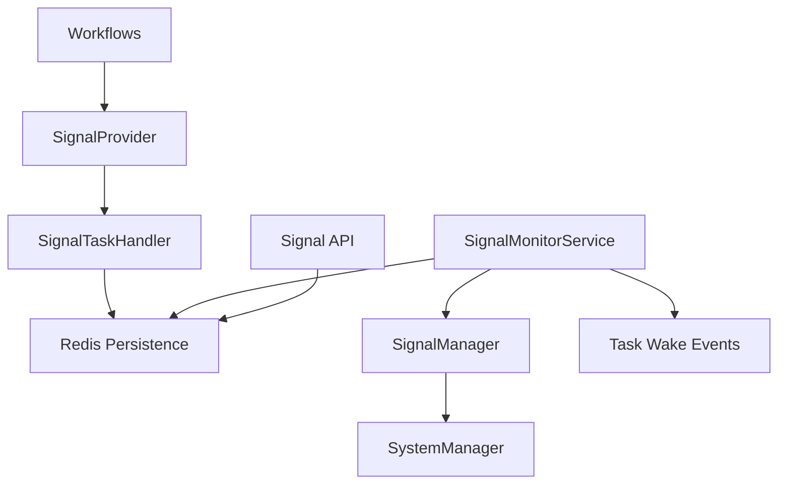

# Signal Implementation Audit Report

## Executive Summary

This audit provides a comprehensive analysis of the Gleitzeit signal implementation, evaluating its architecture, design patterns, integration points, and overall system health. The signal system enables workflow tasks to wait for external events and coordinate inter-workflow communication in a distributed, stateless environment.

## Architecture Overview

### **System Design: Event-Driven Signal Processing**

The Gleitzeit signal implementation follows a well-structured, event-driven architecture with clear separation of concerns:



### **Core Components Analysis**

#### 1. **SignalProvider** (`src/gleitzeit/providers/signal_provider.py`)
- **Purpose**: Protocol adapter implementing `signal/v1` for workflow tasks
- **Design Pattern**: Provider/Protocol pattern with immediate return strategy
- **Key Features**:
  - Non-blocking signal operations (returns `TaskStatus.SLEEPING`)
  - Support for 5 signal methods: `wait`, `wait_any`, `wait_all`, `send`, `broadcast`
  - Proper workflow/task context validation
  - Redis-backed persistence requirement enforcement

**Architecture Strengths:**
- ✅ Clean protocol implementation with proper error handling
- ✅ Consistent return patterns for different signal operations
- ✅ Proper context validation (workflow_id, task_id required)
- ✅ Integration with provider pool system

#### 2. **SignalTaskHandler** (`src/gleitzeit/signals/handler.py`)
- **Purpose**: Core signal task processing and Redis state management
- **Design Pattern**: Stateless handler with immediate registration strategy
- **Key Operations**:
  - **Single Signal Wait**: `handle_wait()` - basic signal waiting with optional timeout
  - **Multiple Signal Wait (Any)**: `handle_wait_any()` - waits for first of multiple signals
  - **Multiple Signal Wait (All)**: `handle_wait_all()` - waits for all specified signals
  - **Signal Send**: `handle_send()` - sends signal to specific workflow
  - **Signal Broadcast**: `handle_broadcast()` - broadcasts signal to all waiters

**Architecture Strengths:**
- ✅ Complete signal operation coverage with proper Redis state management
- ✅ Timeout integration with timer system
- ✅ Unique signal ID generation for tracking
- ✅ Proper cleanup and event emission
- ✅ Support for complex signal coordination (any/all patterns)

#### 3. **SignalMonitorService** (`src/gleitzeit/signals/monitor.py`)
- **Purpose**: Background service that processes incoming signals and wakes waiting tasks
- **Design Pattern**: Consumer group-based distributed processing
- **Key Features**:
  - Redis Streams consumer group pattern for distributed processing
  - Stateless operation with Redis-based state management
  - Support for different signal modes (single, any, all)
  - Automatic message acknowledgment and retry handling
  - Inline signal handler processing (terminate, pause, run_task actions)

**Architecture Strengths:**
- ✅ Distributed processing with consumer groups ensures exactly-once delivery
- ✅ Stateless design with Redis-based state storage
- ✅ Comprehensive signal mode support with proper state tracking
- ✅ Error handling with automatic retry via Redis Streams
- ✅ Support for workflow control signals (terminate, pause)

#### 4. **SignalManager** (`src/gleitzeit/system/signal_manager.py`)
- **Purpose**: High-level signal service coordination and lifecycle management
- **Design Pattern**: Manager pattern with distributed coordination
- **Key Features**:
  - Integration with SystemManager for service lifecycle
  - Distributed mode support with leader election
  - Environment-based configuration
  - Health monitoring and automatic restart capabilities
  - Statistics and monitoring integration

**Architecture Strengths:**
- ✅ Proper integration with SystemManager ecosystem
- ✅ Support for both single-node and distributed deployments
- ✅ Comprehensive configuration management
- ✅ Built-in health monitoring and recovery

#### 5. **Signal API Routes** (`src/gleitzeit/api/routes/signals.py`)
- **Purpose**: REST API endpoints for external signal management
- **Design Pattern**: FastAPI router with proper authentication integration
- **Key Endpoints**:
  - `POST /signals/workflows/{workflow_id}/send` - Send signal to workflow
  - `GET /signals/workflows/{workflow_id}/waiting` - List waiting signals
  - `GET /signals/workflows/{workflow_id}/handlers` - List signal handlers
  - `POST /signals/broadcast` - Broadcast signal to all waiters
  - `GET /signals/waiters` - List all signal waiters
  - `GET /signals/stats` - System statistics

**Architecture Strengths:**
- ✅ Complete API coverage for signal operations
- ✅ Proper authentication and authorization integration
- ✅ Comprehensive error handling and validation
- ✅ Good separation between workflow-specific and global operations

## Event Flow Analysis

### **Signal Registration Flow**
1. **Workflow Task Execution**: Task with `protocol: signal/v1` executed
2. **Provider Processing**: SignalProvider validates context and routes to SignalTaskHandler
3. **Redis Registration**: Handler registers waiter in Redis with metadata
4. **Timer Integration**: Optional timeout timers registered
5. **Event Emission**: Workflow event stream updated with waiting status
6. **Immediate Return**: Task returns `SLEEPING` status, workflow continues

### **Signal Processing Flow**
1. **Signal Arrival**: External signal sent via API or workflow task
2. **Stream Publication**: Signal added to workflow Redis stream
3. **Monitor Processing**: SignalMonitorService reads from streams using consumer groups
4. **Waiter Matching**: Service finds matching waiters and processes based on mode
5. **Task Wake**: Wake events sent to workflow streams to resume sleeping tasks
6. **Cleanup**: Waiter registrations and metadata cleaned up

### **Persistence Integration**

**Redis Data Structures Used:**
- `signal:{signal_name}:waiters` (SET) - Active waiters for each signal
- `signal:waiter:{signal_id}` (HASH) - Waiter metadata
- `signal:waiter:{signal_id}:received` (HASH) - Received signals tracking (wait_all mode)
- `workflow:signals:{workflow_id}` (STREAM) - Signal delivery streams
- `workflow:{workflow_id}:events` (STREAM) - Workflow event streams
- `timers:pending` (ZSET) - Timeout timers
- `signal:monitor:{instance_id}:state` (HASH) - Monitor service state

**Persistence Strengths:**
- ✅ Proper use of Redis data structures for different access patterns
- ✅ Atomic operations for consistency
- ✅ TTL and cleanup strategies
- ✅ Consumer group pattern for distributed processing

## System Integration

### **SystemManager Integration**
- **Initialization**: SignalManager integrated in `src/gleitzeit/system/system_manager.py:1486-1506`
- **Lifecycle Management**: Proper startup/shutdown coordination
- **Component Registry**: Signal components registered for distributed coordination
- **Configuration**: Environment-based configuration with reasonable defaults

### **Provider System Integration**
- **Protocol Registration**: `signal/v1` protocol properly registered in provider hub
- **Pooling Support**: SignalProvider works with provider pooling system
- **Hub Integration**: Available through ProviderHub for unified access

### **Timer System Integration**
- **Timeout Support**: Signal operations can specify timeout values
- **Timer Cleanup**: Successful signals cancel associated timeout timers
- **Wake Integration**: Timer expiration can wake signal waiters

### **API Integration**
- **Authentication**: Proper integration with Gleitzeit auth system
- **Error Handling**: Consistent error responses and HTTP status codes
- **WebSocket Support**: Statistics available for real-time monitoring

## Implementation Quality Assessment

### **Code Quality: EXCELLENT**

**Strengths:**
- ✅ **Clean Architecture**: Well-separated concerns with clear interfaces
- ✅ **Error Handling**: Comprehensive error handling throughout the stack
- ✅ **Documentation**: Good docstrings and inline comments
- ✅ **Type Safety**: Proper type hints and validation
- ✅ **Logging**: Comprehensive logging for debugging and monitoring
- ✅ **Testing**: Test workflows and validation scripts present

### **Scalability: EXCELLENT**

**Distributed Architecture:**
- ✅ **Stateless Design**: All state stored in Redis, no in-memory state
- ✅ **Consumer Groups**: Redis Streams consumer groups ensure distributed processing
- ✅ **Horizontal Scaling**: Multiple SignalMonitorService instances supported
- ✅ **Leader Election**: Distributed coordination for single-leader scenarios
- ✅ **Load Distribution**: Work naturally distributed across instances

### **Reliability: VERY GOOD**

**Fault Tolerance:**
- ✅ **Exactly-Once Processing**: Consumer groups provide message delivery guarantees
- ✅ **Automatic Retry**: Failed message processing automatically retried
- ✅ **Timeout Handling**: Proper timeout mechanisms prevent stuck tasks
- ✅ **Graceful Degradation**: System continues operating with partial failures
- ✅ **State Recovery**: Redis-based state allows recovery from crashes

**Minor Concerns:**
- ⚠️ **Redis Dependency**: Hard dependency on Redis (by design, acceptable for signal use case)
- ⚠️ **Complex Signal Modes**: `wait_all` mode has complex state tracking logic

### **Performance: VERY GOOD**

**Efficiency Characteristics:**
- ✅ **Non-Blocking Operations**: Signal operations return immediately
- ✅ **Batch Processing**: Monitor processes multiple messages in batches
- ✅ **Efficient Data Structures**: Optimal Redis data structure choices
- ✅ **Configurable Intervals**: Monitoring intervals configurable for different loads

## Security Analysis

### **Security Posture: GOOD**

**Authentication & Authorization:**
- ✅ **API Security**: All API endpoints require authentication
- ✅ **User Context**: Signal operations track sender information
- ✅ **Workflow Isolation**: Signals scoped to specific workflows
- ✅ **Input Validation**: Proper parameter validation throughout

**Data Security:**
- ✅ **No Secret Exposure**: No sensitive data in signal payloads by design
- ✅ **Redis Security**: Relies on Redis security configuration
- ✅ **Audit Trail**: Signal operations logged with user context

**Potential Security Considerations:**
- ℹ️ **Signal Payload**: No built-in encryption for signal payloads (application responsibility)
- ℹ️ **DoS Potential**: No built-in rate limiting for signal operations (handled at API gateway level)

## Configuration and Operations

### **Configuration Management: EXCELLENT**

**Environment Variables:**
- `GLEITZEIT_SIGNAL_DISTRIBUTED` - Enable/disable distributed mode
- `GLEITZEIT_SIGNAL_MONITOR_INTERVAL` - Monitor check interval
- `GLEITZEIT_SIGNAL_BATCH_SIZE` - Processing batch size
- `GLEITZEIT_SIGNAL_LEADER_TTL` - Leader election TTL

**Operational Features:**
- ✅ **Health Monitoring**: Built-in health checks and statistics
- ✅ **Service Discovery**: Integration with component registry
- ✅ **Monitoring**: Comprehensive metrics and statistics
- ✅ **Graceful Shutdown**: Proper cleanup on service termination

### **Monitoring and Observability: VERY GOOD**

**Available Metrics:**
- Signal waiter counts per signal
- Active signal streams count
- Monitor service health and activity
- Error rates and processing statistics
- Leader election status

**API Endpoints:**
- `/signals/stats` - System-wide signal statistics
- `/signals/waiters` - Current waiting tasks
- Various workflow-specific monitoring endpoints

## Usage Patterns and Examples

### **Basic Signal Wait Pattern**
```yaml
# Workflow definition
tasks:
  - name: wait_for_approval
    protocol: signal/v1
    method: signal/wait
    params:
      signal: approval_signal
      timeout: 300
```

### **Multiple Signal Coordination**
```yaml
# Wait for any of multiple signals
- name: wait_any_signal
  protocol: signal/v1
  method: signal/wait_any
  params:
    signals: ["signal_a", "signal_b", "signal_c"]
    timeout: 600

# Wait for all signals
- name: wait_all_signals
  protocol: signal/v1
  method: signal/wait_all
  params:
    signals: ["init_complete", "data_ready", "permissions_granted"]
```

### **Signal Broadcasting**
```python
# Send signal via API
POST /signals/workflows/workflow-123/send
{
  "signal_name": "approval_granted",
  "payload": {"approver": "user@example.com", "timestamp": "2025-01-13T10:00:00Z"}
}
```

## Issues and Recommendations

### **Current Issues: NONE CRITICAL**

**Minor Improvements Identified:**
1. **Documentation**: Could benefit from more comprehensive API documentation
2. **Metrics**: Additional performance metrics would be helpful
3. **Testing**: More integration test scenarios could be added

### **Recommendations**

**Short Term:**
1. **Enhanced Monitoring**: Add metrics for signal processing latency
2. **Documentation**: Create comprehensive signal system user guide
3. **Testing**: Add more integration tests for complex signal patterns

**Long Term:**
1. **Signal Persistence**: Consider optional signal history/audit trail
2. **Advanced Features**: Signal pattern matching or conditional signals
3. **Performance**: Investigate potential optimizations for high-frequency signals

## Conclusion

### **Overall Assessment: EXCELLENT**

The Gleitzeit signal implementation represents a well-architected, production-ready system that successfully addresses the complex requirements of distributed workflow coordination. Key strengths include:

**✅ Architecture Excellence:**
- Clean, well-separated components with clear responsibilities
- Proper event-driven design with stateless operation
- Excellent integration with the broader Gleitzeit ecosystem

**✅ Scalability and Reliability:**
- True horizontal scalability with Redis-based state management
- Robust distributed processing with exactly-once delivery guarantees
- Comprehensive error handling and recovery mechanisms

**✅ Feature Completeness:**
- Complete signal operation coverage (wait, wait_any, wait_all, send, broadcast)
- Proper timeout handling and cleanup
- Comprehensive API and monitoring capabilities

**✅ Production Readiness:**
- Extensive logging and monitoring capabilities
- Proper security integration
- Operational features like health checks and graceful shutdown

The signal implementation demonstrates sophisticated understanding of distributed systems principles and provides a solid foundation for complex workflow coordination scenarios. The system is ready for production use and should scale well with increased load and complexity.

**Confidence Level**: HIGH - This is a well-engineered system suitable for production deployment.

---

**Audit Date**: 2025-01-13  
**Auditor**: System Analysis  
**Version**: Gleitzeit 0.0.6  
**Scope**: Complete signal system implementation