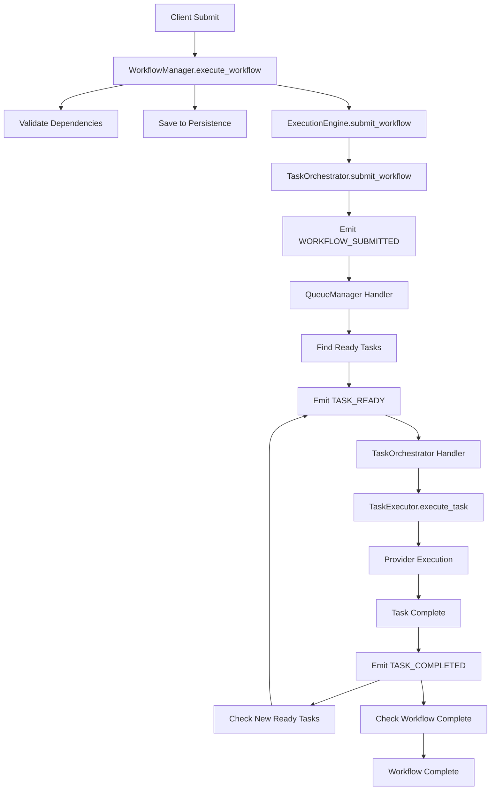

# Workflow Lifecycle Audit - Complete Analysis

## 1. Workflow Submission Path

### Entry Point: Client Submission
```
Client (API/CLI) 
  → NativeAdapter.submit_workflow()
  → WorkflowManager.execute_workflow()
```

### WorkflowManager Processing
**File**: `src/gleitzeit/core/stateless_workflow_manager.py`

1. **Validation** (line 124-128):
   - Calls `dependency_manager.validate_workflow()`
   - Checks for circular dependencies
   - Validates task references

2. **Persistence** (line 130-140):
   - Saves workflow execution record
   - Updates workflow status to RUNNING
   - Saves workflow to persistence

3. **Submission to Engine** (line 150):
   - Calls `execution_engine.submit_workflow(workflow)`

### ExecutionEngine Processing
**File**: `src/gleitzeit/core/execution_engine_v2.py`

1. **Delegation** (line 273):
   - Calls `task_orchestrator.submit_workflow(workflow)`

### TaskOrchestrator Processing
**File**: `src/gleitzeit/core/task_orchestrator.py`

1. **Save Workflow** (line 377-383):
   - Saves workflow to persistence
   - Saves all tasks individually

2. **Event Emission** (line 387-395):
   - Emits `WORKFLOW_SUBMITTED` event
   - Contains workflow_id and task_count

## 2. Task Scheduling Path

### Event Handler Registration
**File**: `src/gleitzeit/task_queue/task_queue.py`

The QueueManager registers for `WORKFLOW_SUBMITTED` events (line 653):
```python
self.event_bus.register(EventType.WORKFLOW_SUBMITTED, self._on_workflow_submitted)
```

### Initial Task Identification
**Handler**: `QueueManager._on_workflow_submitted()` (line 702-720)

1. Gets workflow from persistence
2. Identifies tasks with no dependencies
3. Calls `_enqueue_task_with_ready_event()` for each

### Task Enqueueing
**Method**: `_enqueue_task_with_ready_event()` (line 722-738)

1. Updates task status to QUEUED
2. Saves task to persistence
3. Emits `TASK_READY` event

## 3. Task Execution Path

### Task Ready Handler
The execution engine registers for `TASK_READY` events:

**File**: `src/gleitzeit/core/task_orchestrator.py`
- Registers handler in `__init__` (line 106)
- Handler: `_on_task_ready()` (line 279-295)

### Execution Flow
1. **Task Assignment**:
   - Gets task from persistence
   - Assigns to provider/executor
   
2. **Actual Execution**:
   - `TaskExecutor.execute_task()` (src/gleitzeit/core/task_executor.py)
   - Routes to appropriate provider
   - Provider executes task

3. **Result Handling**:
   - Updates task with result
   - Saves to persistence
   - Emits completion event

## 4. Task Completion Path

### Completion Event
When task completes, `TASK_COMPLETED` event is emitted

### Dependency Resolution
**Handler**: Various components listen for `TASK_COMPLETED`:

1. **TaskOrchestrator** (line 308-327):
   - Marks task as completed in tracking
   - Checks workflow completion

2. **QueueManager** (line 674-686):
   - Processes task completion
   - Checks for newly ready tasks

3. **StatelessDependencyManager**:
   - Updates dependency graph
   - Identifies newly ready tasks

### Workflow Completion Check
**File**: `src/gleitzeit/core/stateless_dependency_manager.py`
Method: `_check_workflow_completion()` (line 596-615)

1. Gets all tasks for workflow
2. Checks if all are completed
3. Updates workflow status if complete

## Issues Found

### 🔴 Critical Issues

1. **Event Handler Registration Timing**
   - Pub/Sub handlers use async registration
   - Race condition: event may be emitted before handler is subscribed
   - Solution: Ensure handlers are fully subscribed before processing

2. **Task Execution Backend Not Connected**
   - TASK_READY events are emitted
   - But no worker/executor is processing them
   - The TaskExecutor needs to be properly wired

3. **Provider Registration Missing**
   - Python provider not registered in registry
   - Task execution fails because no provider found

### 🟡 Important Issues

1. **Workflow Status Updates**
   - Multiple components try to update workflow status
   - Potential race conditions without proper locking

2. **Task Status Transitions**
   - Status changes not always atomic
   - Could lead to inconsistent state

### 🟢 Working Components

1. **Workflow Submission**: ✅ Properly saves and tracks
2. **Event Emission**: ✅ Events are published correctly
3. **Pub/Sub Infrastructure**: ✅ Messages are delivered
4. **Dependency Validation**: ✅ Circular deps detected

## Complete Lifecycle Flow



## Root Cause Analysis

The main issue is that **task execution is not happening** because:

1. **Missing Worker Loop**: No component is actively pulling TASK_READY events and executing them
2. **Provider Not Initialized**: The Python provider isn't properly registered
3. **Async Registration Delay**: Events may be lost during handler registration

## Recommended Fixes

1. **Add Task Worker**:
```python
async def task_worker(event_bus, executor):
    async def handle_task_ready(event):
        task_id = event.data['task_id']
        task = await persistence.get_task(task_id)
        result = await executor.execute_task(task)
        # Emit completion
    
    await event_bus.register_handler(EventType.TASK_READY, handle_task_ready)
```

2. **Ensure Provider Registration**:
```python
# In SystemManager._start_core_components
registry.register_provider('python/v1', python_provider)
```

3. **Fix Async Registration**:
```python
# Wait for subscription before continuing
await event_bus.register_handler(event_type, handler)
await asyncio.sleep(0.1)  # Give time for subscription
```