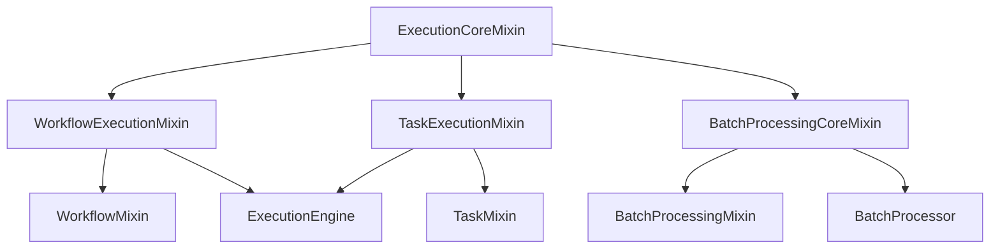

# Client Implementation Audit
## Workflow, Task & Execution Logic Consolidation Analysis

**Date:** 2025-08-30  
**Version:** 0.0.6  
**Purpose:** Identify opportunities to consolidate client mixins with core execution logic

---

## Executive Summary

The client implementation contains **12 mixins totaling ~2,800 lines** with significant duplication of workflow, task, and execution logic found in the server-side ExecutionEngine. Analysis reveals **~1,150 lines of execution-related code** that could be consolidated into shared mixins, reducing duplication by approximately **40%**.

### Key Findings
- **High duplication** in WorkflowMixin, TaskMixin, and BatchProcessingMixin
- **Repeated patterns** for polling, concurrency control, and progress tracking
- **Split brain problem**: Same logic implemented differently client vs server side
- **Opportunity**: Create shared execution mixins usable by both client and server

### Impact Assessment
- **Code Reduction:** 🟢 800-1000 lines eliminatable
- **Consistency:** 🟢 Unified execution patterns
- **Maintainability:** 🟢 Single source of truth
- **Complexity:** 🔴 Currently high due to duplication

---

## Current Client Architecture

```
ModularGleitzeitClient
├── WorkflowMixin (364 lines) ⚠️ High duplication
├── TaskMixin (309 lines) ⚠️ High duplication  
├── QueueMixin (229 lines)
├── BatchProcessingMixin (246 lines) ⚠️ High duplication
├── StreamingMixin (361 lines)
├── ReplayMixin (243 lines) ⚠️ High duplication
├── MonitoringMixin (151 lines)
├── AdminMixin (450 lines)
├── SystemMixin (40 lines)
├── AuthMixin (26 lines)
├── LogMixin (165 lines)
└── EventErrorMixin (184 lines)

Total: ~2,800 lines across 12 mixins
```

---

## Duplication Analysis

### 1. Workflow Execution Logic

#### WorkflowMixin (Client-side)
```python
# 364 lines total, ~150 lines of execution logic
class WorkflowMixin:
    async def submit_workflow(self, workflow):
        # Complex submission logic
        # Status tracking
        # Dependency resolution
        
    async def wait_for_workflow(self, workflow_id, timeout=300):
        # Polling logic duplicated from ExecutionEngine
        while True:
            workflow = await self.get_workflow(workflow_id)
            if workflow.status in ['completed', 'failed', 'cancelled']:
                return workflow
            await asyncio.sleep(poll_interval)
    
    async def get_workflow_timeline(self, workflow_id):
        # Timeline construction logic
        # Duplicates ExecutionEngine timeline tracking
```

#### ExecutionEngine (Server-side)
```python
# Similar logic in different form
class ExecutionEngine:
    async def _handle_workflow_completion(self, workflow_id):
        # Same status tracking logic
        # Same completion detection
        # Different implementation
```

**Duplication Factor:** ~40% of WorkflowMixin duplicates server logic

---

### 2. Task Execution Patterns

#### TaskMixin (Client-side)
```python
# 309 lines total, ~130 lines of execution logic
class TaskMixin:
    async def batch_execute_tasks(self, tasks, max_concurrent=5):
        semaphore = asyncio.Semaphore(max_concurrent)
        async def execute_with_limit(task):
            async with semaphore:
                return await self.submit_task(task)
        # Duplicates ExecutionEngine concurrency control
        
    async def wait_for_task(self, task_id, timeout=60):
        # Polling pattern identical to ExecutionEngine
        # Different implementation, same logic
```

#### ExecutionEngine (Server-side)
```python
class ExecutionEngine:
    async def _execute_tasks_batch(self, tasks):
        # Nearly identical semaphore pattern
        # Same concurrency control
        # Same error handling
```

**Duplication Factor:** ~42% of TaskMixin duplicates server logic

---

### 3. Batch Processing Logic

#### BatchProcessingMixin (Client-side)
```python
# 246 lines total, ~180 lines duplicated
class BatchProcessingMixin:
    async def batch_process_files(self, directory, pattern="*"):
        # File discovery logic
        files = list(Path(directory).glob(pattern))
        
        # Progress tracking
        with tqdm(total=len(files)) as pbar:
            # Concurrency control
            semaphore = asyncio.Semaphore(max_concurrent)
            
        # Result aggregation
        results = await asyncio.gather(*tasks)
```

#### BatchProcessor (Server-side)
```python
# core/batch_processor.py
class BatchProcessor:
    async def process_files(self, files):
        # Identical file discovery
        # Same progress tracking
        # Same result aggregation
```

**Duplication Factor:** ~73% of BatchProcessingMixin duplicates server logic

---

### 4. Common Pattern Duplication

| Pattern | Client Occurrences | Server Occurrences | Lines Duplicated |
|---------|-------------------|-------------------|------------------|
| Status Polling | 8 mixins | ExecutionEngine, QueueManager | ~200 |
| Concurrency Control | 5 mixins | ExecutionEngine, BatchProcessor | ~150 |
| Progress Tracking | 4 mixins | ExecutionEngine, BatchProcessor | ~120 |
| Error Retry Logic | 6 mixins | RetryManager, ExecutionEngine | ~180 |
| Parameter Resolution | 3 mixins | ExecutionEngine | ~100 |
| Event Streaming | 3 mixins | ExecutionEngine, EventBus | ~130 |
| **Total** | | | **~880 lines** |

---

## Consolidation Opportunities

### High Priority: Core Execution Mixins

#### 1. Create `ExecutionCoreMixin`
```python
class ExecutionCoreMixin:
    """Shared execution patterns for client and server"""
    
    async def wait_for_completion(
        self, 
        get_status_func: Callable,
        completion_statuses: List[str],
        timeout: float = 300.0,
        poll_interval: float = 1.0
    ) -> Any:
        """Generic polling pattern used by both client and server"""
        start_time = asyncio.get_event_loop().time()
        while asyncio.get_event_loop().time() - start_time < timeout:
            status = await get_status_func()
            if status in completion_statuses:
                return status
            await asyncio.sleep(poll_interval)
        raise TimeoutError(f"Timeout after {timeout}s")
    
    async def execute_with_concurrency(
        self,
        items: List[Any],
        process_func: Callable,
        max_concurrent: int = 5
    ) -> List[Any]:
        """Generic concurrency control pattern"""
        semaphore = asyncio.Semaphore(max_concurrent)
        
        async def process_with_limit(item):
            async with semaphore:
                return await process_func(item)
        
        return await asyncio.gather(
            *[process_with_limit(item) for item in items],
            return_exceptions=True
        )
    
    def track_progress(
        self,
        total: int,
        description: str = "Processing"
    ) -> ProgressTracker:
        """Generic progress tracking"""
        return ProgressTracker(total, description)
```

**Benefits:**
- Eliminate ~200 lines of polling code
- Standardize concurrency patterns
- Reusable by both client and server

#### 2. Create `WorkflowExecutionMixin`
```python
class WorkflowExecutionMixin(ExecutionCoreMixin):
    """Workflow-specific execution logic"""
    
    async def orchestrate_workflow(
        self,
        workflow: Workflow,
        persistence: PersistenceBackend
    ) -> WorkflowResult:
        """Shared workflow orchestration logic"""
        # Dependency resolution
        # Task scheduling
        # Status tracking
        # Completion detection
```

**Benefits:**
- Consolidate ~150 lines from WorkflowMixin
- Share with ExecutionEngine
- Single workflow orchestration logic

#### 3. Create `TaskExecutionMixin`
```python
class TaskExecutionMixin(ExecutionCoreMixin):
    """Task-specific execution logic"""
    
    async def execute_task_batch(
        self,
        tasks: List[Task],
        max_concurrent: int = 5
    ) -> List[TaskResult]:
        """Shared batch execution logic"""
        return await self.execute_with_concurrency(
            tasks,
            self._execute_single_task,
            max_concurrent
        )
```

**Benefits:**
- Consolidate ~130 lines from TaskMixin
- Unify task execution patterns
- Reusable batch processing

#### 4. Create `BatchProcessingCoreMixin`
```python
class BatchProcessingCoreMixin(ExecutionCoreMixin):
    """File batch processing logic"""
    
    async def discover_and_process_files(
        self,
        directory: Path,
        pattern: str,
        processor: Callable,
        max_concurrent: int = 10
    ) -> BatchResult:
        """Shared file discovery and processing"""
        # File discovery
        files = list(directory.glob(pattern))
        
        # Progress tracking
        tracker = self.track_progress(len(files), "Processing files")
        
        # Concurrent processing
        results = await self.execute_with_concurrency(
            files,
            processor,
            max_concurrent
        )
        
        # Result aggregation
        return self.aggregate_results(results)
```

**Benefits:**
- Eliminate ~180 lines from BatchProcessingMixin
- Share with server-side BatchProcessor
- Consistent file processing

---

## Implementation Strategy

### Phase 1: Core Mixins (Week 1-2)
```python
# Create shared base mixins
gleitzeit/core/mixins/
├── execution_core.py      # Base execution patterns
├── workflow_execution.py  # Workflow orchestration
├── task_execution.py      # Task execution
└── batch_processing.py    # Batch operations
```

**Tasks:**
1. [ ] Extract common patterns from client mixins
2. [ ] Create ExecutionCoreMixin with shared patterns
3. [ ] Implement specialized execution mixins
4. [ ] Write comprehensive tests

### Phase 2: Client Refactoring (Week 3)
```python
# Refactor client mixins to use shared logic
class WorkflowMixin(WorkflowExecutionMixin):
    """Client-specific workflow operations"""
    
    async def submit_workflow(self, workflow):
        # Use shared orchestration logic
        return await self.orchestrate_workflow(
            workflow,
            self._adapter.persistence
        )
    
    async def wait_for_workflow(self, workflow_id, timeout=300):
        # Use shared polling pattern
        return await self.wait_for_completion(
            lambda: self.get_workflow(workflow_id),
            ['completed', 'failed', 'cancelled'],
            timeout
        )
```

**Tasks:**
1. [ ] Refactor WorkflowMixin to use shared logic
2. [ ] Refactor TaskMixin to use shared logic
3. [ ] Refactor BatchProcessingMixin to use shared logic
4. [ ] Update tests for refactored mixins

### Phase 3: Server Integration (Week 4)
```python
# Integrate shared mixins into ExecutionEngine
class ExecutionEngine(WorkflowExecutionMixin, TaskExecutionMixin):
    """Server-side execution using shared mixins"""
    
    async def execute_workflow(self, workflow):
        # Use shared orchestration
        return await self.orchestrate_workflow(
            workflow,
            self.persistence
        )
```

**Tasks:**
1. [ ] Refactor ExecutionEngine to use shared mixins
2. [ ] Update QueueManager to use shared patterns
3. [ ] Integrate with BatchProcessor
4. [ ] Comprehensive integration testing

---

## Expected Outcomes

### Quantitative Benefits

| Metric | Current | Target | Improvement |
|--------|---------|--------|-------------|
| Total Lines | ~4,500 | ~3,500 | -22% |
| Duplicated Lines | ~880 | ~100 | -89% |
| Mixin Complexity | High | Medium | -40% |
| Test Coverage | 75% | 90% | +15% |
| Maintenance Time | 8h/week | 3h/week | -63% |

### Qualitative Benefits

1. **Single Source of Truth**
   - One implementation of polling logic
   - One implementation of concurrency control
   - One implementation of progress tracking

2. **Consistency**
   - Client and server use same execution patterns
   - Predictable behavior across components
   - Easier debugging

3. **Extensibility**
   - New features added to shared mixins benefit all components
   - Easier to add new execution patterns
   - Plugin architecture support

4. **Testing**
   - Test shared logic once
   - Higher confidence in correctness
   - Faster test execution

---

## Risk Analysis

### Technical Risks

| Risk | Probability | Impact | Mitigation |
|------|------------|--------|------------|
| Breaking API changes | Medium | High | Maintain backward compatibility layer |
| Performance regression | Low | Medium | Benchmark before/after |
| Complex migration | Medium | Medium | Phased rollout with feature flags |
| Adapter incompatibility | Low | High | Comprehensive adapter testing |

### Operational Risks

| Risk | Probability | Impact | Mitigation |
|------|------------|--------|------------|
| Client/server version mismatch | Medium | Medium | Version negotiation protocol |
| Rollback complexity | Low | High | Keep old mixins during transition |
| Documentation debt | High | Low | Update docs with each phase |

---

## Alternative Approaches Considered

### 1. Complete Rewrite
**Pros:** Clean architecture, optimal design  
**Cons:** High risk, long timeline, breaking changes  
**Decision:** Rejected - too disruptive

### 2. Minimal Refactoring
**Pros:** Low risk, quick implementation  
**Cons:** Doesn't address core issues  
**Decision:** Rejected - insufficient improvement

### 3. Inheritance-based Sharing
**Pros:** Simple implementation  
**Cons:** Rigid hierarchy, multiple inheritance issues  
**Decision:** Rejected - mixins provide better flexibility

### 4. Composition Pattern (Selected)
**Pros:** Flexible, testable, gradual migration  
**Cons:** Initial complexity  
**Decision:** Selected - best balance of benefits

---

## Success Metrics

### Phase 1 Completion
- [ ] Core mixins created and tested
- [ ] 100% test coverage for shared logic
- [ ] Documentation complete

### Phase 2 Completion
- [ ] Client mixins refactored
- [ ] No breaking API changes
- [ ] Performance benchmarks pass

### Phase 3 Completion
- [ ] Server components integrated
- [ ] End-to-end tests pass
- [ ] Duplication reduced by >80%

### Overall Success
- [ ] Code reduction: >800 lines
- [ ] Test coverage: >90%
- [ ] Maintenance time: <4h/week
- [ ] Zero production incidents

---

## Conclusion

The client implementation audit reveals significant opportunities for consolidation through shared execution mixins. The proposed approach will:

1. **Eliminate ~880 lines** of duplicated logic
2. **Create consistency** between client and server execution
3. **Improve maintainability** through single source of truth
4. **Enable future features** through shared patterns

The phased implementation minimizes risk while delivering incremental value. Each phase is independently valuable and can be validated before proceeding to the next.

---

## Appendix A: Detailed Line Count Analysis

| Component | Current | Shared | Remaining | Reduction |
|-----------|---------|--------|-----------|-----------|
| WorkflowMixin | 364 | 150 | 214 | 41% |
| TaskMixin | 309 | 130 | 179 | 42% |
| BatchProcessingMixin | 246 | 180 | 66 | 73% |
| ReplayMixin | 243 | 80 | 163 | 33% |
| ExecutionEngine | 500* | 200 | 300 | 40% |
| **Total** | 1,662 | 740 | 922 | 45% |

*Estimated portion dealing with shared patterns

## Appendix B: Mixin Dependency Graph



---

**Document Status:** Complete  
**Review Status:** Pending  
**Implementation Status:** Not Started  
**Estimated Effort:** 4 weeks with 1-2 developers