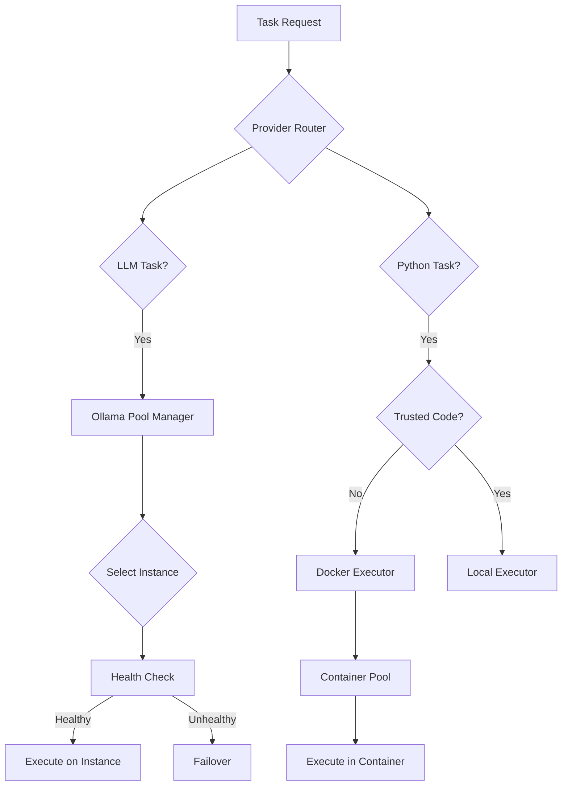

# Multi-Instance Ollama & Docker Execution Design (DRAFT)

## Overview
This document outlines the design for adding multi-Ollama instance orchestration and Docker-based Python execution to Gleitzeit.

**Status**: DRAFT - For implementation in feature branch  
**Target Version**: 0.1.0  
**Branch**: `feature/multi-instance-docker`

## 1. Multiple Ollama Instances Orchestration

### 1.1 Architecture

#### Ollama Pool Manager
A new component that manages multiple Ollama instances with load balancing, health monitoring, and failover capabilities.

```yaml
# Configuration Example
providers:
  ollama:
    instances:
      - id: "ollama-1"
        url: "http://localhost:11434"
        models: ["llama3.2", "codellama"]
        max_concurrent: 3
        tags: ["local", "cpu"]
        
      - id: "ollama-2" 
        url: "http://gpu-server:11434"
        models: ["llama3.2:70b", "mixtral"]
        max_concurrent: 2
        tags: ["remote", "gpu", "high-memory"]
        
      - id: "ollama-3"
        url: "http://192.168.1.100:11434"
        models: ["llava", "bakllava"]
        max_concurrent: 1
        specialization: "vision"
        tags: ["remote", "gpu", "vision"]

    load_balancing:
      strategy: "least_loaded"  # Options: round_robin, model_affinity, latency_based
      health_check_interval: 30
      failover: true
      retry_attempts: 3
```

### 1.2 Load Balancing Strategies

#### Least Loaded
- Track active requests per instance
- Route to instance with lowest current load
- Consider max_concurrent limits

#### Round Robin
- Simple rotation through available instances
- Even distribution regardless of load

#### Model Affinity
- Route requests to instances that have the model loaded
- Minimize model switching overhead
- Fallback to other instances if needed

#### Latency-Based
- Track response times per instance
- Route to fastest responding instances
- Adaptive to network conditions

#### Specialization Routing
- Route vision tasks to GPU-enabled instances
- Route large models to high-memory instances
- Route based on task requirements

### 1.3 Health Monitoring

```python
class OllamaHealthMonitor:
    """
    Monitor health of Ollama instances
    """
    def __init__(self):
        self.instances = {}
        self.health_status = {}
        self.circuit_breakers = {}
    
    async def health_check(self, instance_id: str) -> bool:
        """
        Check if instance is healthy
        - API responsive
        - Models available
        - Not overloaded
        """
        pass
    
    async def monitor_loop(self):
        """
        Continuous monitoring with:
        - Periodic health checks
        - Latency tracking
        - Error rate monitoring
        - Automatic failover triggers
        """
        pass
```

### 1.4 Workflow Integration

```yaml
# Task-level instance preferences
tasks:
  - name: "Heavy Analysis"
    protocol: "llm/v1"
    method: "llm/chat"
    params:
      model: "llama3.2:70b"
      instance_preference: "gpu-server"  # Hint for routing
      fallback_model: "llama3.2:13b"    # If 70b not available
      require_gpu: true                  # Hard requirement
      
  - name: "Quick Summary"
    protocol: "llm/v1"
    method: "llm/chat"
    params:
      model: "llama3.2"
      max_latency: 1000  # ms - prefer fast instances
```

## 2. Docker Support for Python Execution

### 2.1 Architecture

#### Containerized Python Provider
Extension of the Python provider to support containerized execution with security isolation.

```yaml
# Configuration Example
providers:
  python:
    execution_modes:
      - id: "local"
        type: "native"
        trusted: true
        allowed_modules: ["pandas", "numpy", "requests"]
        
      - id: "docker-sandbox"
        type: "container"
        image: "python:3.11-slim"
        memory_limit: "512m"
        cpu_limit: 1.0
        timeout: 60
        network: "none"  # Complete isolation
        read_only_root: true
        
      - id: "docker-datascience"
        type: "container"  
        image: "gleitzeit/datascience:latest"
        volumes:
          - "./data:/data:ro"  # read-only data mount
          - "./output:/output:rw"  # writable output
        memory_limit: "2g"
        cpu_limit: 2.0
        gpu: true
        network: "restricted"  # Limited network for data fetching
```

### 2.2 Security Levels

#### Level 1: Trusted (Local)
- Direct execution on host
- Full system access
- For internal/trusted code only
- No isolation

#### Level 2: Restricted Local
- Local execution with restrictions
- Limited module imports
- No file system access outside working directory
- No network access

#### Level 3: Sandboxed (Docker)
- Full isolation in container
- Resource limits enforced
- No network access
- Read-only filesystem
- Temporary workspace only

#### Level 4: Specialized Containers
- Pre-built environments
- Specific tool access (scipy, tensorflow, etc.)
- GPU support for ML tasks
- Controlled data access via volume mounts

### 2.3 Container Management

```python
class DockerExecutor:
    """
    Manage Docker containers for Python execution
    """
    def __init__(self, config):
        self.docker_client = docker.from_env()
        self.container_pool = {}
        self.config = config
    
    async def execute_in_container(
        self,
        code: str,
        image: str = "python:3.11-slim",
        memory_limit: str = "512m",
        timeout: int = 60,
        volumes: dict = None
    ):
        """
        Execute Python code in isolated container
        """
        container = await self.get_or_create_container(image)
        result = await container.exec_run(code, timeout=timeout)
        return self.parse_result(result)
    
    async def cleanup_idle_containers(self):
        """
        Remove containers idle for > threshold
        """
        pass
```

### 2.4 Workflow Integration

```yaml
tasks:
  # Untrusted user code - force sandbox
  - name: "User Script"
    protocol: "python/v1"
    method: "python/execute"
    params:
      code: "${user_provided_code}"
      execution_mode: "docker-sandbox"
      container_config:
        image: "python:3.11-alpine"
        memory: "256m"
        cpu: 0.5
        timeout: 30
        
  # Data analysis with specialized container
  - name: "ML Analysis"
    protocol: "python/v1"
    method: "python/execute"
    params:
      file: "ml_analysis.py"
      execution_mode: "docker-datascience"
      container_config:
        gpu: true
        mount_data: true
        
  # Trusted internal script
  - name: "System Task"
    protocol: "python/v1"
    method: "python/execute"
    params:
      file: "system_task.py"
      execution_mode: "local"  # Runs on host
```

## 3. Combined System Architecture

### 3.1 High-Level Design

```
┌─────────────────────────────────────────────────┐
│              Gleitzeit Core Engine              │
├─────────────────────────────────────────────────┤
│            Provider Registry & Router           │
├─────────────────────────────────────────────────┤
│                                                 │
│  ┌─────────────┐  ┌─────────────┐  ┌─────────┐│
│  │   Ollama    │  │   Python    │  │   MCP   ││
│  │    Pool     │  │  Provider   │  │Provider ││
│  │   Manager   │  │  Extended   │  │         ││
│  └──────┬──────┘  └──────┬──────┘  └────┬────┘│
│         │                │              │      │
├─────────┼────────────────┼──────────────┼──────┤
│         ↓                ↓              ↓      │
│  ┌─────────────┐  ┌─────────────┐             │
│  │ Ollama      │  │   Docker    │             │
│  │ Instances   │  │  Executor   │             │
│  │             │  │             │             │
│  │ • Local     │  │ • Sandbox   │             │
│  │ • GPU-1     │  │ • DataSci   │             │
│  │ • GPU-2     │  │ • Custom    │             │
│  │ • Vision    │  │             │             │
│  └─────────────┘  └─────────────┘             │
└─────────────────────────────────────────────────┘
```

### 3.2 Request Flow



## 4. Implementation Plan

### Phase 1: Ollama Pool Manager (Week 1-2)
- [ ] Create `OllamaPoolManager` class
- [ ] Implement health monitoring
- [ ] Add load balancing strategies
- [ ] Update configuration system
- [ ] Add tests

### Phase 2: Docker Executor (Week 2-3)
- [ ] Create `DockerExecutor` class
- [ ] Implement container lifecycle management
- [ ] Add security policies
- [ ] Update Python provider
- [ ] Add tests

### Phase 3: Integration (Week 3-4)
- [ ] Update workflow loader for new config
- [ ] Add monitoring/metrics
- [ ] Update documentation
- [ ] Integration tests
- [ ] Performance testing

### Phase 4: UI/CLI Updates (Week 4)
- [ ] Add instance status commands
- [ ] Container management commands
- [ ] Monitoring dashboard
- [ ] Configuration helpers

## 5. Configuration Examples

### 5.1 Full Configuration

```python
from gleitzeit import GleitzeitClient

client = GleitzeitClient(
    # Ollama configuration
    ollama_config={
        "instances": [
            {
                "id": "local",
                "url": "http://localhost:11434",
                "priority": 1,
                "models": ["llama3.2", "codellama"],
                "max_concurrent": 5
            },
            {
                "id": "gpu-server",
                "url": "http://gpu.example.com:11434",
                "priority": 2,
                "models": ["llama3.2:70b", "mixtral"],
                "max_concurrent": 2,
                "tags": ["gpu", "high-memory"]
            }
        ],
        "load_balancing": {
            "strategy": "least_loaded",
            "health_check_interval": 30,
            "failover": True,
            "circuit_breaker": {
                "failure_threshold": 5,
                "recovery_timeout": 60
            }
        }
    },
    
    # Python execution configuration
    python_config={
        "default_mode": "docker-sandbox",
        "modes": {
            "local": {
                "enabled": False  # Disable for production
            },
            "docker-sandbox": {
                "image": "python:3.11-slim",
                "memory_limit": "512m",
                "cpu_limit": 1.0,
                "network": "none",
                "timeout": 60
            },
            "docker-datascience": {
                "image": "gleitzeit/datascience:latest",
                "memory_limit": "4g",
                "cpu_limit": 4.0,
                "gpu": True,
                "volumes": {
                    "/data": {"bind": "/data", "mode": "ro"},
                    "/models": {"bind": "/models", "mode": "ro"}
                }
            }
        },
        "container_pool": {
            "max_containers": 10,
            "idle_timeout": 300,
            "reuse_containers": True
        }
    }
)
```

### 5.2 Environment Variables

```bash
# Ollama instances
export GLEITZEIT_OLLAMA_INSTANCES="local:http://localhost:11434,gpu:http://gpu:11434"
export GLEITZEIT_OLLAMA_STRATEGY="least_loaded"
export GLEITZEIT_OLLAMA_FAILOVER="true"

# Docker execution
export GLEITZEIT_PYTHON_MODE="docker-sandbox"
export GLEITZEIT_DOCKER_IMAGE="python:3.11-slim"
export GLEITZEIT_DOCKER_MEMORY="512m"
export GLEITZEIT_DOCKER_NETWORK="none"
```

## 6. Monitoring & Observability

### 6.1 Metrics to Track

#### Ollama Metrics
- Requests per instance
- Response times per instance
- Model load times
- Error rates
- Failover events
- Queue depths

#### Docker Metrics
- Container creation time
- Execution times
- Resource usage (CPU, memory)
- Container pool size
- Security violations

### 6.2 Dashboard Mockup

```
═══════════════════════════════════════════════════════
                 Gleitzeit Multi-Instance Dashboard
═══════════════════════════════════════════════════════

Ollama Instances (3 active, 1 failed)
┌──────────┬─────────┬──────────┬──────────┬─────────┐
│ Instance │ Status  │ Load     │ Latency  │ Errors  │
├──────────┼─────────┼──────────┼──────────┼─────────┤
│ local    │ ● OK    │ 40% (2/5)│ 120ms    │ 0.1%    │
│ gpu-1    │ ● OK    │ 33% (1/3)│ 200ms    │ 0.0%    │
│ gpu-2    │ ● OK    │ 0% (0/2) │ 180ms    │ 0.0%    │
│ backup   │ ○ FAIL  │ - (0/0)  │ -        │ 100%    │
└──────────┴─────────┴──────────┴──────────┴─────────┘

Python Execution (Docker)
┌──────────────┬─────────┬──────────┬─────────────────┐
│ Mode         │ Active  │ Queued   │ Containers      │
├──────────────┼─────────┼──────────┼─────────────────┤
│ Sandbox      │ 3       │ 1        │ 3/5 running     │
│ DataScience  │ 1       │ 0        │ 1/2 running     │
│ Local        │ 0       │ 0        │ (disabled)      │
└──────────────┴─────────┴──────────┴─────────────────┘

Recent Failovers
┌─────────────────┬────────────┬────────────┬──────────┐
│ Time            │ From       │ To         │ Reason   │
├─────────────────┼────────────┼────────────┼──────────┤
│ 10:23:45        │ backup     │ gpu-1      │ Timeout  │
│ 10:15:12        │ gpu-2      │ local      │ Overload │
└─────────────────┴────────────┴────────────┴──────────┘
```

## 7. Testing Strategy

### 7.1 Unit Tests
- Load balancing algorithms
- Health check logic
- Container lifecycle
- Security policies

### 7.2 Integration Tests
- Multi-instance failover
- Docker execution
- Resource limits
- Network isolation

### 7.3 Performance Tests
- Load distribution
- Failover speed
- Container startup time
- Pool efficiency

### 7.4 Security Tests
- Container escape attempts
- Resource exhaustion
- Network isolation verification
- Volume mount restrictions

## 8. Migration Guide

### 8.1 Breaking Changes
- None - fully backward compatible
- Single Ollama instance works as before
- Local Python execution still default if Docker not configured

### 8.2 New Features Opt-in
- Multi-instance requires explicit configuration
- Docker execution requires Docker daemon
- Default behavior unchanged

## 9. Future Enhancements

### 9.1 Kubernetes Support
- Deploy Ollama as StatefulSet
- Python execution in K8s Jobs
- Horizontal pod autoscaling

### 9.2 Cloud Provider Integration
- AWS Bedrock for LLMs
- Google Cloud Run for Python
- Azure Container Instances

### 9.3 Advanced Features
- Model caching strategies
- Predictive load balancing
- Cost-based routing
- Multi-region support

## 10. Security Considerations

### 10.1 Ollama Security
- TLS/SSL for remote instances
- API key authentication
- Network segmentation
- Rate limiting per client

### 10.2 Docker Security
- Minimal base images
- No privileged containers
- Seccomp profiles
- AppArmor/SELinux policies
- User namespace remapping

## Appendix A: Docker Image Examples

### A.1 Sandbox Image
```dockerfile
FROM python:3.11-slim
RUN pip install --no-cache-dir numpy pandas
RUN useradd -m -u 1000 sandbox
USER sandbox
WORKDIR /tmp
```

### A.2 Data Science Image
```dockerfile
FROM tensorflow/tensorflow:latest-gpu
RUN pip install --no-cache-dir \
    pandas numpy scikit-learn \
    matplotlib seaborn plotly
WORKDIR /workspace
```

## Appendix B: Benchmark Results (Projected)

### B.1 Ollama Load Distribution
- Single instance: 100 req/min max
- 3 instances: 280 req/min (2.8x)
- With failover: 99.9% availability

### B.2 Docker Execution Overhead
- Native: 10ms startup
- Docker (reused): 50ms startup  
- Docker (new): 2s startup
- Recommendation: Use container pooling

---

**End of Draft Document**

This design is ready for review and implementation in the feature branch.