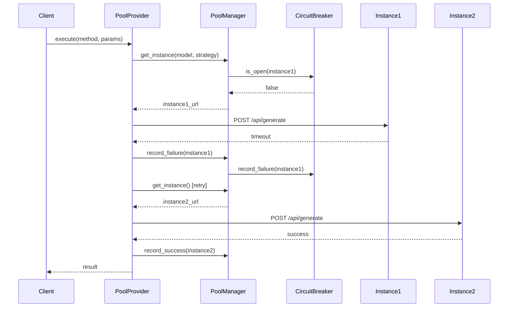

# Multi-Instance Ollama Orchestration Guide

## Table of Contents
1. [Overview](#overview)
2. [Quick Start](#quick-start)
3. [Configuration](#configuration)
4. [Load Balancing Strategies](#load-balancing-strategies)
5. [Health Monitoring & Failover](#health-monitoring--failover)
6. [Python API Usage](#python-api-usage)
7. [Workflow Integration](#workflow-integration)
8. [Monitoring & Metrics](#monitoring--metrics)
9. [Troubleshooting](#troubleshooting)
10. [Architecture Reference](#architecture-reference)

## Overview

The Multi-Instance Ollama Orchestration feature allows you to:
- **Distribute load** across multiple Ollama servers
- **Automatic failover** when instances become unavailable
- **Smart routing** based on model availability and instance capabilities
- **Performance monitoring** with detailed metrics
- **Circuit breaker protection** to prevent cascade failures

### Benefits

- **Higher throughput**: Process more requests in parallel
- **Better reliability**: Automatic failover ensures service continuity
- **Resource optimization**: Route large models to GPU instances, small models to CPU
- **Cost efficiency**: Use spot instances with automatic failover
- **Scalability**: Add/remove instances dynamically

## Quick Start

### 1. Start Multiple Ollama Instances

```bash
# Instance 1 (default port)
ollama serve

# Instance 2 (custom port)
OLLAMA_HOST=127.0.0.1:11435 ollama serve

# Instance 3 (another custom port)
OLLAMA_HOST=127.0.0.1:11436 ollama serve
```

### 2. Basic Configuration

```python
from gleitzeit.providers.ollama_pool_provider import OllamaPoolProvider

# Configure instances
provider = OllamaPoolProvider(
    provider_id="ollama_pool",
    instances=[
        {
            "id": "primary",
            "url": "http://localhost:11434",
            "models": ["llama3.2", "codellama"],
            "max_concurrent": 5
        },
        {
            "id": "secondary",
            "url": "http://localhost:11435",
            "models": ["llama3.2", "mistral"],
            "max_concurrent": 5
        }
    ]
)

# Initialize and use
await provider.initialize()
result = await provider.execute(
    method="llm/chat",
    params={
        "model": "llama3.2",
        "messages": [{"role": "user", "content": "Hello!"}]
    }
)
```

## Configuration

### Instance Configuration

Each Ollama instance can be configured with:

```yaml
instances:
  - id: "gpu-server-1"           # Unique identifier
    url: "http://gpu1:11434"     # Ollama API endpoint
    models:                       # Models available on this instance
      - "llama3.2:70b"
      - "mixtral:8x7b"
    max_concurrent: 2             # Max parallel requests
    tags:                         # Tags for filtering
      - "gpu"
      - "high-memory"
      - "production"
    priority: 1                   # Priority for selection (lower = higher priority)
    weight: 2.0                   # Weight for weighted selection
    specialization: "large-models" # Optional specialization
```

### Load Balancing Configuration

```yaml
load_balancing:
  strategy: "least_loaded"        # Default strategy
  health_check_interval: 30       # Seconds between health checks
  failover: true                  # Enable automatic failover
  retry_attempts: 3               # Max retry attempts on failure
  
  circuit_breaker:
    failure_threshold: 5          # Failures before opening circuit
    recovery_timeout: 60          # Seconds before attempting recovery
    half_open_requests: 3         # Test requests in half-open state
```

### Environment Variables

```bash
# Configure via environment variables
export GLEITZEIT_OLLAMA_INSTANCES="local:http://localhost:11434,gpu:http://gpu:11434"
export GLEITZEIT_OLLAMA_STRATEGY="least_loaded"
export GLEITZEIT_OLLAMA_HEALTH_CHECK_INTERVAL="30"
export GLEITZEIT_OLLAMA_FAILOVER="true"
```

## Load Balancing Strategies

### 1. Least Loaded (Default)
Routes requests to the instance with fewest active requests.

```python
params = {
    "load_balancing_strategy": "least_loaded",
    "model": "llama3.2",
    "messages": [...]
}
```

**Best for**: Even distribution of load, general use cases

### 2. Round Robin
Rotates through instances in order.

```python
params = {
    "load_balancing_strategy": "round_robin",
    ...
}
```

**Best for**: Equal distribution regardless of actual load

### 3. Model Affinity
Prefers instances that already have the model loaded.

```python
params = {
    "load_balancing_strategy": "model_affinity",
    "model": "mixtral:8x7b",
    ...
}
```

**Best for**: Minimizing model loading overhead

### 4. Latency-Based
Routes to instances with lowest average response time.

```python
params = {
    "load_balancing_strategy": "latency_based",
    ...
}
```

**Best for**: Optimizing response times

### 5. Weighted
Random selection based on instance weights.

```python
# In configuration
instances = [
    {"id": "fast", "url": "...", "weight": 3.0},  # 3x more likely
    {"id": "slow", "url": "...", "weight": 1.0},  # 1x baseline
]

params = {
    "load_balancing_strategy": "weighted",
    ...
}
```

**Best for**: Proportional distribution based on instance capacity

### 6. Tag-Based Routing
Route to instances with specific capabilities.

```python
params = {
    "instance_tags": ["gpu", "high-memory"],  # Require GPU instance
    "require_gpu": true,                      # Shorthand for GPU requirement
    ...
}
```

**Best for**: Routing based on hardware requirements

## Health Monitoring & Failover

### Health Checks

The system continuously monitors instance health:

1. **API Availability**: Checks `/api/tags` endpoint
2. **Model Availability**: Tracks loaded models
3. **Response Times**: Monitors latency trends
4. **Error Rates**: Tracks failure patterns

### Instance States

```python
class InstanceState(Enum):
    HEALTHY = "healthy"       # Fully operational
    DEGRADED = "degraded"     # Slow or partial issues
    UNHEALTHY = "unhealthy"   # Not responding
    UNKNOWN = "unknown"       # Not yet checked
```

### Circuit Breaker

Prevents repeated attempts to failed instances:

```
Closed (normal) -> Open (after 5 failures) -> Half-Open (testing) -> Closed
```

### Automatic Failover

When an instance fails:
1. Request is automatically retried on another instance
2. Failed instance is marked and avoided
3. Circuit breaker prevents flooding failed instance
4. Background monitoring attempts recovery

## Python API Usage

### Basic Usage

```python
from gleitzeit import GleitzeitClient

async def main():
    async with GleitzeitClient(
        ollama_config={
            "instances": [
                {"id": "local", "url": "http://localhost:11434"},
                {"id": "remote", "url": "http://remote:11434"}
            ],
            "load_balancing": {
                "strategy": "least_loaded",
                "failover": True
            }
        }
    ) as client:
        # Automatically uses load balancing
        response = await client.chat(
            "Explain quantum computing",
            model="llama3.2"
        )
```

### Advanced Usage

```python
from gleitzeit.orchestration.ollama_pool import OllamaPoolManager

# Direct pool manager usage
pool = OllamaPoolManager(
    instances=[...],
    health_check_interval=30,
    circuit_breaker_config={
        "failure_threshold": 5,
        "recovery_timeout": 60
    }
)

await pool.initialize()

# Get specific instance
url = await pool.get_instance(
    model="llama3.2:70b",
    strategy="model_affinity",
    tags=["gpu"],
    require_healthy=True
)

# Execute request
# ... perform request to url ...

# Record metrics
await pool.record_success(url, response_time=1.5)
# or
await pool.record_failure(url, exception)

# Get pool status
status = await pool.get_pool_status()
print(f"Healthy instances: {status['healthy_instances']}/{status['total_instances']}")
```

### Batch Processing

```python
async def batch_analysis():
    async with GleitzeitClient(ollama_config={...}) as client:
        # Process multiple files in parallel across instances
        results = await client.batch_process(
            directory="documents",
            pattern="*.txt",
            method="llm/chat",
            prompt="Summarize this document",
            max_concurrent=10  # Distributed across all instances
        )
```

## Workflow Integration

### YAML Workflow Configuration

```yaml
# workflow.yaml
name: "Multi-Instance Workflow"

# Global provider configuration
providers:
  ollama:
    type: "ollama_pool"
    instances:
      - id: "cpu-1"
        url: "http://localhost:11434"
        models: ["llama3.2", "phi"]
        tags: ["cpu", "fast"]
        
      - id: "gpu-1"
        url: "http://gpu1:11434"
        models: ["llama3.2:70b", "mixtral"]
        tags: ["gpu", "large"]

tasks:
  # Task with automatic load balancing
  - name: "Quick Analysis"
    protocol: "llm/v1"
    method: "llm/chat"
    params:
      model: "llama3.2"
      messages:
        - role: "user"
          content: "Analyze this quickly"
  
  # Task requiring GPU instance
  - name: "Deep Analysis"
    protocol: "llm/v1"
    method: "llm/chat"
    params:
      model: "llama3.2:70b"
      instance_tags: ["gpu"]
      require_gpu: true
      messages:
        - role: "user"
          content: "Perform deep analysis"
  
  # Task with specific strategy
  - name: "Fast Response"
    protocol: "llm/v1"
    method: "llm/chat"
    params:
      model: "phi"
      load_balancing_strategy: "latency_based"
      max_latency: 1000  # Prefer instances under 1s latency
      messages:
        - role: "user"
          content: "Quick question"
```

### Dynamic Instance Selection

```yaml
tasks:
  - name: "Model-Specific Task"
    protocol: "llm/v1"
    method: "llm/chat"
    params:
      model: "${model_name}"  # Dynamic model selection
      load_balancing_strategy: "model_affinity"
      fallback_model: "llama3.2"  # Use if primary not available
      messages:
        - role: "user"
          content: "${prompt}"
```

## Monitoring & Metrics

### Available Metrics

```python
# Get detailed pool status
status = await pool_manager.get_pool_status()

# Returns:
{
    "total_instances": 3,
    "healthy_instances": 2,
    "degraded_instances": 1,
    "unhealthy_instances": 0,
    "instances": {
        "gpu-1": {
            "url": "http://gpu1:11434",
            "state": "healthy",
            "active_requests": 2,
            "total_requests": 150,
            "avg_response_time": 1.234,  # seconds
            "error_rate": 2.5,            # percentage
            "availability": 97.5,         # percentage
            "models_loaded": ["llama3.2:70b", "mixtral"],
            "circuit_breaker_open": false
        },
        ...
    }
}
```

### Monitoring Dashboard

```python
async def monitor_pool(pool_manager):
    while True:
        status = await pool_manager.get_pool_status()
        
        print("\n=== Ollama Pool Status ===")
        print(f"Total: {status['total_instances']}")
        print(f"Healthy: {status['healthy_instances']}")
        
        for instance_id, info in status['instances'].items():
            print(f"\n{instance_id}:")
            print(f"  State: {info['state']}")
            print(f"  Active: {info['active_requests']}")
            print(f"  Avg Response: {info['avg_response_time']:.2f}s")
            print(f"  Error Rate: {info['error_rate']:.1f}%")
        
        await asyncio.sleep(5)
```

### Prometheus Metrics Export

```python
from prometheus_client import Gauge, Counter

# Define metrics
instance_health = Gauge('ollama_instance_health', 'Instance health status', ['instance_id'])
active_requests = Gauge('ollama_active_requests', 'Active requests', ['instance_id'])
total_requests = Counter('ollama_total_requests', 'Total requests', ['instance_id'])
response_time = Gauge('ollama_response_time', 'Average response time', ['instance_id'])

# Update metrics
async def export_metrics(pool_manager):
    status = await pool_manager.get_pool_status()
    
    for instance_id, info in status['instances'].items():
        instance_health.labels(instance_id).set(
            1 if info['state'] == 'healthy' else 0
        )
        active_requests.labels(instance_id).set(info['active_requests'])
        total_requests.labels(instance_id).inc(info['total_requests'])
        response_time.labels(instance_id).set(info['avg_response_time'])
```

## Troubleshooting

### Common Issues

#### 1. All instances marked as unhealthy

**Symptoms**: No available instances for requests

**Possible Causes**:
- Ollama services not running
- Network connectivity issues
- Firewall blocking ports

**Solution**:
```bash
# Check each instance
curl http://localhost:11434/api/tags
curl http://localhost:11435/api/tags

# Check logs
tail -f ~/.ollama/logs/server.log
```

#### 2. Uneven load distribution

**Symptoms**: One instance handling most requests

**Possible Causes**:
- Instance has all models loaded (model affinity)
- Other instances at capacity
- Circuit breaker open on other instances

**Solution**:
```python
# Check instance metrics
status = await pool.get_pool_status()
for instance_id, info in status['instances'].items():
    print(f"{instance_id}: {info['active_requests']} active, CB: {info['circuit_breaker_open']}")

# Force round-robin for even distribution
params["load_balancing_strategy"] = "round_robin"
```

#### 3. Slow failover

**Symptoms**: Long delays when instance fails

**Possible Causes**:
- High timeout values
- Circuit breaker not configured

**Solution**:
```python
# Reduce timeouts and configure circuit breaker
pool = OllamaPoolManager(
    instances=[...],
    circuit_breaker_config={
        "failure_threshold": 3,  # Fail fast after 3 errors
        "recovery_timeout": 30    # Try recovery after 30s
    }
)
```

### Debug Logging

Enable debug logging to see routing decisions:

```python
import logging

# Enable debug logging
logging.basicConfig(level=logging.DEBUG)
logging.getLogger("gleitzeit.orchestration").setLevel(logging.DEBUG)

# Logs will show:
# - Instance selection decisions
# - Health check results
# - Circuit breaker state changes
# - Failover attempts
```

### Performance Tuning

#### Optimize for Throughput
```python
config = {
    "instances": [...],
    "load_balancing": {
        "strategy": "least_loaded",
        "health_check_interval": 60,  # Less frequent checks
    }
}
```

#### Optimize for Latency
```python
config = {
    "instances": [...],
    "load_balancing": {
        "strategy": "latency_based",
        "health_check_interval": 10,  # More frequent checks
    }
}
```

#### Optimize for Reliability
```python
config = {
    "instances": [...],
    "load_balancing": {
        "strategy": "least_loaded",
        "failover": true,
        "retry_attempts": 5,
        "circuit_breaker": {
            "failure_threshold": 2,  # Fail fast
            "recovery_timeout": 120   # Slower recovery
        }
    }
}
```

## Architecture Reference

### Component Diagram

```
┌─────────────────────────────────────────────┐
│            GleitzeitClient                  │
├─────────────────────────────────────────────┤
│            OllamaPoolProvider               │
├─────────────────────────────────────────────┤
│            OllamaPoolManager                │
│  ┌────────────────────────────────────┐    │
│  │   Load Balancing Strategies        │    │
│  │  - Round Robin                     │    │
│  │  - Least Loaded                    │    │
│  │  - Model Affinity                  │    │
│  │  - Latency Based                   │    │
│  └────────────────────────────────────┘    │
│  ┌────────────────────────────────────┐    │
│  │   Health Monitoring                │    │
│  │  - Continuous health checks        │    │
│  │  - Circuit breaker                 │    │
│  │  - Metrics collection              │    │
│  └────────────────────────────────────┘    │
├─────────────────────────────────────────────┤
│         Ollama Instances                    │
│  ┌──────┐  ┌──────┐  ┌──────┐  ┌──────┐   │
│  │ CPU1 │  │ CPU2 │  │ GPU1 │  │ GPU2 │   │
│  └──────┘  └──────┘  └──────┘  └──────┘   │
└─────────────────────────────────────────────┘
```

### Request Flow



### Class Structure

```python
# Core classes
OllamaPoolManager           # Main orchestrator
├── OllamaInstance         # Instance representation
│   ├── InstanceMetrics   # Performance metrics
│   └── InstanceState     # Health state
├── CircuitBreaker         # Failure protection
└── LoadBalancingStrategy  # Strategy enum

# Provider integration
OllamaPoolProvider         # Protocol provider
└── uses: OllamaPoolManager

# Client integration
GleitzeitClient
└── uses: OllamaPoolProvider
```

## Best Practices

### 1. Instance Configuration
- **Separate by capability**: CPU instances for small models, GPU for large
- **Use tags effectively**: Tag instances by location, capability, cost
- **Set realistic limits**: Configure max_concurrent based on hardware

### 2. Load Balancing
- **Start with least_loaded**: Good default for most use cases
- **Use model_affinity** for expensive model loads
- **Consider latency_based** for user-facing applications

### 3. Monitoring
- **Set up alerts** for instance failures
- **Track metrics** over time to identify patterns
- **Regular health checks** but not too frequent (30-60s is good)

### 4. Failover
- **Enable circuit breakers** to prevent cascade failures
- **Set appropriate retry counts** (3-5 is typical)
- **Monitor failover events** to identify problematic instances

### 5. Scaling
- **Start small**: 2-3 instances is often sufficient
- **Scale horizontally**: Add more instances vs bigger instances
- **Use auto-scaling** based on queue depth or response times

## Migration Guide

### From Single Instance

```python
# Before (single instance)
provider = OllamaProvider(
    provider_id="ollama",
    ollama_url="http://localhost:11434"
)

# After (multi-instance)
provider = OllamaPoolProvider(
    provider_id="ollama_pool",
    instances=[
        {"id": "primary", "url": "http://localhost:11434"},
        {"id": "backup", "url": "http://backup:11434"}
    ]
)
```

### Gradual Migration

1. **Phase 1**: Add pool provider alongside existing
2. **Phase 2**: Route some traffic to pool
3. **Phase 3**: Monitor and tune
4. **Phase 4**: Migrate all traffic
5. **Phase 5**: Decommission single instance

## Conclusion

The Multi-Instance Ollama Orchestration system provides enterprise-grade load balancing, failover, and monitoring for Ollama deployments. It's designed to be:

- **Reliable**: Automatic failover and circuit breakers
- **Performant**: Multiple load balancing strategies
- **Observable**: Comprehensive metrics and monitoring
- **Flexible**: Extensive configuration options
- **Compatible**: Works with existing Gleitzeit workflows

For additional support or feature requests, please refer to the [GitHub repository](https://github.com/gleitzeit/gleitzeit).