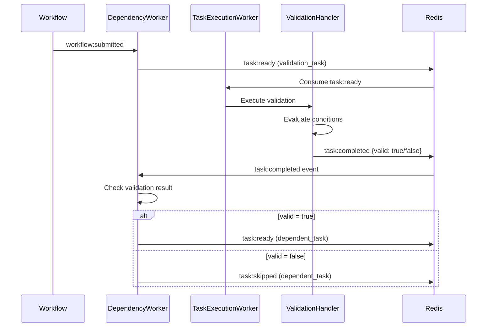

# Conditional Execution Architecture

## Overview

Gleitzeit implements conditional task execution through a validation task pattern. This document describes the architectural design and implementation details.

## Design Philosophy

### Everything is a Task

Rather than adding conditional fields to tasks, Gleitzeit treats conditions as first-class validation tasks. This maintains architectural consistency and provides:

- **Visibility**: Conditions are explicit tasks in the workflow
- **Observability**: Validation execution is tracked like any task
- **Reusability**: Validation logic can be shared across workflows
- **Scalability**: Validations can be distributed and cached

### Convention Over Configuration

Tasks depending on `validation/v1` protocol tasks automatically respect validation results without explicit configuration. This convention-based approach reduces boilerplate while remaining flexible through override options.

## Architecture Components

### ValidationHandler

Located in `src/gleitzeit/handlers/validation.py`, the ValidationHandler executes within the TaskExecutionWorker process.

```
TaskExecutionWorker
    ├── HandlerRegistry
    │   ├── PythonHandler
    │   ├── OllamaHandler
    │   └── ValidationHandler  ← Runs validation logic
    └── Task Execution Loop
```

**Key Features:**
- Safe expression evaluation using SimpleEval
- No external service dependencies
- Three validation methods: evaluate, assert, gate
- Returns structured validation results

### DependencyWorker Enhancement

The DependencyWorker (`src/gleitzeit/workers/dependency_worker.py`) checks validation dependencies when resolving task dependencies.

```python
async def find_ready_tasks():
    # 1. Check all dependencies completed
    # 2. Check validation dependencies
    # 3. Apply validation decisions (skip/fail/continue)
    # 4. Emit ready tasks or skip them
```

### Task Status Extensions

New statuses in `src/gleitzeit/core/models.py`:
- `VALIDATING`: Task is being evaluated
- `SKIPPED`: Task skipped due to validation failure
- `BLOCKED`: Task blocked by validation gate

## Event Flow

### Standard Flow with Validation



### Parallel Validation Flow

Multiple validation tasks can execute in parallel:

```
         ┌──────────────┐
         │ generate_data│
         └──────┬───────┘
                │
        ┌───────┴────────┐
        │                │
   ┌────▼──────┐  ┌─────▼──────┐
   │validate_A │  │validate_B  │  ← Run in parallel
   └────┬──────┘  └─────┬──────┘
        │                │
        └───────┬────────┘
                │
         ┌──────▼───────┐
         │process_data  │  ← Requires both validations
         └──────────────┘
```

## State Management

### Redis Keys Structure

```
# Workflow data
{shard}:workflow:data:{workflow_id}
  - workflow: JSON workflow definition
  - status: running/completed/failed

# Task states
{shard}:task:{task_id}
  - status: executing/completed/skipped/blocked
  - result: JSON result including validation outcome

# Workflow tracking
{shard}:workflow:tasks:completed:{workflow_id}  # Set of completed tasks
{shard}:workflow:tasks:skipped:{workflow_id}    # Set of skipped tasks
{shard}:workflow:tasks:blocked:{workflow_id}    # Set of blocked tasks
```

### Validation Result Structure

```json
{
  "valid": true,
  "mode": "all",
  "on_failure": "skip",
  "summary": {
    "total": 3,
    "passed": 2,
    "failed": 1
  },
  "details": [...],
  "control": {
    "skip_tasks": ["task_a"],
    "enable_tasks": ["task_b"]
  }
}
```

## Expression Persistence

### Where Expressions are Stored

Validation expressions are fully preserved at multiple levels for auditability, debugging, and replay:

#### 1. Workflow Definition Storage

The complete workflow, including all validation expressions, is persisted when submitted:

```python
# In DependencyWorker.handle_workflow_submission()
await self.redis.hset(
    default_sharding.get_workflow_key("data", workflow_id).encode(),
    mapping={
        b"workflow": json.dumps(workflow_data).encode(),  # Full workflow with expressions
        b"submitted_at": datetime.utcnow().isoformat().encode(),
        b"status": b"running"
    }
)
```

#### 2. Task Stream Messages

When tasks are emitted to `task:ready`, the complete task definition including validation parameters is preserved:

```python
await self.redis.xadd(
    default_sharding.get_stream_key("task:ready", workflow_id).encode(),
    {
        b"workflow_id": workflow_id.encode(),
        b"task_id": task_id.encode(),
        b"task": json.dumps(task_data).encode(),  # Full task with expressions
        b"timestamp": datetime.utcnow().isoformat().encode()
    }
)
```

#### 3. Validation Result Storage

Executed expressions are stored in validation results for complete traceability:

```python
# In ValidationHandler results
{
    "valid": true,
    "details": [
        {
            "name": "threshold_check",
            "expression": "value > 100",  # Original expression preserved
            "result": true,
            "evaluated": true
        }
    ]
}
```

### Persistence Example

Here's how a validation task is persisted through its lifecycle:

```json
// 1. In workflow:data:{workflow_id}
{
  "workflow": {
    "name": "Example Workflow",
    "tasks": [
      {
        "name": "validate_order",
        "protocol": "validation/v1",
        "method": "validation/evaluate",
        "params": {
          "conditions": [
            {
              "expression": "order_total > 1000",  // Preserved
              "name": "minimum_order"
            },
            {
              "expression": "customer_type == 'premium'",  // Preserved
              "name": "premium_check"
            }
          ],
          "mode": "all",
          "context": {
            "order_total": "${fetch_order.total}",
            "customer_type": "${fetch_customer.type}"
          }
        }
      }
    ]
  }
}

// 2. In task:ready stream message
{
  "task": {
    "id": "task_abc123",
    "name": "validate_order",
    "params": {
      "conditions": [...]  // Full conditions preserved
    }
  }
}

// 3. In task result after execution
{
  "task_id": "task_abc123",
  "status": "completed",
  "result": {
    "valid": false,
    "details": [
      {
        "name": "minimum_order",
        "expression": "order_total > 1000",  // Original preserved
        "result": false,
        "evaluated": true
      },
      {
        "name": "premium_check",
        "expression": "customer_type == 'premium'",  // Original preserved
        "result": true,
        "evaluated": true
      }
    ],
    "evaluated_at": "2024-01-19T16:54:23.328498"
  }
}
```

### Benefits of Expression Persistence

1. **Complete Auditability**: Can trace exactly what conditions were evaluated and why tasks were skipped
2. **Debugging Support**: Can examine the exact expressions that led to validation decisions
3. **Replay Capability**: Can re-run workflows with identical validation logic
4. **Historical Analysis**: Can analyze validation patterns and failure rates over time
5. **Compliance**: Provides full audit trail for regulatory requirements

### Accessing Persisted Expressions

To retrieve persisted expressions:

```python
# Get original workflow definition
workflow_data = await redis.hget(
    f"{shard}:workflow:data:{workflow_id}",
    "workflow"
)
workflow = json.loads(workflow_data)

# Find validation task
for task in workflow['tasks']:
    if task['protocol'] == 'validation/v1':
        expressions = [
            cond['expression']
            for cond in task['params']['conditions']
        ]

# Get validation results with expressions
task_result = await redis.hget(
    f"{shard}:task:{task_id}",
    "result"
)
result = json.loads(task_result)
evaluated_expressions = [
    detail['expression']
    for detail in result['details']
]
```

## Stateless and Replayable Design

### Deterministic Decisions

Validation decisions are based solely on:
1. Workflow definition (immutable)
2. Task results (stored in Redis)
3. Validation expressions (in workflow)

No hidden state or side effects affect decisions.

### Idempotent Operations

```python
# Can safely re-evaluate at any time
validation_result = evaluate_conditions(task.params, context)
should_skip = not validation_result.get('valid', False)

# Decision is always the same for same inputs
if should_skip:
    mark_task_skipped(task_id)
```

### Event Replay

The system can rebuild state from events:

```python
# Replay from events
for event in redis.get_stream_events():
    if event.type == 'task:completed':
        if is_validation_task(event.task):
            reapply_validation_decisions(event)
```

## Scalability Patterns

### Validation Caching

Results are cached in Redis with TTL:

```python
cache_key = f"validation:cache:{task_id}:{input_hash}"
if cached := redis.get(cache_key):
    return cached
result = evaluate_validation()
redis.setex(cache_key, ttl=300, value=result)
```

### Distributed Validation

Validation tasks distribute across workers:

```yaml
# Worker specialization
worker_1:
  enabled_protocols: [validation/v1]

worker_2:
  enabled_protocols: [python/v1]
```

### Parallel Evaluation

Independent validations run concurrently:

```yaml
tasks:
  - name: validate_auth      # Worker 1
  - name: validate_quota     # Worker 2
  - name: validate_limits    # Worker 3

  - name: process
    dependencies: [validate_auth, validate_quota, validate_limits]
```

## Implementation Details

### Convention Detection

```python
# In DependencyWorker._check_validation_dependencies()
for dep_id in dependencies:
    dep_task = find_task(dep_id)

    # Convention: validation/v1 tasks control flow
    if dep_task.protocol == 'validation/v1':
        result = get_task_result(dep_id)
        if not result.get('valid', False):
            # Apply on_failure behavior
            handle_validation_failure(task_id, dep_id)
```

### Override Mechanism

```yaml
# Task can override validation behavior
- name: process_anyway
  dependencies: [validate_data]
  validation_behavior: "continue"  # Override convention
```

### Expression Evaluation

```python
# Safe evaluation without exec/eval
evaluator = SimpleEval()
evaluator.names = context
result = evaluator.eval(expression)
```

## Comparison with Alternatives

### Why Not Condition Fields?

```yaml
# Rejected approach
- name: process
  condition: "${data.value} > 100"  # Hidden logic
```

Problems:
- Conditions hidden in task definition
- Hard to test and debug
- Not reusable
- No execution tracking

### Why Not Separate Conditional System?

A separate system would:
- Add complexity
- Require new workers
- Break the "everything is a task" model
- Reduce observability

### Why Validation Tasks?

Validation tasks:
- Fit naturally into existing architecture
- Are visible and trackable
- Can be tested independently
- Scale like any other task
- Maintain architectural consistency

## Performance Characteristics

### Overhead

- Validation task execution: ~1-5ms
- Dependency check: <1ms per validation
- SimpleEval evaluation: ~0.1ms per expression

### Optimization Strategies

1. **Batch Validations**: Group related checks in single task
2. **Cache Results**: Reuse validation outcomes
3. **Parallel Execution**: Run independent validations concurrently
4. **Early Exit**: Stop on first assertion failure

### Benchmarks

```
Simple validation (1 condition):     1.2ms
Complex validation (10 conditions):  3.8ms
Cached validation lookup:            0.3ms
Dependency resolution with validation: 2.1ms
```

## Future Enhancements

### Planned Features

1. **Validation Templates**: Reusable validation patterns
2. **Custom Functions**: User-defined validation functions
3. **Validation Metrics**: Track validation pass/fail rates
4. **Smart Caching**: Intelligent cache invalidation

### Potential Optimizations

1. **Compiled Expressions**: Pre-compile frequently used expressions
2. **Validation Batching**: Evaluate multiple validations in single task
3. **Predictive Skipping**: Skip downstream tasks earlier
4. **Result Streaming**: Stream validation results as they complete

## Security Considerations

### Expression Safety

SimpleEval provides safe evaluation:
- No access to imports or builtins
- No file system access
- No network operations
- Restricted to safe operations

### Input Validation

```python
# Validate expression before evaluation
if not is_safe_expression(expression):
    raise ValueError("Unsafe expression")
```

### Context Isolation

Each validation has isolated context:
```python
evaluator.names = context.copy()  # Isolated copy
```

## Troubleshooting

### Common Issues

1. **All tasks skipping**: Check validation logic and context values
2. **Validation not triggering**: Verify protocol is `validation/v1`
3. **Unexpected behavior**: Check `validation_behavior` overrides
4. **Performance issues**: Enable validation caching

### Debug Strategies

```python
# Enable debug logging
logging.getLogger('gleitzeit.handlers.validation').setLevel(logging.DEBUG)
logging.getLogger('gleitzeit.workers.dependency_worker').setLevel(logging.DEBUG)
```

### Monitoring

Key metrics to track:
- Validation pass/fail rates
- Skip/block frequencies
- Validation execution times
- Cache hit rates

## Conclusion

The validation task pattern provides a clean, scalable solution for conditional execution that:

1. **Maintains Architecture**: Fits perfectly with task-based model
2. **Enables Complex Logic**: Sophisticated validation patterns
3. **Provides Visibility**: Full tracking and debugging
4. **Scales Naturally**: Distributed validation execution
5. **Stays Flexible**: Easy to extend and modify

This approach treats conditions as first-class workflow citizens, making them observable, scalable, and maintainable while preserving Gleitzeit's elegant task-based architecture.