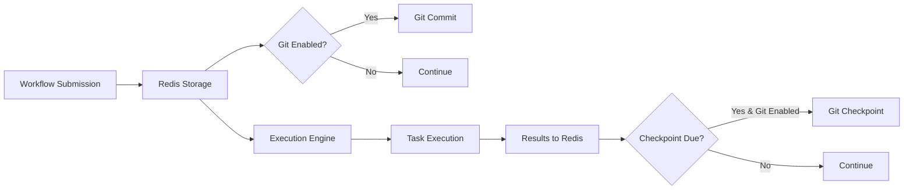

# Git Versioning Feature Design

## Overview

This document outlines the design for adding **optional** git-based versioning to Gleitzeit. Git versioning is a feature layer on top of the core Redis-based system, providing workflow version control, execution history, and advanced replay capabilities.

**Key Principle**: Git features are purely additive. The core Gleitzeit system remains fully functional with Redis alone.

## Architecture Principles

1. **Redis First**: All operational data flows through Redis
2. **Git Optional**: Git features can be completely disabled
3. **No Dependencies**: Core workflows never depend on git
4. **Progressive Enhancement**: Git adds capabilities, doesn't replace them
5. **Zero Breaking Changes**: Existing deployments unaffected

## Feature Capabilities

### With Redis Only (Core)
- ✅ Full workflow execution
- ✅ Event streaming and storage
- ✅ Task dependency resolution
- ✅ Validation/conditional execution
- ✅ Basic replay from events
- ✅ Distributed workers
- ✅ All current Gleitzeit features

### With Git Enabled (Enhanced)
- ➕ Workflow version history
- ➕ Branch-based testing
- ➕ Diff-based replay optimization
- ➕ Long-term audit trail
- ➕ Multi-site synchronization
- ➕ Workflow rollback
- ➕ Change attribution

## System Design

### Component Architecture

```
┌─────────────────────────────────────────────────────────┐
│                   User/API Layer                         │
└─────────────────────────────────────────────────────────┘
                            │
┌─────────────────────────────────────────────────────────┐
│                  Gleitzeit Core                          │
│  ┌─────────────────────────────────────────────────┐   │
│  │            Redis (Required)                      │   │
│  │  - Workflow execution                           │   │
│  │  - Event streams                                │   │
│  │  - Task results                                 │   │
│  │  - Real-time coordination                       │   │
│  └─────────────────────────────────────────────────┘   │
│                                                          │
│  ┌─────────────────────────────────────────────────┐   │
│  │         Git Versioning (Optional)               │   │
│  │  - Version control                              │   │
│  │  - Checkpoint storage                           │   │
│  │  - Diff computation                             │   │
│  │  - Audit logging                                │   │
│  └─────────────────────────────────────────────────┘   │
└─────────────────────────────────────────────────────────┘
```

### Data Flow



## Implementation Design

### 1. Git Version Control Manager

```python
from typing import Optional, Dict, Any
import pygit2
from pathlib import Path
import json
from datetime import datetime

class GitVersionControl:
    """
    Optional git versioning for Gleitzeit workflows.

    This class is only instantiated if git features are enabled.
    All methods are no-ops if git is disabled.
    """

    def __init__(self, config: Dict[str, Any]):
        self.enabled = config.get('enabled', False)
        if not self.enabled:
            return

        self.repo_path = Path(config['repo_path'])
        self.auto_commit = config.get('auto_commit', True)
        self.branch_per_workflow = config.get('branch_per_workflow', False)

        # Initialize or open repository
        if not self.repo_path.exists():
            self.repo = pygit2.init_repository(self.repo_path, bare=False)
            self._create_initial_structure()
        else:
            self.repo = pygit2.Repository(self.repo_path)

    async def version_workflow(
        self,
        workflow_id: str,
        workflow_data: Dict[str, Any],
        metadata: Optional[Dict[str, Any]] = None
    ) -> Optional[str]:
        """
        Create a git commit for workflow version.
        Returns commit SHA if successful, None if git disabled.
        """
        if not self.enabled:
            return None

        # Prepare workflow file
        workflow_dir = self.repo_path / 'workflows' / workflow_id
        workflow_dir.mkdir(parents=True, exist_ok=True)

        # Write workflow definition
        workflow_file = workflow_dir / 'workflow.json'
        with open(workflow_file, 'w') as f:
            json.dump(workflow_data, f, indent=2)

        # Write metadata if provided
        if metadata:
            metadata_file = workflow_dir / 'metadata.json'
            with open(metadata_file, 'w') as f:
                json.dump({
                    **metadata,
                    'versioned_at': datetime.utcnow().isoformat()
                }, f, indent=2)

        # Create commit
        return await self._commit_changes(
            message=f"Update workflow {workflow_id}",
            workflow_id=workflow_id
        )

    async def checkpoint_execution(
        self,
        workflow_id: str,
        execution_summary: Dict[str, Any]
    ) -> Optional[str]:
        """
        Create a checkpoint of workflow execution state.
        """
        if not self.enabled:
            return None

        checkpoint_dir = self.repo_path / 'checkpoints' / workflow_id
        checkpoint_dir.mkdir(parents=True, exist_ok=True)

        # Write checkpoint with timestamp
        timestamp = datetime.utcnow().isoformat().replace(':', '-')
        checkpoint_file = checkpoint_dir / f'checkpoint_{timestamp}.json'

        with open(checkpoint_file, 'w') as f:
            json.dump(execution_summary, f, indent=2)

        return await self._commit_changes(
            message=f"Checkpoint workflow {workflow_id} execution",
            workflow_id=workflow_id
        )

    async def compute_workflow_diff(
        self,
        workflow_id: str,
        from_ref: str = 'HEAD~1',
        to_ref: str = 'HEAD'
    ) -> Optional[Dict[str, Any]]:
        """
        Compute differences between workflow versions.
        """
        if not self.enabled:
            return None

        from_commit = self.repo.revparse_single(from_ref)
        to_commit = self.repo.revparse_single(to_ref)

        diff = self.repo.diff(from_commit.tree, to_commit.tree)

        changes = {
            'tasks_added': [],
            'tasks_removed': [],
            'tasks_modified': [],
            'params_changed': {}
        }

        # Analyze diff for workflow changes
        for patch in diff:
            if f'workflows/{workflow_id}' in patch.delta.new_file.path:
                changes = self._analyze_workflow_patch(patch, changes)

        return changes

    async def get_workflow_history(
        self,
        workflow_id: str,
        limit: int = 10
    ) -> Optional[List[Dict[str, Any]]]:
        """
        Get version history for a workflow.
        """
        if not self.enabled:
            return None

        history = []
        walker = self.repo.walk(
            self.repo.head.target,
            pygit2.GIT_SORT_TIME
        )

        for commit in walker:
            # Check if commit affects this workflow
            if self._commit_affects_workflow(commit, workflow_id):
                history.append({
                    'commit_id': str(commit.id),
                    'message': commit.message,
                    'author': commit.author.name,
                    'timestamp': datetime.fromtimestamp(commit.commit_time).isoformat()
                })

                if len(history) >= limit:
                    break

        return history

    def _commit_changes(self, message: str, workflow_id: str) -> str:
        """Internal method to create git commit."""
        index = self.repo.index
        index.add_all()
        index.write()

        signature = pygit2.Signature(
            'Gleitzeit System',
            'gleitzeit@localhost'
        )

        tree = index.write_tree()

        # Determine branch
        if self.branch_per_workflow:
            branch_name = f'workflows/{workflow_id}'
            # Create branch if needed
            if branch_name not in self.repo.branches:
                self.repo.branches.create(branch_name, self.repo.head.peel())
            ref = f'refs/heads/{branch_name}'
        else:
            ref = 'refs/heads/main'

        commit = self.repo.create_commit(
            ref,
            signature,
            signature,
            message,
            tree,
            [self.repo.head.target] if not self.repo.is_empty else []
        )

        return str(commit)
```

### 2. Integration Points

#### WorkflowLoaderWorker Integration

```python
class WorkflowLoaderWorker(BaseWorker):
    def __init__(self, config: WorkerConfig):
        super().__init__(config)

        # Initialize git versioning if enabled
        git_config = config.__dict__.get('git_versioning', {})
        self.git_vc = GitVersionControl(git_config) if git_config.get('enabled') else None

    async def handle_workflow_submission(self, workflow_id: str, workflow_data: Dict):
        """Handle workflow submission with optional versioning."""

        # Core: Always store in Redis (required)
        await self.redis.hset(
            default_sharding.get_workflow_key("data", workflow_id).encode(),
            mapping={
                b"workflow": json.dumps(workflow_data).encode(),
                b"loaded_at": datetime.utcnow().isoformat().encode()
            }
        )

        # Optional: Version in git if enabled
        if self.git_vc and self.git_vc.enabled:
            try:
                commit_id = await self.git_vc.version_workflow(
                    workflow_id=workflow_id,
                    workflow_data=workflow_data,
                    metadata={
                        'source': 'workflow_submission',
                        'loaded_at': datetime.utcnow().isoformat()
                    }
                )
                logger.info(f"Workflow {workflow_id} versioned in git: {commit_id}")
            except Exception as e:
                # Git failures don't affect core operation
                logger.warning(f"Failed to version workflow in git: {e}")

        # Continue with normal workflow processing
        await self.emit_workflow_loaded(workflow_id, workflow_data)
```

#### ReplayWorker Integration

```python
class ReplayWorker(BaseWorker):
    def __init__(self, config: WorkerConfig):
        super().__init__(config)

        # Git versioning for intelligent replay
        git_config = config.__dict__.get('git_versioning', {})
        self.git_vc = GitVersionControl(git_config) if git_config.get('enabled') else None

    async def replay_workflow(
        self,
        workflow_id: str,
        replay_mode: ReplayMode = ReplayMode.FULL,
        use_git_diff: bool = True
    ):
        """Replay with optional git-based optimization."""

        # Try to use git diff for optimization if available
        if self.git_vc and use_git_diff and replay_mode != ReplayMode.FULL:
            try:
                # Get diff between last execution and current
                diff = await self.git_vc.compute_workflow_diff(workflow_id)

                if diff and diff['tasks_modified']:
                    logger.info(f"Using git diff for optimized replay: {len(diff['tasks_modified'])} tasks changed")
                    # Only clear modified tasks
                    tasks_to_clear = set(diff['tasks_modified'])
                else:
                    # No changes detected, skip replay
                    logger.info("No workflow changes detected, skipping replay")
                    return

            except Exception as e:
                logger.warning(f"Git diff failed, falling back to full replay: {e}")
                tasks_to_clear = None
        else:
            tasks_to_clear = None

        # Continue with standard replay (Redis-based)
        await self._execute_replay(workflow_id, tasks_to_clear)
```

### 3. Checkpoint Service

```python
class CheckpointService:
    """
    Background service for periodic checkpointing to git.
    Only runs if git versioning is enabled.
    """

    def __init__(self, redis_client, git_vc: Optional[GitVersionControl]):
        self.redis = redis_client
        self.git_vc = git_vc
        self.checkpoint_interval = 3600  # 1 hour default

    async def run(self):
        """Main checkpoint loop."""
        if not self.git_vc or not self.git_vc.enabled:
            logger.info("Git versioning disabled, checkpoint service not starting")
            return

        while True:
            try:
                await self.checkpoint_completed_workflows()
                await asyncio.sleep(self.checkpoint_interval)
            except Exception as e:
                logger.error(f"Checkpoint error: {e}", exc_info=True)
                await asyncio.sleep(60)  # Retry after 1 minute

    async def checkpoint_completed_workflows(self):
        """Create git checkpoints for completed workflows."""
        # Get completed workflows from Redis
        completed_workflows = await self.get_completed_workflows()

        for workflow_id in completed_workflows:
            try:
                # Get execution summary from Redis
                summary = await self.get_execution_summary(workflow_id)

                # Create git checkpoint
                await self.git_vc.checkpoint_execution(workflow_id, summary)

                # Mark as checkpointed in Redis
                await self.redis.hset(
                    f"workflow:checkpoint:{workflow_id}",
                    mapping={
                        b"last_checkpoint": datetime.utcnow().isoformat().encode(),
                        b"checkpoint_count": b"1"  # Increment in production
                    }
                )

            except Exception as e:
                logger.warning(f"Failed to checkpoint workflow {workflow_id}: {e}")
```

## Configuration

### Environment Variables

```bash
# Core Gleitzeit (always required)
GLEITZEIT_REDIS_URL=redis://localhost:6379

# Optional git features
GLEITZEIT_GIT_ENABLED=false  # Default: false
GLEITZEIT_GIT_REPO_PATH=/var/gleitzeit/workflows.git
GLEITZEIT_GIT_AUTO_COMMIT=true
GLEITZEIT_GIT_CHECKPOINT_INTERVAL=3600
GLEITZEIT_GIT_BRANCH_PER_WORKFLOW=false
```

### Configuration File (YAML)

```yaml
gleitzeit:
  # Core configuration (required)
  redis:
    url: redis://localhost:6379
    cluster: false

  # Optional git versioning
  git_versioning:
    enabled: false  # Set to true to enable
    repo_path: /var/gleitzeit/workflows.git
    auto_commit: true
    checkpoint_interval: 3600
    branch_per_workflow: false

    # Feature flags for specific git features
    features:
      version_workflows: true
      checkpoint_executions: true
      diff_based_replay: true
      audit_trail: true
```

### Python Configuration

```python
from dataclasses import dataclass
from typing import Optional

@dataclass
class GitVersioningConfig:
    """Configuration for optional git versioning."""
    enabled: bool = False
    repo_path: str = '/var/gleitzeit/workflows.git'
    auto_commit: bool = True
    checkpoint_interval: int = 3600
    branch_per_workflow: bool = False

    # Feature flags
    version_workflows: bool = True
    checkpoint_executions: bool = True
    diff_based_replay: bool = True
    audit_trail: bool = True

@dataclass
class GleitzeitConfig:
    """Main Gleitzeit configuration."""
    redis_url: str
    git_versioning: Optional[GitVersioningConfig] = None

    @classmethod
    def from_env(cls):
        """Load configuration from environment."""
        config = cls(
            redis_url=os.getenv('GLEITZEIT_REDIS_URL', 'redis://localhost:6379')
        )

        # Only configure git if explicitly enabled
        if os.getenv('GLEITZEIT_GIT_ENABLED', 'false').lower() == 'true':
            config.git_versioning = GitVersioningConfig(
                enabled=True,
                repo_path=os.getenv('GLEITZEIT_GIT_REPO_PATH', '/var/gleitzeit/workflows.git'),
                auto_commit=os.getenv('GLEITZEIT_GIT_AUTO_COMMIT', 'true').lower() == 'true'
            )

        return config
```

## Deployment Scenarios

### 1. Basic Deployment (Redis Only)

```bash
# Start Gleitzeit with Redis only
docker run -e GLEITZEIT_REDIS_URL=redis://redis:6379 gleitzeit:latest
```

No git features, full functionality.

### 2. Enhanced Deployment (With Git)

```bash
# Start with git versioning
docker run \
  -e GLEITZEIT_REDIS_URL=redis://redis:6379 \
  -e GLEITZEIT_GIT_ENABLED=true \
  -e GLEITZEIT_GIT_REPO_PATH=/data/workflows.git \
  -v /host/data:/data \
  gleitzeit:latest
```

Git features enabled, versioning active.

### 3. Migration Path

```python
# Existing deployment continues working
gleitzeit = Gleitzeit(redis_url='redis://localhost:6379')

# Later, enable git features without changes
gleitzeit = Gleitzeit(
    redis_url='redis://localhost:6379',
    git_versioning=GitVersioningConfig(enabled=True)
)
```

## Performance Considerations

### Impact Analysis

| Operation | Without Git | With Git | Impact |
|-----------|------------|----------|--------|
| Workflow submission | <5ms | <25ms | +20ms (acceptable) |
| Task execution | <1ms | <1ms | None |
| Event emission | <1ms | <1ms | None |
| Workflow completion | <5ms | <5ms | None (checkpoint async) |
| Replay planning | 10ms | 15ms | +5ms (with diff) |

### Optimization Strategies

1. **Asynchronous Git Operations**: Don't block Redis operations
2. **Batch Commits**: Group multiple changes
3. **Shallow Clones**: Limit history depth
4. **Selective Versioning**: Only version important workflows

## Testing Strategy

### Feature Flag Testing

```python
@pytest.mark.parametrize("git_enabled", [False, True])
async def test_workflow_submission(git_enabled):
    """Test workflow submission with and without git."""
    config = GleitzeitConfig(
        redis_url='redis://localhost:6379',
        git_versioning=GitVersioningConfig(enabled=git_enabled) if git_enabled else None
    )

    worker = WorkflowLoaderWorker(config)
    await worker.handle_workflow_submission(workflow_id, workflow_data)

    # Core functionality works regardless
    assert await redis.exists(f"workflow:data:{workflow_id}")

    # Git features only when enabled
    if git_enabled:
        assert worker.git_vc.repo.head.peel().message.startswith("Update workflow")
```

### Fallback Testing

```python
async def test_git_failure_doesnt_affect_core():
    """Test that git failures don't break core functionality."""
    config = GleitzeitConfig(
        redis_url='redis://localhost:6379',
        git_versioning=GitVersioningConfig(
            enabled=True,
            repo_path='/invalid/path'  # Will fail
        )
    )

    worker = WorkflowLoaderWorker(config)

    # Should still work despite git failure
    await worker.handle_workflow_submission(workflow_id, workflow_data)
    assert await redis.exists(f"workflow:data:{workflow_id}")
```

## Migration Guide

### Enabling Git Versioning

1. **Install pygit2**:
   ```bash
   pip install pygit2
   ```

2. **Update configuration**:
   ```yaml
   git_versioning:
     enabled: true
     repo_path: /var/gleitzeit/workflows.git
   ```

3. **Initialize repository** (automatic on first run)

4. **Verify operation**:
   ```bash
   cd /var/gleitzeit/workflows.git
   git log --oneline
   ```

### Disabling Git Versioning

1. **Update configuration**:
   ```yaml
   git_versioning:
     enabled: false
   ```

2. **Restart workers** (optional, will ignore git config)

3. **Archive repository** (optional):
   ```bash
   tar -czf workflows-archive.tar.gz /var/gleitzeit/workflows.git
   ```

## Security Considerations

1. **Repository Permissions**: Git repo should be writable only by Gleitzeit
2. **No Secrets**: Never version sensitive data (keys, passwords)
3. **Audit Trail**: Git commits provide tamper-evident logging
4. **Isolation**: Git operations isolated from core execution

## Future Enhancements

1. **Git Remote Support**: Push to remote repositories
2. **Branch Strategies**: Different branches for environments
3. **Signed Commits**: GPG signing for authenticity
4. **Git Hooks**: Custom actions on commits
5. **Web UI**: Browse workflow history in UI

## Conclusion

The git versioning feature provides powerful workflow management capabilities while maintaining Gleitzeit's core simplicity. By keeping git optional and Redis-first, we ensure:

- **Zero breaking changes** for existing users
- **Progressive enhancement** for those who need it
- **Clean separation** between core and optional features
- **Graceful degradation** if git is unavailable

This design allows Gleitzeit to scale from simple single-node deployments to complex multi-site installations with full version control and audit trails.