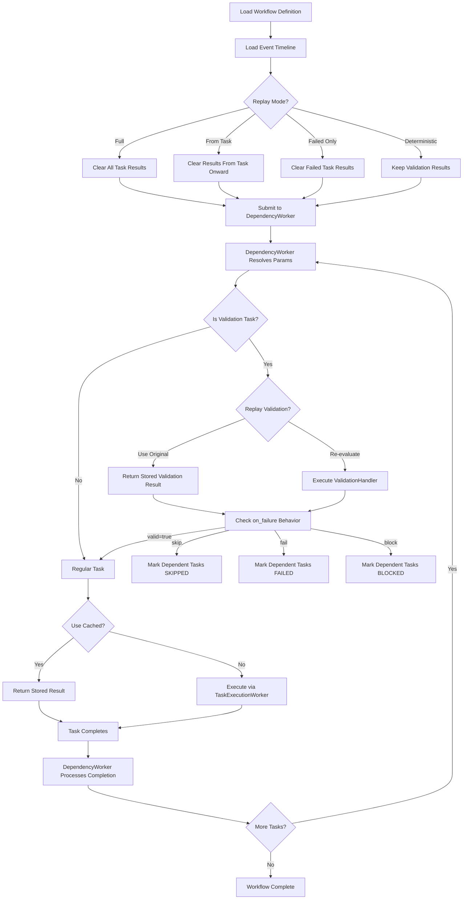

# Gleitzeit Replayability Design

## Executive Summary

This document outlines the design for adding full replayability to Gleitzeit workflows. Replayability enables re-executing workflows from captured state, supporting debugging, auditing, and recovery scenarios.

## Goals

1. **Full Workflow Replay** - Recreate exact execution from stored state
2. **Point-in-Time Replay** - Start replay from any task in the workflow
3. **Deterministic Execution** - Same inputs produce same outputs
4. **Minimal Performance Impact** - Replayability shouldn't slow normal execution
5. **Audit Trail** - Complete history of all workflow executions

## Current State Analysis

### What We Have (Implemented)

1. **Workflow Definitions** - Original workflow with unresolved parameters stored at:
   ```
   {shard:N}:workflow:data:{workflow_id}
   ```

2. **Task Results** - All task outputs stored at:
   ```
   {shard:N}:task:status:{task_id}
   - status: completed/failed/skipped/blocked
   - result: JSON output
   - completed_at: timestamp
   - handler_id: which handler executed
   - worker_id: which worker instance
   - execution_id: unique execution identifier
   ```

3. **Dependency Graph** - Task relationships stored at:
   ```
   {shard:N}:workflow:dependency:graph:{workflow_id}
   ```

4. **Workflow Status** - Completion tracking at:
   ```
   {shard:N}:workflow:status:{workflow_id}
   - total_tasks, completed_tasks, failed_tasks, skipped_tasks, blocked_tasks
   ```

5. **Event History** ✅ **NOW IMPLEMENTED** - Complete execution timeline at:
   ```
   {shard:N}:events:{workflow_id}
   - All state transitions captured
   - WORKFLOW_STARTED, WORKFLOW_COMPLETED, WORKFLOW_FAILED
   - TASK_READY, TASK_STARTED, TASK_COMPLETED, TASK_FAILED, TASK_SKIPPED
   - Validation decisions and skip reasons
   - Execution metadata (execution_id, handler_id, worker_id)
   ```

6. **Event Store** ✅ **NOW IMPLEMENTED** - Event management system:
   ```python
   event_store = EventStore(redis_client)
   timeline = await event_store.get_timeline(workflow_id)
   order = await event_store.get_task_execution_order(workflow_id)
   ```

7. **ReplayWorker** ✅ **NOW IMPLEMENTED** - Orchestrates workflow replay:
   - Multiple replay modes (full, from_task, failed_only, deterministic)
   - Preserves validation results for XOR patterns
   - Leverages existing workers for stateless re-computation

8. **CLI Commands** ✅ **NOW IMPLEMENTED**:
   ```bash
   gleitzeit replay timeline <workflow_id>  # View execution timeline
   gleitzeit replay start <workflow_id>     # Start replay
   gleitzeit replay diff <wf1> <wf2>        # Compare executions
   ```

### What's Still Needed

1. **Idempotency Keys** - Handlers can't detect replay vs first run (execution_id exists but not used)
2. **Production Testing** - Real-world validation of replay functionality
3. **Replay Coordination** - Multiple replay requests need queuing/coordination
4. **Performance Optimization** - Event queries for large workflows

### Architectural Insight: Stateless Parameter Resolution

**Important**: Resolved parameters are intentionally NOT persisted. This maintains Gleitzeit's stateless architecture where:
- Parameters are resolved on-demand by DependencyWorker
- Resolution is a pure function: `f(workflow_definition, task_results) → resolved_params`
- Workers remain stateless, computing what they need from persisted state
- No data duplication or synchronization issues

## Proposed Architecture

### Core Principle: Stateless Replay

Replayability in Gleitzeit maintains the stateless architecture by treating replay as **re-computation** rather than data playback:

1. **Source of Truth**: Workflow definition + Task results (including validation results)
2. **Parameter Resolution**: Computed on-demand by DependencyWorker (not stored)
3. **Replay Process**: Re-run the same stateless worker logic
4. **No Data Duplication**: Resolved parameters are derived, not persisted
5. **Conditional Flow**: Validation task results determine execution path

This approach ensures:
- Workers remain stateless
- No synchronization issues between stored and computed parameters
- Replay naturally uses the same code paths as original execution
- Parameter resolution logic changes are automatically reflected in replays
- Conditional logic (validation tasks) is preserved and re-evaluated

### 1. Event Sourcing Layer

Store all workflow events in persistent Redis streams:

```python
# Event structure
{
    "event_id": "evt_abc123",
    "event_type": "task:started",
    "workflow_id": "wf_xyz",
    "task_id": "task_001",
    "timestamp": "2024-01-20T10:30:00Z",
    "data": {
        "original_params": {...},
        "resolved_params": {...},
        "handler_id": "python_handler_1",
        "worker_id": "worker_001"
    }
}
```

#### Event Storage Strategy

```python
# Persist events to workflow-specific stream
await redis.xadd(
    f"{{shard:{shard}}}:events:{workflow_id}",
    {
        "event_type": event_type,
        "task_id": task_id,
        "timestamp": timestamp,
        "data": json.dumps(event_data)
    },
    maxlen=10000  # Keep last 10k events per workflow
)
```

### 2. Execution Tracking

Track execution metadata without storing resolved parameters:

```python
# When task starts execution
await redis.hset(
    get_task_key(task_id, workflow_id),
    mapping={
        b"status": b"running",
        b"started_at": timestamp.encode(),
        b"execution_id": execution_id.encode(),  # For idempotency
        b"replay_id": replay_id.encode() if is_replay else b""
    }
)
```

Note: Resolved parameters are computed on-demand by DependencyWorker from workflow definition + task results. This maintains stateless architecture.

### 3. Replay Worker

New worker type that orchestrates replay by re-running the existing workers:

```python
class ReplayWorker(BaseWorker):
    """
    Orchestrates workflow replay using existing stateless workers.

    Key principle: Replay is re-computation, not data playback.
    DependencyWorker will re-resolve parameters from source data.
    """

    async def replay_workflow(
        self,
        workflow_id: str,
        replay_mode: str = "full",
        start_from: str = None,
        use_cached_results: bool = True,
        replay_validations: bool = False  # New parameter
    ):
        """
        Replay modes:
        - full: Re-execute entire workflow (clear results, re-run)
        - from_task: Start from specific task (partial re-computation)
        - failed_only: Only replay failed tasks
        - debug: Step-through execution with breakpoints
        - deterministic: Keep validation results for identical paths

        The replay process:
        1. Load workflow definition (original params)
        2. Load execution timeline (if following original order)
        3. Clear/reset task status as needed
           - If replay_validations=False, keep validation task results
           - This preserves the original execution path
        4. Let DependencyWorker re-compute parameters
        5. DependencyWorker checks validation dependencies
           - If validation result exists (not cleared), use it
           - Apply skip/fail/block behavior to dependent tasks
        6. Execute tasks (or use cached results)
        """
```

#### Replay Execution Flow



Key insight: The replay leverages existing workers - DependencyWorker naturally re-computes parameters from source data and respects validation results.

### 4. Conditional Task Handling in Replay

Validation tasks create conditional execution paths that need special consideration during replay:

```python
class ReplayWorker:
    async def handle_validation_replay(
        self,
        task_id: str,
        workflow_id: str,
        replay_mode: str
    ):
        """
        Determine how to handle validation tasks during replay.
        """
        if replay_mode == "deterministic":
            # Use original validation result to preserve execution path
            original_result = await self.get_task_result(task_id, workflow_id)
            if original_result:
                return original_result  # Keep original path

        elif replay_mode == "re_evaluate":
            # Clear validation result to re-evaluate conditions
            await self.clear_task_result(task_id, workflow_id)
            # ValidationHandler will re-evaluate with current data

        elif replay_mode == "alternate_path":
            # Allow testing different execution paths
            # Could override validation results for testing
            pass
```

#### Validation Replay Modes

1. **Deterministic Replay** (Default)
   - Preserves original validation results
   - Ensures same execution path
   - Skipped tasks remain skipped
   - Use case: Debugging exact execution

2. **Re-evaluate Conditions**
   - Clears validation results
   - Re-runs validation logic
   - May take different path
   - Use case: Testing with updated data

3. **Path Override** (Testing)
   - Manually set validation results
   - Force specific execution paths
   - Use case: Testing all branches

#### Example: XOR Pattern Replay

```yaml
# Original execution with payment_type = "credit_card"
tasks:
  - validate_credit_card: valid=true  # This ran
  - validate_paypal: valid=false       # This caused skip
  - validate_crypto: valid=false       # This caused skip
  - process_credit_card: COMPLETED     # This executed
  - process_paypal: SKIPPED           # This was skipped
  - process_crypto: SKIPPED           # This was skipped

# Deterministic replay:
# - Keeps all validation results
# - process_credit_card re-executes (or uses cache)
# - process_paypal/crypto remain SKIPPED

# Re-evaluate replay with payment_type = "paypal":
# - Clears validation results
# - Re-runs validations with new context
# - Now process_paypal executes, others skip
```

### 5. Idempotency Support

Enable handlers to detect replay:

```python
class TaskExecution:
    execution_id: str  # Unique per execution
    replay_id: str     # Set during replay
    is_replay: bool
    original_execution_id: str  # If replaying
```

Handlers can implement idempotent behavior:

```python
async def execute(self, task: Task) -> TaskResult:
    if task.execution_context.is_replay:
        # Check if side effects already applied
        if self.check_idempotency_key(task.execution_id):
            return self.get_cached_result(task.execution_id)

    # Normal execution
    result = await self.perform_work(task)

    # Store idempotency key
    self.store_idempotency_key(task.execution_id, result)
    return result
```

### 5. Timeline Reconstruction

Build execution timeline from events:

```python
class WorkflowTimeline:
    """
    Reconstructs exact execution order
    """

    async def build_timeline(self, workflow_id: str) -> List[TimelineEntry]:
        # Read all events
        events = await redis.xrange(
            f"events:{workflow_id}",
            min="-",
            max="+"
        )

        # Build timeline
        timeline = []
        for event in events:
            timeline.append(TimelineEntry(
                timestamp=event['timestamp'],
                task_id=event['task_id'],
                event_type=event['event_type'],
                data=event['data']
            ))

        return sorted(timeline, key=lambda x: x.timestamp)
```

## Implementation Plan

### Phase 1: Event Capture (Week 1-2)

1. Add event emission to all workers
2. Configure Redis stream retention
3. Add event types for all state transitions
4. Test event capture completeness

```python
# Add to TaskExecutionWorker
async def emit_event(self, event_type: str, task_id: str, data: dict):
    await self.redis.xadd(
        f"events:{workflow_id}",
        {
            "event_type": event_type,
            "task_id": task_id,
            "timestamp": datetime.utcnow().isoformat(),
            "data": json.dumps(data)
        }
    )
```

### Phase 2: Execution Tracking (Week 2-3)

1. Add execution_id generation
2. Store handler configuration snapshots
3. Track execution metadata (no resolved params needed)

```python
# Add to TaskExecutionWorker
async def track_execution(self, task_id: str, workflow_id: str):
    await self.redis.hset(
        get_task_key(task_id, workflow_id),
        mapping={
            b"execution_id": generate_execution_id().encode(),
            b"executed_at": datetime.utcnow().isoformat().encode(),
            b"is_replay": b"true" if is_replay else b"false"
        }
    )
```

### Phase 3: Replay Worker (Week 3-4)

1. Create ReplayWorker class
2. Implement replay modes
3. Add replay CLI commands
4. Test deterministic replay

```python
# CLI integration
@click.command()
@click.option('--workflow-id', required=True)
@click.option('--mode', default='full')
@click.option('--use-cache/--no-cache', default=True)
async def replay(workflow_id: str, mode: str, use_cache: bool):
    worker = ReplayWorker()
    await worker.replay_workflow(
        workflow_id=workflow_id,
        replay_mode=mode,
        use_cached_results=use_cache
    )
```

### Phase 4: Idempotency (Week 4-5)

1. Add execution context to tasks
2. Implement idempotency key storage
3. Update handlers to support replay detection
4. Test side-effect management

### Phase 5: Timeline & Debugging (Week 5-6)

1. Create timeline reconstruction
2. Add debug replay mode
3. Implement replay breakpoints
4. Create replay visualization

## Storage Requirements

### Per Workflow Storage

```
Events stream: ~100 bytes/event * 1000 events = 100KB
Timeline index: ~50 bytes/entry * 1000 entries = 50KB
Execution metadata: ~100 bytes/task * 50 tasks = 5KB
Total: ~155KB per workflow
```

Note: Resolved parameters are not stored - they're computed on-demand from workflow definition + task results.

### Retention Policy

```python
# Configuration
REPLAY_CONFIG = {
    "event_retention_days": 30,
    "max_events_per_workflow": 10000,
    "timeline_cache_ttl": 3600,  # 1 hour
    "execution_metadata_ttl": 86400 * 7,  # 7 days
}
```

## API Design

### Replay API

```python
# Start replay
POST /workflows/{workflow_id}/replay
{
    "mode": "full|from_task|failed_only|debug",
    "start_from": "task_id",  # Optional
    "use_cached_results": true,
    "execution_overrides": {
        "task_001": {
            "params": {...}  # Override specific task params
        }
    }
}

# Get replay status
GET /workflows/{workflow_id}/replay/{replay_id}

# Get workflow timeline
GET /workflows/{workflow_id}/timeline

# Get task execution history
GET /tasks/{task_id}/executions
```

### CLI Commands

```bash
# Replay full workflow
gleitzeit replay wf_abc123

# Replay from specific task
gleitzeit replay wf_abc123 --from-task task_005

# Replay only failed tasks
gleitzeit replay wf_abc123 --failed-only

# Debug replay with stepping
gleitzeit replay wf_abc123 --debug --breakpoint task_003

# Show workflow timeline
gleitzeit timeline wf_abc123

# Compare two executions
gleitzeit diff wf_abc123 wf_abc124
```

## Testing Strategy

### Unit Tests

1. Event capture completeness
2. Parameter resolution storage
3. Timeline reconstruction accuracy
4. Idempotency key management

### Integration Tests

1. Full workflow replay
2. Partial replay from checkpoint
3. Failed task retry
4. Deterministic execution verification

### Replay Test Cases

```python
async def test_full_replay():
    # Execute workflow
    workflow_id = await execute_workflow(test_workflow)

    # Capture original results
    original_results = await get_all_task_results(workflow_id)

    # Clear results (simulate fresh run)
    await clear_task_results(workflow_id)

    # Replay
    replay_id = await replay_workflow(workflow_id, mode="full")

    # Compare results
    replay_results = await get_all_task_results(workflow_id)
    assert original_results == replay_results
```

## Performance Considerations

### Event Capture Overhead

- Async emission: ~1ms per event
- Batch emission for high-throughput tasks
- Use pipeline for multiple events

### Storage Optimization

```python
# Compress large parameters
if len(json.dumps(params)) > 1024:
    params_stored = compress(json.dumps(params))
    metadata['compressed'] = True
```

### Replay Performance

- Parallel task replay where possible
- Cache resolution results
- Skip non-deterministic tasks in cache mode

## Security Considerations

1. **Sensitive Data** - Mask secrets in events
2. **Access Control** - Replay requires same permissions as execution
3. **Audit Trail** - Log all replay attempts
4. **Data Retention** - Comply with data policies

## Migration Path

1. Deploy event capture (backward compatible)
2. Start storing events for new workflows
3. Add replay capability
4. Backfill events for critical workflows (optional)

## Success Metrics

1. **Coverage** - % of workflows with full event history
2. **Replay Success Rate** - % of successful replays
3. **Performance Impact** - < 5% overhead on normal execution
4. **Storage Efficiency** - < 500KB per workflow average
5. **Replay Speed** - 10x faster than original for cached mode

## Future Enhancements

1. **Distributed Replay** - Replay across multiple workers
2. **Replay Orchestration** - Replay multiple related workflows
3. **Time Travel Debugging** - Step forward/backward through execution
4. **Chaos Replay** - Inject failures during replay for testing
5. **Replay Analytics** - Compare execution patterns across replays

## Conclusion

Full replayability will provide Gleitzeit with powerful debugging, auditing, and recovery capabilities. By treating replay as re-computation rather than data playback, we maintain the stateless architecture that makes Gleitzeit scalable and reliable.

Key advantages of this approach:
1. **No data duplication** - Resolved parameters computed on-demand
2. **Consistency guaranteed** - Single source of truth (workflow def + results)
3. **Stateless workers** - Replay uses same worker logic as original execution
4. **Minimal storage overhead** - Only ~155KB per workflow
5. **Natural correctness** - Replay inherently uses current parameter resolution logic
6. **Conditional flow support** - Validation tasks and XOR patterns replay correctly
7. **Path flexibility** - Can replay exact path or re-evaluate conditions

The implementation preserves backward compatibility while adding minimal overhead to normal execution. The phased approach allows incremental delivery of value while maintaining system stability.

### Critical Design Decision: Validation Task Replay

The handling of validation tasks during replay is crucial:
- **Default behavior**: Preserve validation results for deterministic replay
- **Optional re-evaluation**: Clear validation results to test different paths
- **DependencyWorker naturally handles both**: It checks for existing validation results and applies skip/fail/block behavior accordingly

This design ensures that conditional workflows (XOR patterns, feature flags, etc.) replay correctly while maintaining the flexibility to explore alternate execution paths when needed.