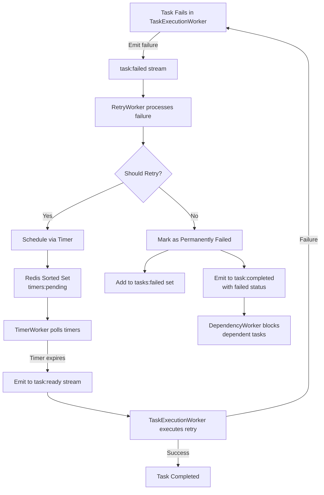
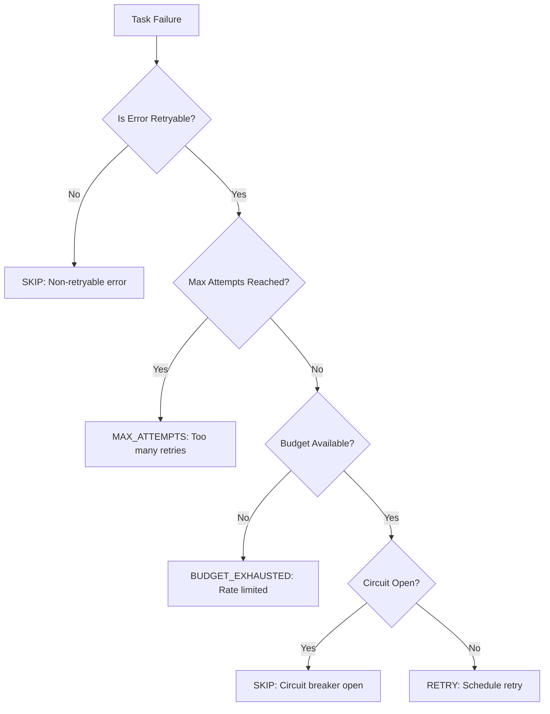
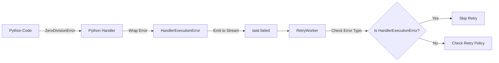

# Gleitzeit Retry Mechanism Documentation

## Table of Contents
1. [Overview](#overview)
2. [Architecture](#architecture)
3. [Configuration](#configuration)
4. [Retry Strategies](#retry-strategies)
5. [Retry Decision Logic](#retry-decision-logic)
6. [Budget System](#budget-system)
7. [Monitoring & Metrics](#monitoring--metrics)
8. [Examples](#examples)
9. [Troubleshooting](#troubleshooting)
10. [Best Practices](#best-practices)

## Overview

The Gleitzeit retry mechanism provides a robust, stateless, and scalable approach to handling task failures. It features:

- **Centralized retry management** via dedicated RetryWorker
- **Stateless operation** with all state stored in Redis
- **Configurable retry strategies** (exponential backoff, linear, fixed)
- **Retry budgeting** to prevent retry storms
- **Circuit breaker integration** for cascading failure prevention
- **Comprehensive metrics** for monitoring and alerting

### Key Components

1. **RetryWorker** - Centralized worker that makes retry decisions
2. **StatelessRetryService** - Core retry logic and state management
3. **TimerWorker** - Manages delayed retry execution
4. **TaskExecutionWorker** - Executes retried tasks

## Architecture

### Retry Flow



### Component Interactions

```
┌─────────────────────────────────────────────────────────────┐
│                         Redis State                          │
│                                                              │
│  ┌─────────────┐  ┌──────────────┐  ┌──────────────┐      │
│  │Configuration│  │Retry Budgets │  │   Metrics    │      │
│  │  Hierarchy  │  │Token Buckets │  │  & Events    │      │
│  └─────────────┘  └──────────────┘  └──────────────┘      │
│         ↑                ↑                   ↑              │
└─────────┼────────────────┼───────────────────┼──────────────┘
          │                │                   │
    ┌─────┴──────┐  ┌──────┴──────┐  ┌────────┴────────┐
    │RetryWorker │  │RetryService │  │  EventStore    │
    │            │──│ (Stateless) │──│                │
    └────────────┘  └─────────────┘  └────────────────┘
```

### State Storage in Redis

All retry state is stored in Redis using the following key structure:

```
# Configuration
retry:config:global                      # Global defaults
retry:config:workflow:{workflow_id}      # Workflow-specific overrides
retry:config:task:{workflow_id}:{task_id} # Task-specific overrides

# Retry Budgets (Token Buckets)
retry:budget:workflow:{workflow_id}      # Per-workflow budget
retry:budget:service:{service_name}      # Per-service budget
retry:budget:refill:{identifier}         # Last refill timestamp

# Metrics
retry:metrics:{workflow_id}              # Hash of retry counters
retry:metrics:window:{workflow_id}       # Sliding window (sorted set)
retry:events:{workflow_id}               # Event stream for audit

# Task State
{shard:N}:task:status:{task_id}         # Task status including retry_count
{shard:N}:task:{workflow_id}:{task_id}  # Task metadata
{shard:0}:global:timers:pending         # Sorted set of scheduled retries
{shard:N}:workflow:tasks:failed:{workflow_id}  # Set of permanently failed tasks
{shard:N}:workflow:tasks:blocked:{workflow_id} # Set of blocked tasks
```

## Configuration

### Configuration Hierarchy

Configuration follows a hierarchical structure with inheritance:

1. **Global Defaults** - Apply to all retries
2. **Workflow Configuration** - Override for specific workflow
3. **Task Configuration** - Override for specific task

The most specific configuration wins.

### Configuration Options

```python
{
    # Maximum number of retry attempts
    'max_retries': 2,              # Default: 2

    # Initial delay before first retry (seconds)
    'base_delay': 1.0,             # Default: 1.0

    # Maximum delay between retries (seconds)
    'max_delay': 30.0,             # Default: 30.0

    # Multiplier for exponential backoff
    'multiplier': 2.0,             # Default: 2.0

    # Retry strategy
    'strategy': 'exponential_jitter',  # Options: exponential, exponential_jitter,
                                       #          linear, fixed

    # Jitter factor (0.0 to 1.0)
    'jitter': 0.1,                 # Default: 0.1

    # Budget limits
    'budget_per_minute': 100,      # Max retries per minute
    'budget_per_hour': 3000,       # Max retries per hour
}
```

### Setting Configuration

#### Via Component Orchestrator
```yaml
# In gleitzeit configuration
workers:
  - worker_type: retry
    count: 2
    config:
      retry:
        max_retries: 3
        base_delay: 2.0
        strategy: exponential_jitter
        budget_per_minute: 50
```

#### Via API (Runtime)
```python
# Set global configuration
await retry_service.set_retry_config({
    'max_retries': 3,
    'base_delay': 2.0
})

# Set workflow-specific configuration
await retry_service.set_retry_config(
    {'max_retries': 5, 'strategy': 'linear'},
    workflow_id='critical_workflow'
)

# Set task-specific configuration
await retry_service.set_retry_config(
    {'max_retries': 1, 'base_delay': 5.0},
    workflow_id='workflow_123',
    task_id='important_task'
)
```

#### Via Configuration Stream
```python
# Emit configuration update
await redis.xadd('retry:configure:shard0', {
    b'type': b'workflow',
    b'workflow_id': b'workflow_123',
    b'config': json.dumps({
        'max_retries': 5,
        'base_delay': 2.0,
        'strategy': 'exponential_jitter'
    }).encode()
})
```

## Retry Strategies

### 1. Exponential Backoff
Delay increases exponentially with each attempt.

```python
delay = base_delay * (multiplier ** attempt)
# Example: 1s, 2s, 4s, 8s, 16s...
```

### 2. Exponential Backoff with Jitter
Adds randomization to prevent thundering herd.

```python
delay = base_delay * (multiplier ** attempt)
jitter = random.uniform(0, delay * jitter_factor)
final_delay = min(delay + jitter, max_delay)
# Example: 1.1s, 2.3s, 4.2s, 8.5s...
```

### 3. Linear Backoff
Delay increases linearly.

```python
delay = base_delay * (attempt + 1) * multiplier
# Example: 2s, 4s, 6s, 8s, 10s...
```

### 4. Fixed Delay
Constant delay between retries.

```python
delay = base_delay
# Example: 5s, 5s, 5s, 5s...
```

## Retry Decision Logic

The retry decision process follows this logic:



### Non-Retryable Errors

The system uses centralized error types for retry decisions. The following errors are NOT retried:

#### Handler-Level Errors (Non-Retryable)
- `HandlerExecutionError` - Handler code execution failures (wraps underlying errors)
  - Python execution errors (ZeroDivisionError, ValueError, etc.)
  - SQL syntax errors
  - Script compilation errors
  - Any programming/logic error in handler code
- `ValidationError` - Input validation failures
- `AuthenticationError` - Authentication failures (wrong credentials)
- `AuthorizationError` - Permission denied
- `NotFoundError` - Resource not found
- `ConfigurationError` - Misconfiguration
- `CircuitOpenError` - Circuit breaker is open

#### Error Propagation
When a handler encounters an error, it's wrapped in `HandlerExecutionError`:
```python
# Original Python error
ZeroDivisionError: division by zero

# Wrapped as HandlerExecutionError
[TASK_EXECUTION_FAILED] Python execution failed: ZeroDivisionError: division by zero
  error_type: HandlerExecutionError
  original_error_type: ZeroDivisionError
  handler_type: python
```

### Retryable Errors

Common retryable errors include:

- `ConnectionError` - Network connectivity issues
- `TimeoutError` - Request timeouts
- `HTTPError` (5xx) - Server errors
- `TemporaryError` - Explicitly marked temporary failures
- Database connection errors
- Rate limit errors (with backoff)

## Budget System

The retry budget system prevents retry storms using a token bucket algorithm.

### How It Works

1. **Token Bucket**: Each workflow/service has a bucket with tokens
2. **Token Consumption**: Each retry attempt consumes one token
3. **Token Refill**: Tokens refill at a configured rate
4. **Budget Exhaustion**: No retries when tokens depleted

### Budget Levels

```python
# Workflow-level budget
retry:budget:workflow:{workflow_id}  # Default: 100/minute

# Service-level budget (shared across workflows)
retry:budget:service:{service_name}  # Default: 25/minute per service

# Global budget (system-wide limit)
retry:budget:global                  # Default: 500/minute
```

### Budget Configuration

```python
# Set budget limits
config = {
    'budget_per_minute': 50,    # Short-term limit
    'budget_per_hour': 2000,    # Long-term limit
    'budget_burst': 10          # Allow burst of 10 immediate retries
}
```

### Emergency Budget Reset

```python
# Reset budget for a workflow
await redis.xadd('retry:configure:shard0', {
    b'type': b'reset_budget',
    b'workflow_id': b'workflow_123'
})

# Reset all budgets
await redis.xadd('retry:configure:shard0', {
    b'type': b'reset_budget',
    b'workflow_id': b''  # Empty = global reset
})
```

## Monitoring & Metrics

### Available Metrics

The retry system tracks comprehensive metrics:

```python
# Get retry metrics for a workflow
metrics = await retry_worker.get_retry_metrics('workflow_123')

# Metrics include:
{
    'total_retries': 42,
    'successful_retries': 38,
    'failed_retries': 4,
    'retry_rate': 2.5,  # retries per minute
    'success_rate': 90.5,  # percentage
    'error_distribution': {
        'ConnectionError': 20,
        'TimeoutError': 15,
        'HTTPError': 7
    },
    'task_distribution': {
        'task_1': 10,
        'task_2': 25,
        'task_3': 7
    },
    'budget_remaining': 58,
    'budget_consumption_rate': 42  # per minute
}
```

### Monitoring Queries

```bash
# Check retry metrics
redis-cli HGETALL retry:metrics:workflow_123

# Check budget status
redis-cli GET retry:budget:workflow:workflow_123

# View retry events (last 10)
redis-cli XREVRANGE retry:events:workflow_123 + - COUNT 10

# Check scheduled retries
redis-cli ZRANGE timers 0 -1 WITHSCORES
```

### Alerting Thresholds

Set up alerts for:

```yaml
alerts:
  - name: high_retry_rate
    condition: retry_rate > 10/minute
    severity: warning

  - name: budget_exhausted
    condition: budget_remaining == 0
    severity: critical

  - name: low_success_rate
    condition: success_rate < 50%
    severity: warning

  - name: retry_storm
    condition: total_retries > 1000 in 5 minutes
    severity: critical
```

## Error Registry

### Centralized Error System

Gleitzeit uses a centralized error registry (`core/errors.py`) with standardized error codes:

```python
from gleitzeit.core.errors import (
    HandlerExecutionError,
    ErrorCode,
    GleitzeitError
)

# Handler wraps execution errors
try:
    result = execute_python_code(code)
except Exception as e:
    raise HandlerExecutionError(
        message=f"Python execution failed: {e}",
        task_id=task.id,
        handler_type="python",
        original_error=str(e),
        original_error_type=type(e).__name__
    )
```

### Error Code Ranges

- `-29999 to -29000`: Task execution errors
- `-28999 to -28000`: Workflow errors
- `-27999 to -27000`: Queue and scheduling errors
- `-26999 to -26000`: Persistence errors
- `-25999 to -25000`: Network and communication errors

### HandlerExecutionError

The `HandlerExecutionError` is the standard wrapper for all handler-level failures:

```python
class HandlerExecutionError(TaskError):
    """
    Wraps handler-specific errors for consistent retry decisions.
    Always uses ErrorCode.TASK_EXECUTION_FAILED (-29002).
    """

    def __init__(self,
                 message: str,
                 task_id: Optional[str] = None,
                 handler_type: Optional[str] = None,
                 original_error: Optional[str] = None,
                 original_error_type: Optional[str] = None):
        # Stores original error details in metadata
        # Marks as non-retryable in retry service
```

### Error Flow Example



## Dependency Blocking

### Overview

When a task permanently fails after exhausting its retries, the system automatically blocks any tasks that depend on it. This prevents wasted computation and maintains workflow integrity.

### How It Works

1. **Task Failure**: When a task exhausts its retry attempts, RetryWorker marks it as permanently failed
2. **Failed Set Update**: The task is added to the `tasks:failed` set for the workflow
3. **Completion Event**: A `task:completed` event is emitted with `status: failed`
4. **Dependency Check**: DependencyWorker receives the event and checks for dependent tasks
5. **Task Blocking**: Any tasks depending on the failed task are marked as `blocked`
6. **Workflow Completion**: The workflow completes with appropriate failed/blocked counts

### Task States

Tasks can be in the following states related to failure and blocking:

- **pending**: Task is waiting to be executed
- **running**: Task is currently being executed
- **completed**: Task finished successfully
- **failed**: Task permanently failed after exhausting retries
- **blocked**: Task cannot run because a dependency failed
- **skipped**: Task was skipped due to validation or conditional logic

### Redis Keys for Tracking

```bash
# Failed tasks set (tasks that permanently failed)
{shard:N}:workflow:tasks:failed:{workflow_id}

# Blocked tasks set (tasks blocked by failed dependencies)
{shard:N}:workflow:tasks:blocked:{workflow_id}

# Task status (includes blocked_by and blocked_reason)
{shard:N}:task:{workflow_id}:{task_id}
```

### Example Scenario

```yaml
# Workflow with dependencies
tasks:
  - task1:
      name: "Database Connection"
      retry:
        max_retries: 2
  - task2:
      name: "Fetch Data"
      depends_on: [task1]
  - task3:
      name: "Process Data"
      depends_on: [task2]
```

If `task1` fails after 2 retries:
1. `task1` is marked as `failed` and added to `tasks:failed`
2. `task2` is marked as `blocked` with reason "Dependencies failed: task1"
3. `task3` is never attempted since `task2` is blocked
4. Workflow completes with status `failed`

### Querying Blocked Tasks

```python
# Get all blocked tasks for a workflow
blocked_tasks = await redis.smembers(
    f"{{shard:{shard}}}:workflow:tasks:blocked:{workflow_id}"
)

# Get blocking details for a specific task
task_data = await redis.hgetall(
    f"{{shard:{shard}}}:task:{workflow_id}:{task_id}"
)
blocked_by = task_data.get(b'blocked_by')
blocked_reason = task_data.get(b'blocked_reason')
```

## Examples

### Example 1: Basic Retry Configuration

```python
# Configure a workflow with aggressive retry
await retry_service.set_retry_config(
    {
        'max_retries': 5,
        'base_delay': 0.5,
        'max_delay': 10.0,
        'strategy': 'exponential_jitter',
        'budget_per_minute': 20
    },
    workflow_id='critical_data_processing'
)
```

### Example 2: Handling Connection Errors

```python
# Task fails with connection error
error = "ConnectionError: Unable to connect to database"

# RetryWorker automatically:
# 1. Identifies as retryable error
# 2. Checks retry count (attempt 0)
# 3. Verifies budget available
# 4. Schedules retry with exponential backoff
# 5. Retry executes after 1.1s (1s + jitter)
```

### Example 3: HandlerExecutionError (Non-Retryable)

```python
# Python task with division by zero
task:
  id: calculate_average
  handler: python
  method: python/execute
  params:
    code: |
      total = 100
      count = 0
      average = total / count  # ZeroDivisionError

# Result:
# 1. Python handler catches ZeroDivisionError
# 2. Wraps in HandlerExecutionError
# 3. Error message: "[TASK_EXECUTION_FAILED] Python execution failed: ZeroDivisionError: division by zero"
# 4. RetryWorker sees error_type: HandlerExecutionError
# 5. Immediately marks as non-retryable (retry_decision: skip)
# 6. Task marked as permanently failed
# 7. Dependent tasks are blocked
```

### Example 4: Custom Error Handling

```python
# Mark specific error as non-retryable for a task
await retry_service.set_retry_config(
    {
        'max_retries': 0,  # No retries
        'non_retryable_patterns': ['CRITICAL_DATA_ERROR']
    },
    workflow_id='workflow_123',
    task_id='validation_task'
)
```

### Example 4: Manual Retry Trigger

```python
# Manually trigger retry for a failed task
await redis.xadd('retry:check:shard0', {
    b'task_id': b'task_123',
    b'workflow_id': b'workflow_456',
    b'reason': b'manual_intervention'
})
```

### Example 5: Circuit Breaker Integration

```python
# When circuit opens, retries are skipped
if error_type == "CircuitOpenError":
    # No retry scheduled
    # Task marked as permanently failed
    # Circuit must be manually reset
    pass
```

## Troubleshooting

### Common Issues and Solutions

#### 1. Tasks Not Retrying

**Symptoms**: Tasks fail but no retries occur

**Check**:
```bash
# Is RetryWorker running?
ps aux | grep RetryWorker

# Is TimerWorker running?
ps aux | grep TimerWorker

# Check retry configuration
redis-cli HGETALL retry:config:global

# Check if task has pending timers
redis-cli ZRANGE "{shard:0}:global:timers:pending" 0 -1 WITHSCORES

# Check task retry count
redis-cli HGET "{shard:N}:task:status:{task_id}" retry_count

# Check budget
redis-cli GET retry:budget:workflow:{workflow_id}

# Check if error is retryable
redis-cli xread count 1 STREAMS "{shard:N}:task:failed" 0 | grep error_type

# Check for HandlerExecutionError (non-retryable)
redis-cli hget "{shard:N}:task:status:{task_id}" error | grep "TASK_EXECUTION_FAILED"
```

**Solutions**:
- Ensure both RetryWorker and TimerWorker are running
- Increase max_retries configuration if retry_count reached limit
- Reset budget if exhausted
- Check if error is `HandlerExecutionError` (programming errors are not retried)
- Verify error is not in non-retryable list (HandlerExecutionError, ValidationError, etc.)

#### 2. Retry Storm

**Symptoms**: Too many retries causing system overload

**Check**:
```bash
# Check retry rate
redis-cli HGET retry:metrics:{workflow_id} total_retries

# Check budget consumption
redis-cli GET retry:budget:workflow:{workflow_id}
```

**Solutions**:
```python
# Reduce retry frequency
await retry_service.set_retry_config({
    'budget_per_minute': 10,  # Reduce from default
    'base_delay': 5.0,        # Increase delay
    'max_retries': 2          # Reduce attempts
})

# Emergency stop
await retry_service.set_retry_config({
    'max_retries': 0  # Disable retries
})
```

#### 3. Retries Delayed or Stuck

**Symptoms**: Retries not executing at expected time

**Check**:
```bash
# Check timer queue
redis-cli ZRANGE timers 0 10 WITHSCORES

# Check TimerWorker status
redis-cli XREAD STREAMS timer:worker:heartbeat 0

# Check task:retry stream
redis-cli XLEN task:retry:shard0
```

**Solutions**:
- Restart TimerWorker if down
- Check system clock synchronization
- Verify Redis sorted set operations

#### 4. Tasks Blocked But Dependencies Succeeded

**Symptoms**: Tasks marked as blocked even though dependencies completed

**Check**:
```bash
# Check failed tasks set
redis-cli SMEMBERS "{shard:N}:workflow:tasks:failed:{workflow_id}"

# Check blocked tasks set
redis-cli SMEMBERS "{shard:N}:workflow:tasks:blocked:{workflow_id}"

# Check specific task status
redis-cli HGETALL "{shard:N}:task:{workflow_id}:{task_id}"
```

**Solutions**:
- Ensure DependencyWorker is running
- Check if dependency actually failed (not just temporarily)
- Verify dependency graph is correct
- Manual unblock if needed:
```bash
# Remove from blocked set
redis-cli SREM "{shard:N}:workflow:tasks:blocked:{workflow_id}" "{task_id}"

# Update task status to pending
redis-cli HSET "{shard:N}:task:{workflow_id}:{task_id}" status pending

# Re-emit to task:ready
redis-cli XADD "{shard:N}:task:ready" "*" \
  workflow_id "{workflow_id}" \
  task_id "{task_id}" \
  task "{task_json}"
```

#### 5. Budget Always Exhausted

**Symptoms**: Budget depletes immediately

**Check**:
```bash
# Monitor budget refill
redis-cli GET retry:budget:refill:workflow:{workflow_id}

# Check consumption pattern
redis-cli XRANGE retry:events:{workflow_id} - + COUNT 100
```

**Solutions**:
```python
# Increase budget limits
await retry_service.set_retry_config({
    'budget_per_minute': 200,
    'budget_per_hour': 6000
})

# Implement service-specific budgets
await retry_service.set_retry_config(
    {'budget_per_minute': 50},
    service_name='unreliable_api'
)
```

### Debug Commands

```bash
# Enable debug logging
export GLEITZEIT_LOG_LEVEL=DEBUG

# Trace retry decision
redis-cli XREAD STREAMS retry:trace:{workflow_id} 0

# Check retry worker logs
tail -f logs/retry_worker.log | grep -E "retry_decision|budget|schedule"

# Monitor retry events in real-time
redis-cli --csv MONITOR | grep retry
```

## Best Practices

### 1. Configure Appropriately

```python
# For critical, reliable services
config_reliable = {
    'max_retries': 5,
    'base_delay': 0.5,
    'strategy': 'exponential_jitter',
    'budget_per_minute': 100
}

# For unreliable third-party APIs
config_unreliable = {
    'max_retries': 2,
    'base_delay': 5.0,
    'max_delay': 60.0,
    'strategy': 'exponential_jitter',
    'budget_per_minute': 10
}

# For non-critical background tasks
config_background = {
    'max_retries': 10,
    'base_delay': 60.0,
    'strategy': 'fixed',
    'budget_per_hour': 100
}
```

### 2. Use Appropriate Error Types

```python
# Retryable - temporary failures
raise ConnectionError("Database temporarily unavailable")
raise TimeoutError("Request timed out")

# Non-retryable - permanent failures
raise ValueError("Invalid input data")
raise CircuitOpenError("Service circuit breaker is open")
```

### 3. Monitor and Alert

```python
# Set up monitoring
async def monitor_retry_health():
    metrics = await retry_service.get_retry_metrics(workflow_id)

    if metrics['success_rate'] < 50:
        alert("Low retry success rate", severity="warning")

    if metrics['budget_remaining'] < 10:
        alert("Budget nearly exhausted", severity="warning")

    if metrics['retry_rate'] > 20:
        alert("High retry rate detected", severity="critical")
```

### 4. Test Retry Behavior

```python
# Unit test retry logic
async def test_retry_behavior():
    # Simulate failure
    context = RetryContext(
        task_id='test_task',
        workflow_id='test_workflow',
        error_type='ConnectionError',
        error_msg='Connection refused',
        current_attempt=0
    )

    decision, metadata = await retry_service.should_retry(context)
    assert decision == RetryDecision.RETRY
    assert metadata['delay'] > 0
```

### 5. Handle Edge Cases

```python
# Implement graceful degradation
if decision == RetryDecision.BUDGET_EXHAUSTED:
    # Fall back to dead letter queue
    await emit_to_dlq(task)

elif decision == RetryDecision.MAX_ATTEMPTS:
    # Trigger manual intervention
    await notify_ops_team(task)
```

### 6. Document Service Expectations

```yaml
# Service retry requirements
services:
  payment_api:
    retry:
      max_retries: 3
      expected_errors: [ConnectionError, TimeoutError]
      sla: 99.9%

  email_service:
    retry:
      max_retries: 5
      expected_errors: [RateLimitError, ServiceUnavailable]
      sla: 99.0%
```

## Advanced Topics

### Custom Retry Strategies

Implement custom retry logic:

```python
class CustomRetryStrategy:
    async def calculate_delay(self, context: RetryContext) -> float:
        # Custom logic based on error type
        if "RateLimit" in context.error_type:
            # Parse rate limit reset time
            return parse_rate_limit_reset(context.error_msg)

        # Fibonacci sequence delays
        if context.current_attempt <= 1:
            return 1.0
        return fibonacci(context.current_attempt)
```

### Cross-Workflow Retry Coordination

Share retry budgets across related workflows:

```python
# Create workflow group budget
await retry_service.set_retry_config(
    {'budget_per_minute': 50},
    workflow_group='data_pipeline_*'
)
```

### Adaptive Retry Timing

Learn optimal retry delays from historical data:

```python
# Analyze success patterns
success_delays = await redis.zrange(
    f"retry:success:delays:{service}",
    0, -1, withscores=True
)

optimal_delay = calculate_percentile(success_delays, 75)
await retry_service.set_retry_config(
    {'base_delay': optimal_delay},
    service_name=service
)
```

## Summary

The Gleitzeit retry mechanism provides:

- **Reliability**: Persistent retry scheduling survives failures
- **Scalability**: Stateless design enables horizontal scaling
- **Flexibility**: Configurable strategies and budgets
- **Observability**: Comprehensive metrics and events
- **Safety**: Budget system prevents retry storms
- **Integration**: Works seamlessly with circuit breakers

For additional support, refer to the troubleshooting guide or contact the platform team.