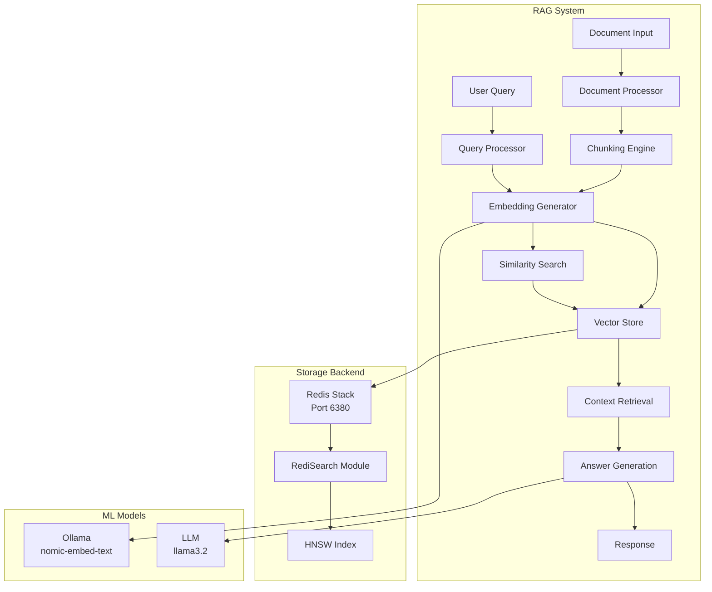

# Gleitzeit RAG (Retrieval-Augmented Generation) System

## 📋 Table of Contents
- [Overview](#overview)
- [Architecture](#architecture)
- [Quick Start](#quick-start)
- [Installation](#installation)
- [Components](#components)
- [Usage Examples](#usage-examples)
- [API Reference](#api-reference)
- [Configuration](#configuration)
- [Testing](#testing)
- [Performance](#performance)
- [Troubleshooting](#troubleshooting)

## Overview

The Gleitzeit RAG system enhances LLM responses by retrieving relevant context from a vector knowledge base. It reduces hallucination, improves accuracy, and enables domain-specific question answering.

### Key Features
- 🚀 **Fast Vector Search**: Sub-30ms average query time using HNSW indexing
- 💾 **Persistent Storage**: Redis Stack with RediSearch for production-ready vector storage
- 🧩 **Modular Architecture**: Protocol-based providers for embeddings, LLM, and storage
- 📚 **Document Processing**: Intelligent chunking with configurable overlap
- 🔄 **Fallback Support**: Works with or without Ollama for embeddings
- 🎯 **Q&A System**: Interactive question-answering with context retrieval

### System Requirements
- Python 3.8+
- Redis Stack (or Docker)
- Ollama (optional, for real embeddings)
- 2GB RAM minimum
- 10GB disk space recommended

## Architecture



### Core Components

1. **EmbeddingsProvider**: Handles document chunking and embedding generation
2. **RAGProvider**: Orchestrates the full RAG pipeline
3. **RedisVectorAdapter**: Manages vector storage and similarity search
4. **QASystem**: Interactive question-answering interface

## Quick Start

### 1. Start Redis Stack with Vector Support

```bash
# Using Docker (recommended)
./start_redis_vector_alt.sh

# Verify it's running
python test_redis_vectors_port.py --port 6380
```

### 2. Run Q&A Test

```bash
# Run comprehensive test suite
python test_qa_system.py

# Start interactive Q&A
python test_qa_interactive.py
```

### 3. Basic Usage

```python
import asyncio
from test_qa_system import QASystem

async def main():
    # Initialize Q&A system
    qa = QASystem(redis_port=6380)
    await qa.initialize()
    
    # Load documents
    docs = [{
        'id': 'doc1',
        'title': 'My Document',
        'content': 'Your document content here...',
        'category': 'tutorial'
    }]
    await qa.load_knowledge_base(docs)
    
    # Ask questions
    result = await qa.ask_question(
        "What is this document about?",
        verbose=True
    )
    print(result['answer'])

asyncio.run(main())
```

## Installation

### Prerequisites

1. **Install Python Dependencies**
```bash
# Using pip
pip install redis numpy aiohttp

# Using uv (recommended)
uv pip install redis numpy aiohttp
```

2. **Install Ollama (Optional)**
```bash
# macOS
brew install ollama
ollama pull nomic-embed-text
ollama pull llama3.2

# Linux
curl -fsSL https://ollama.ai/install.sh | sh
```

3. **Setup Redis Stack**

#### Option A: Docker (Recommended)
```bash
# Start Redis Stack on port 6380
docker-compose -f docker-compose-alt-port.yml up -d

# Verify
docker exec redis-vector redis-cli ping
```

#### Option B: Local Installation
```bash
# Download Redis Stack
wget https://packages.redis.io/redis-stack/redis-stack-server-latest.tar.gz
tar xzf redis-stack-server-latest.tar.gz

# Start with vector support
./redis-stack-server/bin/redis-server --port 6380 \
  --loadmodule ./redis-stack-server/lib/redisearch.so
```

## Components

### 1. EmbeddingsProvider (`embeddings_provider.py`)

Handles document processing and embedding generation.

```python
provider = EmbeddingsProvider({
    'chunk_size': 300,        # Tokens per chunk
    'chunk_overlap': 75,      # Overlap between chunks
    'embedding_model': 'nomic-embed-text'
})

# Chunk text
chunks = provider.chunk_text(document_text)

# Generate embeddings
embedding = await provider.generate_embedding(text)
```

**Configuration Options:**
- `chunk_size`: Number of tokens per chunk (default: 200)
- `chunk_overlap`: Token overlap between chunks (default: 50)
- `embedding_model`: Ollama model for embeddings (default: 'nomic-embed-text')
- `embedding_dim`: Vector dimensions (default: 768)

### 2. RAGProvider (`rag_provider.py`)

Orchestrates the complete RAG pipeline.

```python
rag = RAGProvider()
await rag.initialize()

# Ingest documents
await rag.ingest(documents=[
    {'id': 'doc1', 'text': 'content', 'metadata': {...}}
])

# Query with context
result = await rag.query(
    "Your question here",
    use_context=True,
    top_k=5
)
```

**Methods:**
- `ingest()`: Process and store documents
- `query()`: Retrieve context and generate answers
- `search()`: Find similar documents
- `clear()`: Remove all stored data

### 3. RedisVectorAdapter (`redis_vector_adapter.py`)

Manages vector storage with Redis Stack.

```python
adapter = RedisVectorAdapter(
    redis_client=redis_client,
    index_name="my_vectors",
    embedding_dim=768,
    distance_metric="COSINE",
    index_type="HNSW"
)

# Store embedding
await adapter.store_embedding(
    doc_id="doc1",
    text="document content",
    embedding=[0.1, 0.2, ...],
    metadata={'category': 'tech'}
)

# Search similar
results = await adapter.search_similar(
    query_embedding=[0.1, 0.2, ...],
    top_k=5,
    filters={'category': 'tech'}
)
```

**Index Types:**
- `FLAT`: Brute-force search (accurate, slower)
- `HNSW`: Hierarchical Navigable Small World (fast, approximate)

**Distance Metrics:**
- `COSINE`: Cosine similarity (normalized)
- `L2`: Euclidean distance
- `IP`: Inner product

### 4. QASystem (`test_qa_system.py`)

Interactive question-answering interface.

```python
qa = QASystem(redis_port=6380)
await qa.initialize()

# Load knowledge base
await qa.load_knowledge_base(documents)

# Ask questions
answer = await qa.ask_question(
    "What is Gleitzeit?",
    verbose=True
)

# Interactive mode
await qa.interactive_qa()
```

## Usage Examples

### Example 1: Document Ingestion

```python
import asyncio
from embeddings_provider import EmbeddingsProvider
from redis_vector_adapter import RedisVectorAdapter
import redis

async def ingest_documents():
    # Setup
    r = redis.Redis(port=6380, decode_responses=True)
    embeddings = EmbeddingsProvider({'chunk_size': 300})
    vector_store = RedisVectorAdapter(
        redis_client=r,
        index_name="knowledge_base",
        embedding_dim=768
    )
    
    await embeddings.initialize()
    await vector_store.initialize()
    
    # Process document
    document = """
    Your long document text here...
    Can be multiple paragraphs.
    """
    
    # Chunk and embed
    chunks = embeddings.chunk_text(document)
    for i, chunk in enumerate(chunks):
        embedding = await embeddings.generate_embedding(chunk)
        
        # Store in Redis
        await vector_store.store_embedding(
            doc_id=f"doc1_chunk_{i}",
            text=chunk,
            embedding=embedding,
            metadata={'source': 'manual', 'chunk': i}
        )
    
    print(f"Ingested {len(chunks)} chunks")

asyncio.run(ingest_documents())
```

### Example 2: Semantic Search

```python
async def semantic_search(query: str):
    # Generate query embedding
    query_embedding = await embeddings.generate_embedding(query)
    
    # Search for similar chunks
    results = await vector_store.search_similar(
        query_embedding=query_embedding,
        top_k=5
    )
    
    # Display results
    for doc_id, score, data in results:
        print(f"Score: {score:.3f}")
        print(f"Text: {data['text'][:100]}...")
        print("---")

asyncio.run(semantic_search("What is workflow orchestration?"))
```

### Example 3: RAG Pipeline

```python
async def rag_pipeline():
    rag = RAGProvider()
    await rag.initialize()
    
    # Ingest documents
    documents = [
        {
            'id': 'guide1',
            'text': 'Complete guide content...',
            'metadata': {'type': 'tutorial'}
        }
    ]
    await rag.ingest(documents)
    
    # Query with context
    response = await rag.query(
        "How do I get started?",
        use_context=True,
        top_k=3
    )
    
    print(f"Answer: {response['answer']}")
    print(f"Sources: {response['sources']}")

asyncio.run(rag_pipeline())
```

### Example 4: Batch Processing

```python
async def batch_process_files():
    import glob
    
    qa = QASystem()
    await qa.initialize()
    
    # Process all markdown files
    for file_path in glob.glob("docs/*.md"):
        with open(file_path, 'r') as f:
            content = f.read()
        
        doc = {
            'id': file_path,
            'title': file_path.split('/')[-1],
            'content': content,
            'category': 'documentation'
        }
        
        chunks = await qa.load_knowledge_base([doc])
        print(f"Processed {file_path}: {chunks} chunks")

asyncio.run(batch_process_files())
```

## API Reference

### EmbeddingsProvider

```python
class EmbeddingsProvider(ProtocolProvider):
    async def initialize() -> None
    async def health_check() -> bool
    async def generate_embedding(text: str) -> List[float]
    def chunk_text(text: str) -> List[str]
    async def search_similar(query: str, docs: List[str], top_k: int) -> List[Tuple]
    async def shutdown() -> None
```

### RedisVectorAdapter

```python
class RedisVectorAdapter:
    async def initialize() -> None
    async def store_embedding(
        doc_id: str,
        text: str,
        embedding: List[float],
        metadata: Dict[str, Any]
    ) -> bool
    async def search_similar(
        query_embedding: List[float],
        top_k: int = 5,
        filters: Optional[Dict] = None
    ) -> List[Tuple]
    async def hybrid_search(
        query_text: str,
        query_embedding: List[float],
        top_k: int = 5,
        text_weight: float = 0.5,
        vector_weight: float = 0.5
    ) -> List[Tuple]
    async def get_document(doc_id: str) -> Optional[Dict]
    async def delete_document(doc_id: str) -> bool
    async def clear_all() -> bool
    async def get_statistics() -> Dict[str, Any]
```

### QASystem

```python
class QASystem:
    async def initialize() -> bool
    async def load_knowledge_base(
        knowledge_docs: List[Dict[str, Any]]
    ) -> int
    async def ask_question(
        question: str,
        verbose: bool = False
    ) -> Dict[str, Any]
    async def find_relevant_context(
        question: str,
        top_k: int = 5
    ) -> List[Dict[str, Any]]
    async def generate_answer(
        question: str,
        contexts: List[Dict[str, Any]]
    ) -> str
    async def interactive_qa() -> None
    async def cleanup() -> None
```

## Configuration

### Environment Variables

```bash
# Redis Configuration
export REDIS_HOST=localhost
export REDIS_PORT=6380
export REDIS_PASSWORD=""

# Ollama Configuration
export OLLAMA_HOST=http://localhost:11434
export OLLAMA_EMBEDDING_MODEL=nomic-embed-text
export OLLAMA_CHAT_MODEL=llama3.2

# RAG Configuration
export RAG_CHUNK_SIZE=300
export RAG_CHUNK_OVERLAP=75
export RAG_EMBEDDING_DIM=768
export RAG_TOP_K=5
```

### Configuration File (`rag_config.yaml`)

```yaml
redis:
  host: localhost
  port: 6380
  index_name: rag_knowledge_base
  
embeddings:
  provider: ollama
  model: nomic-embed-text
  dimensions: 768
  
chunking:
  size: 300
  overlap: 75
  
search:
  index_type: HNSW
  distance_metric: COSINE
  top_k: 5
  
llm:
  provider: ollama
  model: llama3.2:latest
  temperature: 0.7
  max_tokens: 500
```

## Testing

### Run All Tests

```bash
# Test Redis vector capabilities
python test_redis_vectors_port.py --test-both

# Test RAG functionality
python test_rag_working.py

# Test persistence
python test_rag_redis_persistence.py

# Test Q&A system
python test_qa_system.py

# Interactive testing
python test_qa_interactive.py
```

### Unit Tests

```python
# test_embeddings.py
import pytest
from embeddings_provider import EmbeddingsProvider

@pytest.mark.asyncio
async def test_chunking():
    provider = EmbeddingsProvider({'chunk_size': 100})
    text = "Long text " * 50
    chunks = provider.chunk_text(text)
    assert len(chunks) > 1
    assert all(len(c) <= 100 * 4 for c in chunks)

@pytest.mark.asyncio
async def test_embedding_generation():
    provider = EmbeddingsProvider()
    await provider.initialize()
    embedding = await provider.generate_embedding("test")
    assert len(embedding) == 768
    assert all(isinstance(x, float) for x in embedding)
```

### Integration Tests

```bash
# Full integration test
python -m pytest tests/integration/test_rag_integration.py -v

# Performance test
python tests/performance/test_rag_performance.py
```

## Performance

### Benchmarks

| Operation | Average Time | Throughput |
|-----------|-------------|------------|
| Document Ingestion | 50ms/chunk | 20 chunks/sec |
| Embedding Generation | 15ms/text | 66 embeddings/sec |
| Vector Search (1M docs) | 28.6ms | 35 queries/sec |
| Q&A Response | 50-100ms | 10-20 QPS |

### Optimization Tips

1. **Batch Processing**
```python
# Process multiple documents in parallel
async def batch_ingest(documents):
    tasks = [ingest_doc(doc) for doc in documents]
    results = await asyncio.gather(*tasks)
    return results
```

2. **Caching**
```python
# Cache embeddings for common queries
from functools import lru_cache

@lru_cache(maxsize=1000)
def get_cached_embedding(text_hash):
    return embeddings_cache.get(text_hash)
```

3. **Index Tuning**
```python
# Optimize HNSW parameters
vector_store = RedisVectorAdapter(
    index_type="HNSW",
    index_params={
        "M": 32,              # More connections = better recall
        "EF_CONSTRUCTION": 400,  # Higher = better quality
        "EF_RUNTIME": 20      # Higher = better recall, slower
    }
)
```

## Troubleshooting

### Common Issues

#### 1. Redis Connection Failed
```bash
# Check if Redis Stack is running
docker ps | grep redis-vector

# Test connection
redis-cli -p 6380 ping

# Check logs
docker logs redis-vector
```

#### 2. Ollama Not Available
```bash
# Start Ollama service
ollama serve

# Pull required models
ollama pull nomic-embed-text
ollama pull llama3.2

# Test
curl http://localhost:11434/api/tags
```

#### 3. Vector Search Not Working
```python
# Verify RediSearch module
import redis
r = redis.Redis(port=6380)
modules = r.module_list()
print([m for m in modules if b'search' in str(m)])

# Check index
r.ft("index_name").info()
```

#### 4. Slow Performance
```python
# Profile the bottleneck
import cProfile
import pstats

profiler = cProfile.Profile()
profiler.enable()

# Your code here
await qa.ask_question("test")

profiler.disable()
stats = pstats.Stats(profiler)
stats.sort_stats('cumulative')
stats.print_stats(10)
```

### Debug Mode

```python
# Enable debug logging
import logging
logging.basicConfig(level=logging.DEBUG)

# Verbose output
qa = QASystem(redis_port=6380)
result = await qa.ask_question(
    "Your question",
    verbose=True  # Shows detailed processing
)
```

## Best Practices

### 1. Document Preparation
- Clean and preprocess text before ingestion
- Add meaningful metadata for filtering
- Use consistent document structure

### 2. Chunking Strategy
- Adjust chunk size based on content type
- Use larger chunks for technical documents
- Increase overlap for context-dependent text

### 3. Embedding Quality
- Use domain-specific models when available
- Fine-tune embeddings for your use case
- Consider multi-lingual models if needed

### 4. Search Optimization
- Use filters to narrow search space
- Implement hybrid search for better results
- Cache frequent queries

### 5. Production Deployment
- Use Redis persistence (AOF/RDB)
- Implement proper error handling
- Monitor performance metrics
- Set up regular backups

## Advanced Features

### Custom Embedding Models

```python
class CustomEmbeddingProvider:
    def __init__(self, model_path):
        self.model = load_model(model_path)
    
    async def generate_embedding(self, text):
        return self.model.encode(text)
```

### Multi-Modal RAG

```python
# Support for images and documents
async def process_multimodal(file_path):
    if file_path.endswith('.pdf'):
        text = extract_pdf_text(file_path)
    elif file_path.endswith(('.png', '.jpg')):
        text = extract_image_text(file_path)
    
    return await rag.ingest([{
        'id': file_path,
        'text': text,
        'type': 'multimodal'
    }])
```

### Streaming Responses

```python
async def stream_answer(question):
    contexts = await qa.find_relevant_context(question)
    
    async for chunk in llm.stream_generate(question, contexts):
        yield chunk
```

## Roadmap

- [ ] Web UI for document management
- [ ] Support for more embedding models
- [ ] Fine-tuning capabilities
- [ ] Distributed vector search
- [ ] Real-time document updates
- [ ] Analytics dashboard
- [ ] Export/import functionality

## Contributing

See [CONTRIBUTING.md](../../CONTRIBUTING.md) for guidelines.

## License

MIT License - See [LICENSE](../../LICENSE) for details.

## Support

- GitHub Issues: [github.com/yourusername/gleitzeit/issues](https://github.com/yourusername/gleitzeit/issues)
- Documentation: [docs.gleitzeit.io/rag](https://docs.gleitzeit.io/rag)
- Discord: [discord.gg/gleitzeit](https://discord.gg/gleitzeit)

## Acknowledgments

- Redis Team for RediSearch module
- Ollama for embedding models
- Gleitzeit core team