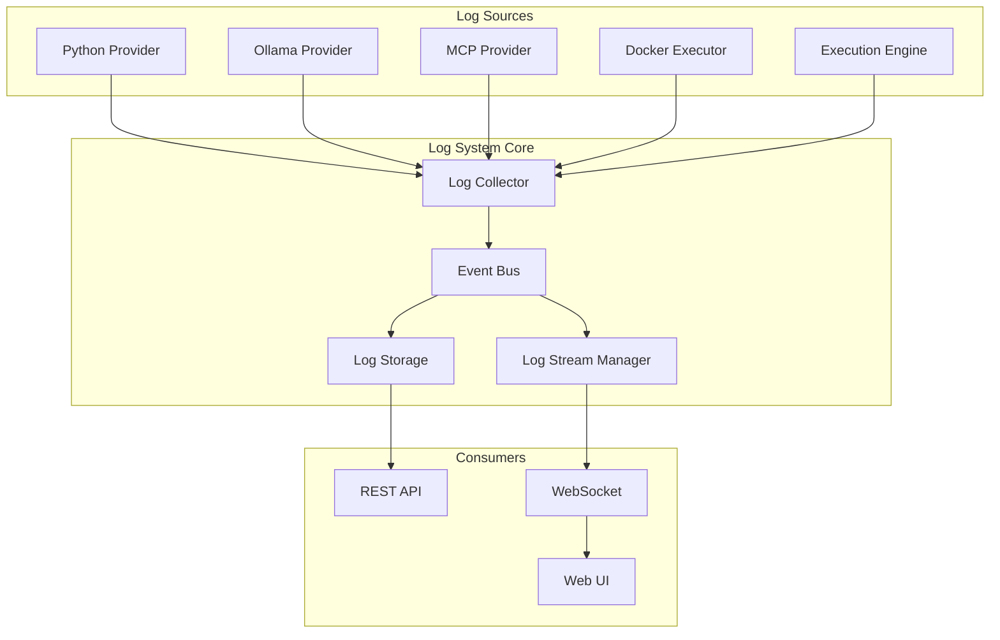

# Gleitzeit Comprehensive Log System Design

## Executive Summary

Gleitzeit currently has scattered logging across components without centralized storage, streaming, or correlation capabilities. This document proposes a comprehensive log system that leverages the existing event-driven architecture to provide unified log collection, real-time streaming, persistent storage, and analytics capabilities.

## Current State Analysis

### What We Have
- ✅ **Python logging infrastructure** (944 occurrences across 55+ files)
- ✅ **Event-driven architecture** with EventBus and 40+ event types
- ✅ **Provider output capture** (stdout/stderr from Python, Docker, MCP)
- ✅ **Persistence backend** with SQLAlchemy and task result storage

### Critical Gaps
- ❌ **No centralized log storage** - Logs only in task results
- ❌ **No real-time streaming** - Can't watch long-running tasks
- ❌ **No log correlation** - Can't trace workflow execution
- ❌ **No search/analytics** - Can't analyze patterns or errors

## Architecture Design

### Core Principles
1. **Zero Breaking Changes** - Extend existing systems, don't replace
2. **Event-Driven** - Use EventBus as the central nervous system
3. **Progressive Enhancement** - System works without log subsystem
4. **Performance First** - <5ms overhead on task execution

### System Components



## Implementation Plan

### Phase 1: Foundation (Week 1-2)

#### 1.1 Log Event Types
```python
# Extend src/gleitzeit/core/events.py
class EventType(str, Enum):
    # ... existing events ...
    
    # New log events
    LOG_MESSAGE = "log:message"
    LOG_STREAM_START = "log:stream:start"
    LOG_STREAM_END = "log:stream:end"
    LOG_BATCH = "log:batch"
```

#### 1.2 Log Data Model
```python
# New file: src/gleitzeit/core/logs.py
from dataclasses import dataclass
from typing import Optional, Dict, Any
from datetime import datetime
from enum import Enum

class LogLevel(str, Enum):
    DEBUG = "debug"
    INFO = "info"
    WARNING = "warning"
    ERROR = "error"
    CRITICAL = "critical"

class LogSource(str, Enum):
    PROVIDER = "provider"
    ENGINE = "engine"
    QUEUE = "queue"
    DOCKER = "docker"
    SYSTEM = "system"

@dataclass
class LogEntry:
    """Single log entry with full context"""
    timestamp: datetime
    level: LogLevel
    message: str
    source: LogSource
    
    # Context
    task_id: Optional[str] = None
    workflow_id: Optional[str] = None
    provider_id: Optional[str] = None
    
    # Additional data
    stream_type: Optional[str] = None  # stdout, stderr
    line_number: Optional[int] = None
    metadata: Dict[str, Any] = None
    
    def to_dict(self) -> Dict[str, Any]:
        return {
            "timestamp": self.timestamp.isoformat(),
            "level": self.level.value,
            "message": self.message,
            "source": self.source.value,
            "task_id": self.task_id,
            "workflow_id": self.workflow_id,
            "provider_id": self.provider_id,
            "stream_type": self.stream_type,
            "line_number": self.line_number,
            "metadata": self.metadata
        }
```

#### 1.3 Database Schema
```sql
-- Add to existing SQLAlchemy models
CREATE TABLE task_logs (
    id INTEGER PRIMARY KEY AUTOINCREMENT,
    timestamp DATETIME NOT NULL DEFAULT CURRENT_TIMESTAMP,
    level VARCHAR(20) NOT NULL,
    message TEXT NOT NULL,
    source VARCHAR(50) NOT NULL,
    
    -- Context fields
    task_id VARCHAR(255),
    workflow_id VARCHAR(255),
    provider_id VARCHAR(255),
    
    -- Additional fields
    stream_type VARCHAR(20),
    line_number INTEGER,
    metadata TEXT,  -- JSON
    
    -- Indexes for performance
    INDEX idx_logs_task (task_id, timestamp),
    INDEX idx_logs_workflow (workflow_id, timestamp),
    INDEX idx_logs_level (level),
    INDEX idx_logs_timestamp (timestamp),
    
    -- Foreign keys
    FOREIGN KEY (task_id) REFERENCES tasks(id) ON DELETE CASCADE,
    FOREIGN KEY (workflow_id) REFERENCES workflows(id) ON DELETE CASCADE
);

-- Aggregated log statistics (for performance)
CREATE TABLE log_stats (
    id INTEGER PRIMARY KEY AUTOINCREMENT,
    workflow_id VARCHAR(255) UNIQUE,
    total_logs INTEGER DEFAULT 0,
    error_count INTEGER DEFAULT 0,
    warning_count INTEGER DEFAULT 0,
    first_log_at DATETIME,
    last_log_at DATETIME,
    
    FOREIGN KEY (workflow_id) REFERENCES workflows(id) ON DELETE CASCADE
);
```

### Phase 2: Log Collection (Week 3-4)

#### 2.1 Log Collector Service
```python
# New file: src/gleitzeit/core/log_collector.py
import asyncio
from typing import Optional, List
from datetime import datetime
from contextlib import contextmanager

class LogCollector:
    """Centralized log collection service"""
    
    def __init__(self, event_bus: EventBus, persistence: UnifiedPersistenceAdapter):
        self.event_bus = event_bus
        self.persistence = persistence
        self.buffer: List[LogEntry] = []
        self.buffer_size = 100
        self.flush_interval = 1.0  # seconds
        
    async def start(self):
        """Start background flush task"""
        asyncio.create_task(self._flush_loop())
        
    async def log(
        self,
        level: LogLevel,
        message: str,
        source: LogSource,
        task_id: Optional[str] = None,
        workflow_id: Optional[str] = None,
        **kwargs
    ):
        """Log a message"""
        entry = LogEntry(
            timestamp=datetime.utcnow(),
            level=level,
            message=message,
            source=source,
            task_id=task_id,
            workflow_id=workflow_id,
            **kwargs
        )
        
        # Buffer for batch writes
        self.buffer.append(entry)
        
        # Emit to event bus for real-time streaming
        await self.event_bus.emit(GleitzeitEvent(
            event_type=EventType.LOG_MESSAGE,
            data=entry.to_dict()
        ))
        
        # Flush if buffer is full
        if len(self.buffer) >= self.buffer_size:
            await self._flush_buffer()
    
    async def _flush_buffer(self):
        """Write buffered logs to storage"""
        if not self.buffer:
            return
            
        batch = self.buffer.copy()
        self.buffer.clear()
        
        try:
            await self.persistence.save_logs_batch(batch)
        except Exception as e:
            logger.error(f"Failed to persist logs: {e}")
            # Re-add to buffer for retry
            self.buffer.extend(batch)
    
    async def _flush_loop(self):
        """Periodic buffer flush"""
        while True:
            await asyncio.sleep(self.flush_interval)
            await self._flush_buffer()
    
    @contextmanager
    def task_context(self, task_id: str, workflow_id: str):
        """Context manager for task execution logging"""
        # Store context in contextvars
        token = log_context.set({
            "task_id": task_id,
            "workflow_id": workflow_id
        })
        try:
            yield
        finally:
            log_context.reset(token)
```

#### 2.2 Provider Integration
```python
# Update src/gleitzeit/providers/python_provider.py
class PythonProvider(ProtocolProvider):
    def __init__(self, log_collector: LogCollector, ...):
        self.log_collector = log_collector
        # ... existing init ...
    
    async def execute_python(self, code: str, params: Dict) -> Any:
        """Execute Python code with log capture"""
        task_id = params.get("task_id")
        workflow_id = params.get("workflow_id")
        
        # Log execution start
        await self.log_collector.log(
            LogLevel.INFO,
            f"Starting Python execution: {params.get('method')}",
            LogSource.PROVIDER,
            task_id=task_id,
            workflow_id=workflow_id
        )
        
        # Run subprocess with output capture
        process = await asyncio.create_subprocess_exec(
            'python', script_path,
            stdout=asyncio.subprocess.PIPE,
            stderr=asyncio.subprocess.PIPE
        )
        
        # Stream output to logs
        async def stream_output(stream, stream_type):
            line_num = 0
            async for line in stream:
                line_num += 1
                await self.log_collector.log(
                    LogLevel.INFO,
                    line.decode().strip(),
                    LogSource.PROVIDER,
                    task_id=task_id,
                    workflow_id=workflow_id,
                    stream_type=stream_type,
                    line_number=line_num
                )
        
        # Stream both stdout and stderr
        await asyncio.gather(
            stream_output(process.stdout, "stdout"),
            stream_output(process.stderr, "stderr")
        )
        
        return_code = await process.wait()
        
        # Log completion
        level = LogLevel.INFO if return_code == 0 else LogLevel.ERROR
        await self.log_collector.log(
            level,
            f"Python execution completed with code {return_code}",
            LogSource.PROVIDER,
            task_id=task_id,
            workflow_id=workflow_id
        )
```

### Phase 3: Real-time Streaming (Week 5-6)

#### 3.1 Log Stream Manager
```python
# New file: src/gleitzeit/core/log_stream.py
from typing import Dict, Set, List
from collections import defaultdict
import asyncio

class LogStreamManager:
    """Manages real-time log streaming to clients"""
    
    def __init__(self, event_bus: EventBus):
        self.event_bus = event_bus
        self.subscribers: Dict[str, Set[WebSocket]] = defaultdict(set)
        self.buffers: Dict[str, List[LogEntry]] = defaultdict(list)
        self.buffer_size = 1000  # Keep last N logs per stream
        
        # Register for log events
        event_bus.register(EventType.LOG_MESSAGE, self._handle_log_event)
    
    async def subscribe(
        self,
        websocket: WebSocket,
        task_id: Optional[str] = None,
        workflow_id: Optional[str] = None,
        send_buffer: bool = True
    ):
        """Subscribe to log stream"""
        stream_key = self._get_stream_key(task_id, workflow_id)
        self.subscribers[stream_key].add(websocket)
        
        # Send buffered logs to new subscriber
        if send_buffer and stream_key in self.buffers:
            for entry in self.buffers[stream_key]:
                await websocket.send_json({
                    "type": "log:history",
                    "data": entry.to_dict()
                })
        
        # Send subscription confirmation
        await websocket.send_json({
            "type": "log:subscribed",
            "stream": stream_key
        })
    
    async def unsubscribe(self, websocket: WebSocket):
        """Remove subscription"""
        for subscribers in self.subscribers.values():
            subscribers.discard(websocket)
    
    async def _handle_log_event(self, event: GleitzeitEvent):
        """Route log events to subscribers"""
        data = event.data
        task_id = data.get("task_id")
        workflow_id = data.get("workflow_id")
        
        # Buffer the log
        stream_key = self._get_stream_key(task_id, workflow_id)
        self.buffers[stream_key].append(LogEntry(**data))
        
        # Trim buffer if too large
        if len(self.buffers[stream_key]) > self.buffer_size:
            self.buffers[stream_key] = self.buffers[stream_key][-self.buffer_size:]
        
        # Send to all matching subscribers
        for key in self._get_matching_keys(task_id, workflow_id):
            for websocket in self.subscribers.get(key, []):
                try:
                    await websocket.send_json({
                        "type": "log:message",
                        "data": data
                    })
                except Exception as e:
                    logger.warning(f"Failed to send log to client: {e}")
                    await self.unsubscribe(websocket)
    
    def _get_stream_key(self, task_id: str = None, workflow_id: str = None) -> str:
        """Generate stream key"""
        if task_id:
            return f"task:{task_id}"
        elif workflow_id:
            return f"workflow:{workflow_id}"
        else:
            return "global"
    
    def _get_matching_keys(self, task_id: str, workflow_id: str) -> List[str]:
        """Get all stream keys that match this log"""
        keys = ["global"]
        if task_id:
            keys.append(f"task:{task_id}")
        if workflow_id:
            keys.append(f"workflow:{workflow_id}")
        return keys
```

#### 3.2 WebSocket Endpoints
```python
# Add to src/gleitzeit/api/main.py
@app.websocket("/ws/logs/task/{task_id}")
async def stream_task_logs(websocket: WebSocket, task_id: str):
    """Stream logs for a specific task"""
    await websocket.accept()
    
    try:
        await app_state.log_stream_manager.subscribe(
            websocket,
            task_id=task_id,
            send_buffer=True
        )
        
        # Keep connection alive
        while True:
            message = await websocket.receive_text()
            if message == "ping":
                await websocket.send_text("pong")
    
    except WebSocketDisconnect:
        await app_state.log_stream_manager.unsubscribe(websocket)

@app.websocket("/ws/logs/workflow/{workflow_id}")
async def stream_workflow_logs(websocket: WebSocket, workflow_id: str):
    """Stream logs for entire workflow"""
    await websocket.accept()
    
    try:
        await app_state.log_stream_manager.subscribe(
            websocket,
            workflow_id=workflow_id,
            send_buffer=True
        )
        
        while True:
            message = await websocket.receive_text()
            if message == "ping":
                await websocket.send_text("pong")
    
    except WebSocketDisconnect:
        await app_state.log_stream_manager.unsubscribe(websocket)
```

### Phase 4: REST API Endpoints (Week 7)

#### 4.1 Log Query API
```python
# Add to src/gleitzeit/api/main.py

@app.get("/api/logs")
async def get_logs(
    task_id: Optional[str] = None,
    workflow_id: Optional[str] = None,
    level: Optional[str] = None,
    source: Optional[str] = None,
    start_time: Optional[datetime] = None,
    end_time: Optional[datetime] = None,
    limit: int = Query(100, le=10000),
    offset: int = Query(0, ge=0)
):
    """Query logs with filtering"""
    filters = {}
    if task_id:
        filters["task_id"] = task_id
    if workflow_id:
        filters["workflow_id"] = workflow_id
    if level:
        filters["level"] = level
    if source:
        filters["source"] = source
    if start_time:
        filters["start_time"] = start_time
    if end_time:
        filters["end_time"] = end_time
    
    logs = await app_state.persistence.query_logs(
        filters=filters,
        limit=limit,
        offset=offset
    )
    
    return {
        "logs": [log.to_dict() for log in logs],
        "total": len(logs),
        "limit": limit,
        "offset": offset
    }

@app.get("/api/tasks/{task_id}/logs")
async def get_task_logs(
    task_id: str,
    tail: Optional[int] = None,
    follow: bool = False
):
    """Get logs for a specific task"""
    if follow:
        # Return WebSocket URL for streaming
        return {
            "streaming_url": f"/ws/logs/task/{task_id}"
        }
    
    # Return stored logs
    logs = await app_state.persistence.get_task_logs(
        task_id=task_id,
        tail=tail
    )
    
    return {
        "task_id": task_id,
        "logs": [log.to_dict() for log in logs],
        "total": len(logs)
    }

@app.get("/api/workflows/{workflow_id}/logs")
async def get_workflow_logs(
    workflow_id: str,
    tail: Optional[int] = None,
    follow: bool = False
):
    """Get logs for entire workflow"""
    if follow:
        return {
            "streaming_url": f"/ws/logs/workflow/{workflow_id}"
        }
    
    logs = await app_state.persistence.get_workflow_logs(
        workflow_id=workflow_id,
        tail=tail
    )
    
    return {
        "workflow_id": workflow_id,
        "logs": [log.to_dict() for log in logs],
        "total": len(logs)
    }

@app.delete("/api/logs")
async def delete_logs(
    older_than_days: int = Query(..., ge=1, le=365)
):
    """Delete old logs (admin only)"""
    cutoff_date = datetime.utcnow() - timedelta(days=older_than_days)
    
    deleted = await app_state.persistence.delete_logs_before(cutoff_date)
    
    return {
        "deleted": deleted,
        "cutoff_date": cutoff_date.isoformat()
    }
```

#### 4.2 Log Analytics API
```python
@app.get("/api/logs/stats")
async def get_log_stats(
    workflow_id: Optional[str] = None,
    task_id: Optional[str] = None
):
    """Get log statistics"""
    stats = await app_state.persistence.get_log_stats(
        workflow_id=workflow_id,
        task_id=task_id
    )
    
    return {
        "total_logs": stats.total_logs,
        "error_count": stats.error_count,
        "warning_count": stats.warning_count,
        "info_count": stats.info_count,
        "debug_count": stats.debug_count,
        "sources": stats.sources,  # Dict of source -> count
        "time_range": {
            "first": stats.first_log_at,
            "last": stats.last_log_at
        }
    }

@app.get("/api/logs/search")
async def search_logs(
    query: str = Query(..., min_length=1),
    limit: int = Query(100, le=1000)
):
    """Full-text search in logs"""
    results = await app_state.persistence.search_logs(
        query=query,
        limit=limit
    )
    
    return {
        "query": query,
        "results": [
            {
                "log": log.to_dict(),
                "score": score  # Relevance score
            }
            for log, score in results
        ],
        "total": len(results)
    }

@app.get("/api/logs/export")
async def export_logs(
    workflow_id: str,
    format: str = Query("json", regex="^(json|csv|txt)$")
):
    """Export logs in various formats"""
    logs = await app_state.persistence.get_workflow_logs(workflow_id)
    
    if format == "json":
        return JSONResponse({
            "workflow_id": workflow_id,
            "logs": [log.to_dict() for log in logs]
        })
    
    elif format == "csv":
        import csv
        import io
        
        output = io.StringIO()
        writer = csv.DictWriter(output, fieldnames=[
            "timestamp", "level", "source", "message", "task_id"
        ])
        writer.writeheader()
        for log in logs:
            writer.writerow(log.to_dict())
        
        return Response(
            content=output.getvalue(),
            media_type="text/csv",
            headers={
                f"Content-Disposition": f"attachment; filename=logs_{workflow_id}.csv"
            }
        )
    
    elif format == "txt":
        lines = []
        for log in logs:
            lines.append(
                f"[{log.timestamp}] {log.level.upper()} - {log.source}: {log.message}"
            )
        
        return Response(
            content="\n".join(lines),
            media_type="text/plain",
            headers={
                f"Content-Disposition": f"attachment; filename=logs_{workflow_id}.txt"
            }
        )
```

### Phase 5: UI Integration (Week 8)

#### 5.1 React Log Viewer Component
```javascript
// New component for UI
const LogViewer = ({ taskId, workflowId }) => {
    const [logs, setLogs] = useState([]);
    const [following, setFollowing] = useState(true);
    const ws = useRef(null);
    
    useEffect(() => {
        // Connect to WebSocket
        const wsUrl = taskId 
            ? `/ws/logs/task/${taskId}`
            : `/ws/logs/workflow/${workflowId}`;
            
        ws.current = new WebSocket(wsUrl);
        
        ws.current.onmessage = (event) => {
            const message = JSON.parse(event.data);
            
            if (message.type === 'log:history') {
                // Initial buffer
                setLogs(prev => [...prev, message.data]);
            } else if (message.type === 'log:message') {
                // Real-time update
                setLogs(prev => [...prev, message.data]);
                
                // Auto-scroll if following
                if (following) {
                    scrollToBottom();
                }
            }
        };
        
        return () => ws.current?.close();
    }, [taskId, workflowId]);
    
    return (
        <div className="log-viewer">
            <div className="log-controls">
                <button onClick={() => setFollowing(!following)}>
                    {following ? 'Stop Following' : 'Follow'}
                </button>
                <button onClick={clearLogs}>Clear</button>
                <button onClick={exportLogs}>Export</button>
            </div>
            
            <div className="log-content">
                {logs.map((log, idx) => (
                    <LogLine key={idx} log={log} />
                ))}
            </div>
        </div>
    );
};
```

## Performance Considerations

### 1. Buffering Strategy
- **Memory Buffer**: 100 logs before flush
- **Time Buffer**: 1 second maximum delay
- **Circuit Breaker**: Skip logging if system overloaded

### 2. Storage Optimization
- **Batch Writes**: Group inserts for efficiency
- **Index Strategy**: Task/workflow/time composite indexes
- **Retention**: Automatic cleanup of old logs

### 3. Streaming Efficiency
- **WebSocket Multiplexing**: Share connections
- **Selective Streaming**: Filter at source
- **Buffer Management**: Ring buffer with size limits

## Migration Path

### Step 1: Deploy Foundation (No Breaking Changes)
1. Add log tables to database
2. Deploy LogCollector service
3. Update EventBus with log events

### Step 2: Provider Integration (Gradual Rollout)
1. Add logging to Python provider
2. Add logging to Docker executor
3. Add logging to other providers

### Step 3: API Endpoints (Feature Flag)
1. Deploy REST endpoints
2. Deploy WebSocket endpoints
3. Enable via feature flag

### Step 4: UI Integration (Progressive)
1. Add log viewer to task details
2. Add log viewer to workflow page
3. Add standalone log explorer

## Success Metrics

### Technical Metrics
- **Log Capture Rate**: >99% of provider output captured
- **Streaming Latency**: <100ms from generation to UI
- **Storage Overhead**: <10% of task result size
- **Query Performance**: <500ms for 10K logs

### User Experience Metrics
- **Task Visibility**: Real-time progress for all tasks
- **Debug Time**: 50% reduction in troubleshooting
- **Search Accuracy**: 95% relevant results
- **Export Success**: 100% data fidelity

## Risk Mitigation

### Risk 1: Performance Impact
**Mitigation**: Async buffering, circuit breaker, feature flags

### Risk 2: Storage Growth
**Mitigation**: Retention policies, compression, archival

### Risk 3: Breaking Changes
**Mitigation**: Extend don't replace, versioned APIs

### Risk 4: Complexity
**Mitigation**: Phased rollout, monitoring, documentation

## Conclusion

This comprehensive log system will transform Gleitzeit from a black-box orchestrator into a fully observable platform. By leveraging the existing event-driven architecture and adding minimal overhead, we can provide enterprise-grade logging capabilities while maintaining backward compatibility and performance.

The phased implementation approach allows for gradual rollout with validation at each step, ensuring system stability while delivering immediate value to users through improved visibility and debugging capabilities.