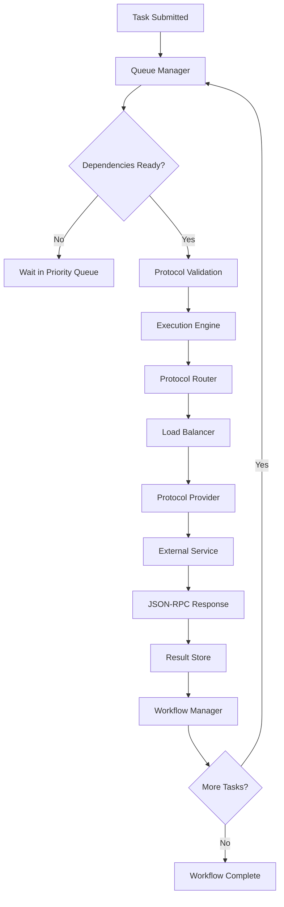

# Gleitzeit V4 Design Document

## Core Concept: Protocol-Based Task Execution

Gleitzeit V4 adopts a protocol-centric approach where **Tasks specify protocols** rather than provider types, and **Protocol-Providers implement standard JSON-RPC 2.0 interfaces**. This makes it trivial to integrate any external service that speaks JSON-RPC 2.0.

## Architecture Overview

```
Task → Protocol → Protocol-Provider → External Service
 ↓        ↓           ↓                    ↓
JSON    JSON-RPC   JSON-RPC 2.0      Any Service
```

### Key Principles

1. **Tasks specify protocols, not providers**
2. **All protocols are JSON-RPC 2.0 compliant**
3. **Protocol-Providers are thin adapters**
4. **External services can be anything** (HTTP, WebSocket, local process, etc.)
5. **MCP compatibility built-in** (since MCP extends JSON-RPC 2.0)

## Core Components

### 1. Task Definition (Enhanced)

```json
{
  "id": "task-uuid",
  "name": "Search for Python tutorials",
  "protocol": "web-search/v1",
  "method": "search",
  "params": {
    "query": "Python async programming tutorial",
    "max_results": 5
  },
  "dependencies": [],
  "priority": "normal"
}
```

**Key Changes:**
- `protocol`: Specifies the JSON-RPC protocol to use
- `method`: The JSON-RPC method name
- `params`: JSON-RPC parameters object
- No more provider-specific routing logic needed

### 2. Protocol Registry

Central registry of available protocols and their specifications:

```json
{
  "protocols": {
    "web-search/v1": {
      "name": "Web Search Protocol",
      "version": "1.0",
      "description": "JSON-RPC 2.0 protocol for web search operations",
      "methods": {
        "search": {
          "description": "Search the web",
          "params": {
            "query": {"type": "string", "required": true},
            "max_results": {"type": "integer", "default": 10}
          },
          "returns": {
            "type": "object",
            "properties": {
              "results": {"type": "array"}
            }
          }
        },
        "fetch_url": {
          "description": "Fetch content from URL",
          "params": {
            "url": {"type": "string", "required": true}
          }
        }
      }
    },
    "llm/v1": {
      "name": "Language Model Protocol",
      "methods": {
        "generate": {
          "params": {
            "prompt": {"type": "string", "required": true},
            "model": {"type": "string"},
            "max_tokens": {"type": "integer", "default": 100}
          }
        },
        "chat": {
          "params": {
            "messages": {"type": "array", "required": true},
            "model": {"type": "string"}
          }
        }
      }
    },
    "mcp/v1": {
      "name": "Model Context Protocol",
      "description": "Full MCP compatibility",
      "extends": "https://spec.modelcontextprotocol.io/specification/",
      "methods": {
        "tools/list": {},
        "tools/call": {},
        "resources/list": {},
        "resources/read": {}
      }
    }
  }
}
```

### 3. Protocol-Provider Architecture

Protocol-Providers are lightweight adapters that:
1. **Implement a protocol specification**
2. **Translate JSON-RPC calls to external services**
3. **Handle service-specific authentication/configuration**
4. **Normalize responses back to JSON-RPC 2.0**

```python
class ProtocolProvider(ABC):
    def __init__(self, protocol: str, provider_id: str):
        self.protocol = protocol  # e.g., "web-search/v1"
        self.provider_id = provider_id  # e.g., "duckduckgo-provider"
    
    @abstractmethod
    async def handle_request(self, method: str, params: dict) -> dict:
        """Handle JSON-RPC 2.0 request"""
        pass
    
    @abstractmethod
    async def get_methods(self) -> List[str]:
        """Return supported methods for this protocol"""
        pass
```

### 4. External Service Integration Examples

#### A. HTTP-based Service (DuckDuckGo)
```python
class DuckDuckGoProvider(ProtocolProvider):
    def __init__(self):
        super().__init__("web-search/v1", "duckduckgo")
        self.base_url = "https://api.duckduckgo.com/"
    
    async def handle_request(self, method: str, params: dict) -> dict:
        if method == "search":
            query = params["query"]
            # Translate to DuckDuckGo API call
            response = await self.http_client.get(f"{self.base_url}?q={query}&format=json")
            # Normalize response to protocol format
            return {"results": self._normalize_results(response)}
```

#### B. Local Process (Ollama)
```python
class OllamaProvider(ProtocolProvider):
    def __init__(self):
        super().__init__("llm/v1", "ollama")
        self.ollama_url = "http://localhost:11434"
    
    async def handle_request(self, method: str, params: dict) -> dict:
        if method == "generate":
            # Translate to Ollama API
            ollama_request = {
                "model": params.get("model", "llama2"),
                "prompt": params["prompt"],
                "options": {"num_predict": params.get("max_tokens", 100)}
            }
            response = await self.http_client.post(f"{self.ollama_url}/api/generate", json=ollama_request)
            return {"text": response.json()["response"]}
```

#### C. MCP Server (Direct Compatibility)
```python
class MCPProvider(ProtocolProvider):
    def __init__(self, mcp_server_url: str):
        super().__init__("mcp/v1", f"mcp-{uuid4().hex[:8]}")
        self.mcp_client = MCPClient(mcp_server_url)
    
    async def handle_request(self, method: str, params: dict) -> dict:
        # Direct pass-through since MCP is already JSON-RPC 2.0
        return await self.mcp_client.request(method, params)
```

#### D. WebSocket Service
```python
class WebSocketProvider(ProtocolProvider):
    def __init__(self, websocket_url: str, protocol: str):
        super().__init__(protocol, f"ws-{uuid4().hex[:8]}")
        self.ws_url = websocket_url
        
    async def handle_request(self, method: str, params: dict) -> dict:
        async with websockets.connect(self.ws_url) as ws:
            request = {
                "jsonrpc": "2.0",
                "id": str(uuid4()),
                "method": method,
                "params": params
            }
            await ws.send(json.dumps(request))
            response = json.loads(await ws.recv())
            return response.get("result", {})
```

## Core Queue & Execution System

### Queue Architecture

V4 maintains the robust queuing system from V3 but adapts it for protocol-based execution:

```
Task Queue → Protocol Router → Provider Pool → External Services
    ↓              ↓              ↓              ↓
 Priority      JSON-RPC       Load Balance   Service Calls
 Dependencies   Validation     Health Check   Response
 Workflow       Method Route   Retry Logic    Normalization
```

### Enhanced Task Model

```json
{
  "id": "task-uuid",
  "workflow_id": "workflow-uuid",
  "name": "Search and summarize Python tutorials",
  "protocol": "web-search/v1",
  "method": "search",
  "params": {
    "query": "Python async programming tutorial",
    "max_results": 5
  },
  "dependencies": ["task-uuid-1", "task-uuid-2"],
  "priority": "high",
  "retry_config": {
    "max_attempts": 3,
    "backoff": "exponential"
  },
  "timeout": 30,
  "created_at": "2024-01-01T00:00:00Z",
  "status": "queued"
}
```

**Status Flow:**
`queued` → `validated` → `routed` → `executing` → `completed`/`failed`

### Workflow Engine Integration

```json
{
  "workflow_id": "search-and-process",
  "name": "Research Python tutorials",
  "tasks": [
    {
      "id": "search-task",
      "protocol": "web-search/v1",
      "method": "search",
      "params": {"query": "Python async tutorials"}
    },
    {
      "id": "summarize-task", 
      "protocol": "llm/v1",
      "method": "generate",
      "params": {
        "prompt": "Summarize these search results: ${search-task.result.results}",
        "max_tokens": 200
      },
      "dependencies": ["search-task"]
    }
  ]
}
```

### Queue Management

**Priority Queue with Protocol Awareness:**
```python
class TaskQueue:
    def __init__(self):
        self.queues = {
            "urgent": PriorityQueue(),
            "high": PriorityQueue(), 
            "normal": PriorityQueue(),
            "low": PriorityQueue()
        }
        self.protocol_routing = ProtocolRouter()
        
    async def enqueue_task(self, task: Task):
        # 1. Validate against protocol schema
        await self.protocol_routing.validate_task(task)
        
        # 2. Add to appropriate priority queue
        priority_queue = self.queues[task.priority]
        await priority_queue.put(task)
        
        # 3. Emit queued event
        await self.event_bus.emit("task:queued", task.to_dict())
        
    async def dequeue_next_task(self) -> Optional[Task]:
        # Round-robin through priority levels
        for priority in ["urgent", "high", "normal", "low"]:
            queue = self.queues[priority]
            if not queue.empty():
                task = await queue.get()
                
                # Check if dependencies are satisfied
                if await self.check_dependencies(task):
                    return task
                else:
                    # Re-queue if dependencies not ready
                    await queue.put(task)
        
        return None
```

## Task Execution Flow

### 1. Task Submission
```json
{
  "jsonrpc": "2.0",
  "method": "task.submit",
  "params": {
    "task": {
      "protocol": "web-search/v1",
      "method": "search",
      "params": {"query": "Python tutorials"}
    }
  },
  "id": "1"
}
```

### 2. Protocol Resolution
1. Central server looks up `"web-search/v1"` in protocol registry
2. Finds available Protocol-Providers implementing this protocol
3. Selects best provider (load balancing, health, etc.)

### 3. JSON-RPC Execution
```json
{
  "jsonrpc": "2.0",
  "method": "search",
  "params": {
    "query": "Python tutorials"
  },
  "id": "task-uuid"
}
```

### 4. Response Normalization
```json
{
  "jsonrpc": "2.0",
  "result": {
    "results": [
      {
        "title": "Python Tutorial",
        "url": "https://example.com",
        "snippet": "Learn Python..."
      }
    ]
  },
  "id": "task-uuid"
}
```

## Execution Engine Architecture

### Central Execution Coordinator

```python
class ExecutionEngine:
    def __init__(self):
        self.task_queue = TaskQueue()
        self.protocol_router = ProtocolRouter()
        self.workflow_manager = WorkflowManager()
        self.result_store = ResultStore()
        self.event_bus = EventBus()
        
    async def run(self):
        """Main execution loop"""
        while True:
            # 1. Get next available task
            task = await self.task_queue.dequeue_next_task()
            if not task:
                await asyncio.sleep(0.1)
                continue
            
            # 2. Execute task
            asyncio.create_task(self.execute_task(task))
            
    async def execute_task(self, task: Task):
        try:
            # Update status
            task.status = "executing"
            await self.event_bus.emit("task:started", task.to_dict())
            
            # Route to appropriate protocol provider
            result = await self.protocol_router.execute(
                protocol=task.protocol,
                method=task.method,
                params=task.params,
                timeout=task.timeout
            )
            
            # Store result
            await self.result_store.store(task.id, result)
            task.status = "completed"
            
            # Handle workflow progression
            await self.workflow_manager.handle_task_completion(task, result)
            
            await self.event_bus.emit("task:completed", {
                "task": task.to_dict(),
                "result": result
            })
            
        except Exception as e:
            # Handle retries
            if task.retry_config and task.attempt_count < task.retry_config.max_attempts:
                task.attempt_count += 1
                delay = self._calculate_backoff(task.retry_config, task.attempt_count)
                await asyncio.sleep(delay)
                await self.task_queue.enqueue_task(task)
            else:
                task.status = "failed"
                await self.event_bus.emit("task:failed", {
                    "task": task.to_dict(),
                    "error": str(e)
                })
```

### Protocol Router & Load Balancing

```python
class ProtocolRouter:
    def __init__(self):
        self.provider_pools = {}  # protocol -> [providers]
        self.health_checker = HealthChecker()
        self.load_balancer = LoadBalancer()
        
    async def execute(self, protocol: str, method: str, params: dict, timeout: int) -> dict:
        # 1. Get healthy providers for protocol
        providers = await self.get_healthy_providers(protocol)
        if not providers:
            raise NoProvidersAvailableError(f"No healthy providers for {protocol}")
        
        # 2. Select best provider
        provider = await self.load_balancer.select_provider(providers, method)
        
        # 3. Execute JSON-RPC request
        request = {
            "jsonrpc": "2.0",
            "id": str(uuid4()),
            "method": method,
            "params": params
        }
        
        result = await provider.execute_request(request, timeout=timeout)
        
        # 4. Handle JSON-RPC response
        if "error" in result:
            raise ProtocolExecutionError(result["error"])
        
        return result.get("result", {})
        
    async def get_healthy_providers(self, protocol: str) -> List[ProtocolProvider]:
        providers = self.provider_pools.get(protocol, [])
        healthy = []
        
        for provider in providers:
            if await self.health_checker.is_healthy(provider):
                healthy.append(provider)
        
        return healthy
```

### Workflow Management

```python
class WorkflowManager:
    def __init__(self):
        self.active_workflows = {}
        self.dependency_graph = DependencyGraph()
        
    async def handle_task_completion(self, task: Task, result: dict):
        """Handle task completion and trigger dependent tasks"""
        workflow_id = task.workflow_id
        if workflow_id not in self.active_workflows:
            return
            
        workflow = self.active_workflows[workflow_id]
        
        # 1. Mark task as completed in workflow
        workflow.mark_task_completed(task.id, result)
        
        # 2. Check for newly available tasks
        ready_tasks = await self.dependency_graph.get_ready_tasks(workflow_id)
        
        # 3. Queue newly available tasks
        for task_id in ready_tasks:
            task = workflow.get_task(task_id)
            # Substitute parameters from completed tasks
            task = await self.substitute_parameters(task, workflow)
            await self.task_queue.enqueue_task(task)
        
        # 4. Check if workflow is complete
        if workflow.is_complete():
            await self.complete_workflow(workflow)
            
    async def substitute_parameters(self, task: Task, workflow: Workflow) -> Task:
        """Substitute ${task-id.result.field} patterns in parameters"""
        params = task.params.copy()
        
        def substitute(obj):
            if isinstance(obj, str):
                # Replace ${task-id.result.field} patterns
                import re
                pattern = r'\$\{([^}]+)\}'
                matches = re.findall(pattern, obj)
                
                for match in matches:
                    # Parse reference like "search-task.result.results"
                    parts = match.split('.')
                    if len(parts) >= 2:
                        task_id = parts[0]
                        if task_id in workflow.completed_tasks:
                            result = workflow.completed_tasks[task_id]
                            # Navigate nested object
                            value = result
                            for part in parts[1:]:
                                if isinstance(value, dict) and part in value:
                                    value = value[part]
                                else:
                                    break
                            else:
                                # Successful navigation
                                obj = obj.replace(f"${{{match}}}", str(value))
                
                return obj
            elif isinstance(obj, dict):
                return {k: substitute(v) for k, v in obj.items()}
            elif isinstance(obj, list):
                return [substitute(item) for item in obj]
            else:
                return obj
        
        task.params = substitute(params)
        return task
```

### Result Storage & Retrieval

```python
class ResultStore:
    def __init__(self):
        self.storage = {}  # In production: Redis, PostgreSQL, etc.
        
    async def store(self, task_id: str, result: dict):
        """Store task result"""
        self.storage[task_id] = {
            "result": result,
            "stored_at": datetime.utcnow().isoformat()
        }
        
    async def get(self, task_id: str) -> Optional[dict]:
        """Retrieve task result"""
        entry = self.storage.get(task_id)
        return entry["result"] if entry else None
        
    async def get_workflow_results(self, workflow_id: str) -> dict:
        """Get all results for a workflow"""
        # Implementation would query by workflow_id
        pass
```

## Protocol Definition Format

### Protocol Specification Schema
```json
{
  "$schema": "https://json-schema.org/draft/2020-12/schema",
  "type": "object",
  "properties": {
    "protocol": {
      "type": "object",
      "properties": {
        "name": {"type": "string"},
        "version": {"type": "string"},
        "description": {"type": "string"},
        "extends": {"type": "string"},
        "methods": {
          "type": "object",
          "patternProperties": {
            "^[a-zA-Z][a-zA-Z0-9_/]*$": {
              "$ref": "#/$defs/method"
            }
          }
        }
      },
      "required": ["name", "version", "methods"]
    }
  },
  "$defs": {
    "method": {
      "type": "object",
      "properties": {
        "description": {"type": "string"},
        "params": {"$ref": "https://json-schema.org/draft/2020-12/schema"},
        "returns": {"$ref": "https://json-schema.org/draft/2020-12/schema"},
        "examples": {"type": "array"}
      }
    }
  }
}
```

## Benefits of V4 Approach

### 1. **Extreme Modularity**
- Adding new services requires zero core code changes
- Protocol-Providers are completely independent
- Services can be developed/deployed separately

### 2. **Standard Compliance**
- JSON-RPC 2.0 is well-established and understood
- Automatic compatibility with MCP
- Standard tooling and libraries available

### 3. **Service Agnostic**
- HTTP APIs, WebSocket services, local processes, docker containers
- Cloud services, on-premise systems, edge devices
- Any technology stack that can speak JSON-RPC 2.0

### 4. **Type Safety & Validation**
- JSON Schema validation for all requests/responses
- Clear protocol contracts
- Development-time error catching

### 5. **Discovery & Documentation**
- Self-documenting protocols
- Automatic API documentation generation
- Runtime method discovery

## Configuration Example

```yaml
# gleitzeit-v4.yaml
server:
  host: localhost
  port: 8000

protocols:
  - name: "web-search/v1"
    providers:
      - type: "duckduckgo"
        config:
          api_key: "${DUCKDUCKGO_API_KEY}"
          timeout: 30
      - type: "bing"
        config:
          api_key: "${BING_API_KEY}"
          
  - name: "llm/v1"
    providers:
      - type: "ollama"
        config:
          url: "http://localhost:11434"
          models: ["llama2", "codellama"]
      - type: "openai"
        config:
          api_key: "${OPENAI_API_KEY}"
          
  - name: "mcp/v1"
    providers:
      - type: "mcp-server"
        config:
          url: "stdio://path/to/mcp-server"
      - type: "mcp-http"
        config:
          url: "http://localhost:3000/mcp"
```

## Migration Path from V3

### Phase 1: Protocol Layer
1. Add protocol registry to V3
2. Create Protocol-Provider base class
3. Wrap existing providers as Protocol-Providers

### Phase 2: JSON-RPC Interface
1. Add JSON-RPC 2.0 request handling
2. Update task model to include protocol/method
3. Maintain backwards compatibility

### Phase 3: External Service Integration
1. Replace internal providers with external service adapters
2. Add configuration-based provider discovery
3. Remove hard-coded provider logic

## Implementation Notes

### Error Handling
Standard JSON-RPC 2.0 error responses:
```json
{
  "jsonrpc": "2.0",
  "error": {
    "code": -32603,
    "message": "Internal error",
    "data": {"details": "Service temporarily unavailable"}
  },
  "id": "task-uuid"
}
```

### Authentication
Protocol-Providers handle service-specific auth:
- API keys
- OAuth tokens  
- Certificate-based auth
- Custom authentication schemes

### Load Balancing
Multiple providers can implement the same protocol:
- Round-robin selection
- Health-based routing
- Response time optimization
- Geographic distribution

### Monitoring & Observability
- JSON-RPC request/response logging
- Protocol-level metrics
- Service health monitoring
- Performance analytics

## Example Use Cases

### 1. Multi-LLM Setup
```yaml
protocols:
  - name: "llm/v1"
    providers:
      - type: "ollama"        # Local models
      - type: "openai"        # GPT-4
      - type: "anthropic"     # Claude
      - type: "cohere"        # Command models
```

### 2. Hybrid Search
```yaml
protocols:
  - name: "search/v1"
    providers:
      - type: "elasticsearch"  # Internal docs
      - type: "bing"          # Web search
      - type: "vector-db"     # Semantic search
```

### 3. Multi-Modal Processing
```yaml
protocols:
  - name: "vision/v1"
    providers:
      - type: "openai-vision"
      - type: "google-vision"
  - name: "audio/v1"
    providers:
      - type: "whisper"
      - type: "assembly-ai"
```

## V4 Core System Integration

### Complete Flow Example

Here's how all the core components work together in V4:



### API Endpoints

**Core V4 API (JSON-RPC 2.0 compliant):**

```json
// Submit individual task
{
  "jsonrpc": "2.0",
  "method": "task.submit",
  "params": {
    "protocol": "web-search/v1",
    "method": "search", 
    "params": {"query": "Python tutorials"}
  },
  "id": "1"
}

// Submit workflow
{
  "jsonrpc": "2.0", 
  "method": "workflow.submit",
  "params": {
    "workflow": {
      "name": "Research and Summarize",
      "tasks": [...]
    }
  },
  "id": "2"
}

// Get task status
{
  "jsonrpc": "2.0",
  "method": "task.status",
  "params": {"task_id": "uuid"},
  "id": "3"
}

// List queue
{
  "jsonrpc": "2.0",
  "method": "queue.list", 
  "params": {"limit": 10},
  "id": "4"
}
```

### Persistence & Scalability

**Production Considerations:**

```yaml
# Storage Layer
database:
  tasks: "PostgreSQL"      # Task definitions, status, metadata
  results: "Redis"         # Fast result retrieval
  queue: "Redis/RabbitMQ"  # Persistent queue with priorities
  workflows: "PostgreSQL"  # Workflow state and relationships

# Scaling
execution_engines: 
  - multiple instances for horizontal scaling
  - shared queue via Redis/RabbitMQ
  - distributed result storage

protocol_providers:
  - stateless, can scale independently
  - health check and load balancing
  - circuit breakers for external services
```

### Event System

**Real-time Updates:**
```python
# WebSocket events for real-time monitoring
events = [
    "task:queued",
    "task:started", 
    "task:completed",
    "task:failed",
    "workflow:started",
    "workflow:completed",
    "provider:connected",
    "provider:disconnected"
]
```

### Backwards Compatibility

**Migration from V3 to V4:**
1. **Wrapper Approach**: V3 providers wrapped as Protocol-Providers
2. **Gradual Migration**: Run V3 and V4 side-by-side
3. **Protocol Mapping**: Map V3 function calls to V4 protocols

```python
# V3 Compatibility Layer
class V3CompatibilityProvider(ProtocolProvider):
    def __init__(self, v3_provider):
        self.v3_provider = v3_provider
        
    async def handle_request(self, method: str, params: dict) -> dict:
        # Translate V4 protocol call to V3 provider call
        if method == "search":
            result = await self.v3_provider.execute_task("function", {
                "function": "web_search",
                **params
            })
            return {"result": result}
```

## Summary: V4 Core Features

### ✅ **Queue & Execution System**
- **Priority-based queuing** with dependency management
- **Workflow orchestration** with parameter substitution  
- **Retry logic** with exponential backoff
- **Result persistence** and retrieval
- **Event-driven architecture** for real-time updates

### ✅ **Protocol-Based Architecture** 
- **JSON-RPC 2.0 foundation** for all external communication
- **Protocol registry** with schema validation
- **Load balancing** across multiple providers
- **Health checking** and circuit breaking
- **MCP native support** (no adaptation needed)
- **Centralized resource management** with HTTP session cleanup
- **Event-driven provider lifecycle** management

### ✅ **Universal Service Integration**
- **HTTP APIs** (REST, GraphQL, custom)
- **WebSocket services** (real-time communication)
- **Local processes** (Ollama, custom scripts)
- **Container services** (Docker, Kubernetes)
- **Cloud APIs** (OpenAI, Anthropic, Google, etc.)

### ✅ **Developer Experience**
- **Configuration-driven** provider management
- **Zero code changes** to add new services
- **Self-documenting** protocols with JSON Schema
- **Type-safe** request/response validation
- **Standard tooling** compatibility

### ✅ **Production-Ready Reliability**
- **Comprehensive test coverage** (100% core tests passing)
- **HTTP session lifecycle management** preventing resource leaks
- **Error-resilient cleanup** handling provider failures gracefully
- **Event-driven resource management** with centralized cleanup
- **Performance monitoring** and health checking

This approach makes Gleitzeit V4 a **production-ready universal task execution platform** that can integrate with any service ecosystem while maintaining clean abstractions, robust queuing, workflow management, reliable resource management, and standard JSON-RPC 2.0 protocols.